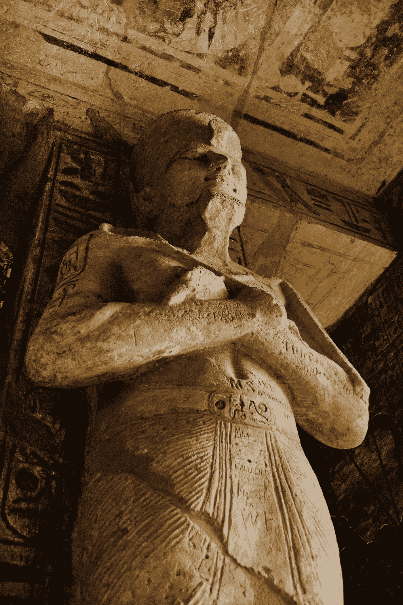

# 未来人类会如何评判我们的文明？

> 原文：<https://medium.com/swlh/how-will-future-humans-judge-our-civilization-c33a49a9c892>

2000 年后还会有人留下来挖掘我们社会的残余吗？

Photo by [Roxanne Shewchuk](https://www.pexels.com/@roxanne-shewchuk-1146107?utm_content=attributionCopyText&utm_medium=referral&utm_source=pexels) from [Pexels](https://www.pexels.com/photo/mummy-sleeping-statue-2183927/?utm_content=attributionCopyText&utm_medium=referral&utm_source=pexels)

珀西·比希·雪莱的《T1》给我们的启示

**奥兹曼迪斯 **

我遇到了一个来自古老国度的旅行者，他说:“两条巨大的没有腿的石头腿矗立在沙漠中。。。。在他们附近的沙滩上，
半沉着一张破碎的脸，他的双眉，
和皱着的嘴唇，还有冷笑…