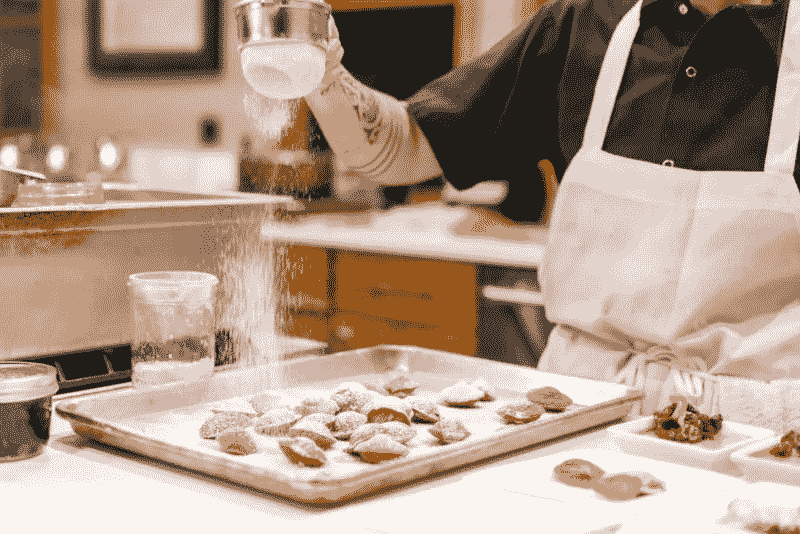

# 世界级厨师如何体现思想领导力(以及你如何做到这一点)

> 原文：<https://medium.com/swlh/how-world-class-chefs-epitomize-thought-leadership-and-how-you-can-do-the-same-36664ef3ef02>

你有没有试过一遍又一遍地用一堆例子和“举例子”来解释某事，但仍然无法有效地阐明你的观点？

然后，有点出乎意料地，你遇到了最谦逊的类比，它完美地总结了你试图证明的东西，让你不得不问，“为什么我没想到呢？”

## 嗯，我最近也遇到过这种情况。

在过去的一年半时间里，我一直在写关于如何让[成为思想领袖](https://www.minutesmagazine.com/jack-martin/what-does-the-term-thought-leadership-mean/)的文章，试图证明为什么分享你所知道的是建立一个有机追随者并让自己成为行业领袖的唯一途径。

我用了大量的例子来阐述我的观点，强调个人故事和脆弱性如何显示真实性——以及真实性如何是真正与观众联系的唯一方式。

但是不管我怎么说，我都不觉得我是真的*在传达我想要传达的信息。*

上周，我在阅读杰森·弗里德和大卫·海涅迈尔·汉森的[新作](https://basecamp.com/books/rework)时，发现了一个完美的类比，即为什么分享你所知道的是成为思想领袖的唯一途径。

> 他们的榜样？

# 思想领袖需要效仿厨师。

你可能会想，*“怎么会呢？”*

可以这样想:世界名厨是如何达到“世界闻名”的地位的？为什么艾米尔·拉加斯和戈登·拉姆齐在烹饪界家喻户晓？

# 因为他们分享他们知道的一切。

看看任何一个著名的厨师，你都会看到同样的事情:无数的烹饪书，杂志特写，可能还有他们自己在美食网上的节目。

事实上，很难找到一个没有出版过某种食谱的著名厨师。

厨师知道他们擅长什么，也意识到有很多人想学习同样的技能。他们利用这种需求，根据自己的专业知识提供答案——通过不断分享自己的知识，在烹饪界脱颖而出。

事实上，这是他们能够分离自己的唯一方法。

例如，如果一个崭露头角的厨师写了一本关于所有最好的食物的书，但他把所有的食谱都留给了自己，你会买他的书吗？

当然不是！

一个厨师谈论他们能做出的美味食物而不教你如何实际自己做是没有价值的。

# 思想领导力也不例外。

如果你想被认可为行业领导者，你需要通过[定期分享你所知道的](https://www.minutesmagazine.com/jack-martin/from-your-first-blog-post-to-industry-authority-this-1-tiny-shift-will-make-all-the-difference/)来为你的行业增加价值。

用你的亲身经历和专业知识去*教*，而不是炫耀。发表关于你公司发生的事情的文章或者谈论你的新技术是如何“颠覆性”的不会让你被认为是你所在行业的有价值的一员。给你的观众你所有的“食谱”是什么共鸣。

再说一次，如果厨师不实际教他们*如何做*，那么她大谈她的茄子帕尔玛有多棒对有兴趣做它的人来说没什么作用。

重要的是——也是价值所在——厨师对食材的详细解释，以及准备、烹饪和上菜的过程。

无论你是创始人、高管、高级团队成员，还是拥有独特、受欢迎技能的人，都要知道:

# 人们想向你学习。

他们想知道做你的工作需要什么。

他们想知道有一天他们怎样才能达到你的位置。他们想知道你读什么，看什么，听什么。他们想知道你如何建立关系网，如何克服逆境，如何抓住机遇。

所以像厨师一样教他们。找出人们想从你这里知道什么，然后把你的食谱给他们。

这是让你成为行业思想领袖的唯一途径。

[本文原载于《会议纪要》。](https://www.minutesmagazine.com/jack-martin/how-world-class-chefs-epitomize-thought-leadership-and-how-you-can-do-the-same/)

## 这篇文章发表在 [The Startup](https://medium.com/swlh) 上，这是 Medium 最大的创业刊物，拥有+421，678 名读者。

## 在这里订阅接收[我们的头条新闻](https://growthsupply.com/the-startup-newsletter/)。

