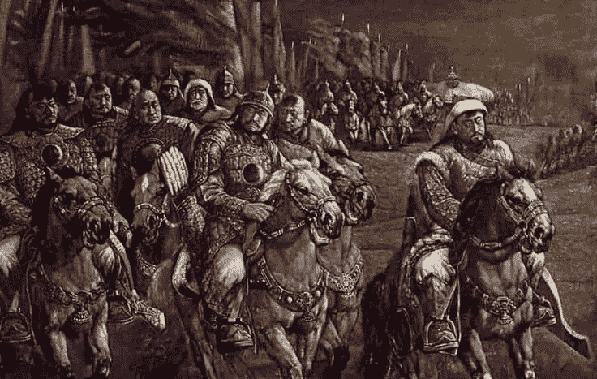
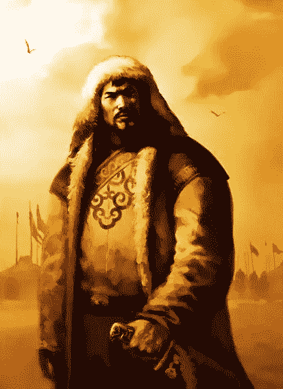

# 成吉思汗会如何经营你的生意？

> 原文：<https://medium.com/swlh/how-would-genghis-khan-run-your-business-9d62437ed2a>

Source: Adapted from Forgeofempires.com

你们可能都听说过成吉思汗，他的名字很可能会让人联想到一个多毛的野蛮军阀统治和掠夺古代世界的画面。我承认我有类似的印象，直到最近，当我看到一篇文章详细描述了他的壮举几乎令人难以置信的印象。

成吉思在必要的时候可能会变得严厉、无情和残忍，但他作为有史以来最聪明、最务实的领导人、战术家和征服者之一，却远未被人们铭记。

虽然他的行为的无情和凶残不应该受到钦佩(显然不适用于 21 世纪)，但成吉思汗取得成功的哲学同样适用于今天的商业世界。这个世界的核心与 13 世纪战争的竞争性和残酷性并不遥远。

我试图将成吉思最有效的领导策略总结为:**精英管理、纪律、忠诚和决心。**这四种品质使成吉思汗能够将交战的游牧部落联合起来，组成历史上最成功的军队，在大约 700 年后，开创了一个规模仅次于英国的帝国。

这些给成吉思带来成功的策略，同样适用于任何现代领导职位，如果运用得当，可能会让你开创一个属于自己的帝国。

## 精英管理

需要指出的是，在他的时代，成吉思是进步的和前瞻性的思想。他最成功的特点之一是他有一种不可思议的能力，能够识别人们的价值，并据此在他的帝国中定位他们。

> **..我没有什么才能，所以我喜欢聪明的人，把他们当作我的兄弟”——成吉思汗**

绝大多数领导人和统治者在这个时候围绕裙带关系、任人唯亲和贵族特权来构建他们的军队和政府。然而，成吉思偏爱技能、天赋和能力胜过一切，他会让自己身边围绕着那些他认为最能为帝国和人民服务的人，而不管他们的个人背景如何。

据说成吉思招募了一名敌军士兵，这名士兵在战斗中用箭射伤了他。战斗一结束，成吉思就要求战败者说出是谁开枪打了他。敌军士兵哲别站出来坦白，但向成吉思表白，如果他饶他一命，他将获得他的绝对忠诚。成吉思汗认识到哲别的潜力，重视诚实、技能和忠诚，于是赦免了他，并将他安置在军队中，后来成功晋升为可汗的高级将领之一。

今天的领导者和管理者可以追随成吉思的脚步，既要牢记自己的价值和局限性，又要无差别地将任务委派给具有公认价值和专业知识的员工，并提拔他们。或许，像成吉思一样，甚至通过收购竞争对手公司的人才？

事实上，用成吉思汗组建军队的方式来组建你的企业，不仅会产生一个高效、多产的团队，还能通过员工之间的紧密合作来缓解个人的弱点。每个士兵(雇员)都有强烈的忠诚和纪律，这进一步加强了这种忠诚和纪律。

Mongol Teamwork (Source: HistoryCollection.co)

## 纪律和忠诚

纪律是蒙古军队得以在极端条件下和长途跋涉中，在寡不敌众的情况下与敌军作战并击败他们的原因。

成吉思汗批准的纪律要求他领导下的每个人都服从。将军或指挥官没有特权。事实上，如果一个将军打了败仗，或者一个军官犯了大错，他就会被降级为普通士兵。

虽然训练很艰苦，要求也很高，但从来没有不合理或过于严厉的时候。成吉思确保他的士兵在他们能想象到的各种环境下接受训练，优先考虑准备。

战斗中的纪律和准备与商业中的准备一样重要。一个训练有素的员工更有效率和价值，在工作技能上也不太可能有差距。

就像成吉思的《士兵》一样，一个有效的培训计划不仅能提高绩效，还能培养忠诚度，并在员工中产生一种集体团结感。

成吉思也反对微观管理，通常允许他的军官和指挥官在如何训练和管理他们的士兵方面有自主权，只要更广泛的目标得以实现。

这种策略帮助蒙古人避免了过于僵化的管理结构的常见陷阱**，**这在经营你的企业时同样有益。事实表明，任何公司层面的微观管理都会导致一系列负面后果，包括:不信任、缺乏忠诚度、士气低落、员工过度依赖、生产力低下等等。

众所周知，成吉思以多种方式培养忠诚，你可能会同意，其中一种方式类似于现代的员工奖励计划。是的，蒙古军队的每个士兵都得到一份战利品。因此，激励效率和生产力(至少在战争中)。

这在很大程度上反映了现代员工持股计划，许多企业已经从这种策略中获益。当公司有一个好的财政年度时，奖励员工使员工的利益与公司的利益一致，并且可以导致生产力、忠诚度和参与度的显著提高。

## 决心

成吉思汗非常以身作则。他无与伦比的决心和纯粹的意志力影响了所有追随他的人。

> “任何事情在完成之前都没有价值。”——成吉思汗

Source: Reddit/r/forhonour

历史上很少有男人有这样的决心去实现他们的目标，而真正做到的人就更少了。

有远见、动力和决心可以说是任何领导者最有价值的特征。成吉思激励他的部下跟随他。他的故事类似于诗歌或史诗故事，成吉思出身卑微，成为已知世界的征服者。他对统一世界的坚定愿景成就了这一壮举。

虽然决心对各行各业的成功都很重要，但对于创业和成为这方面的领导者来说尤其重要。

> **“有许多时刻充满了绝望和痛苦，当你不得不解雇人，取消事情，处理非常困难的情况。。。(建立一家公司)太难了，如果你没有激情，你就会放弃。”
> ——苹果公司首席执行官史蒂夫·乔布斯**

拥有动力、决心和远见有助于改变。它们是成功的无可争议的基础。拥有这些品质的人在困难的时候不会放弃，他们会一直努力直到成功。决心铸就了成吉思汗的帝国，它也会铸就你的帝国吗？

我希望这篇文章能让你对成吉思汗的才华有一个简要的了解，以及他会如何启发你的商业实践和你的个人生活。我鼓励你做自己的研究，找到更多关于这位神秘征服者的信息。