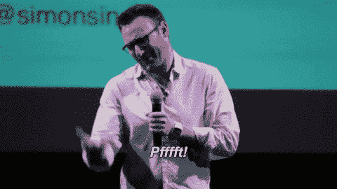
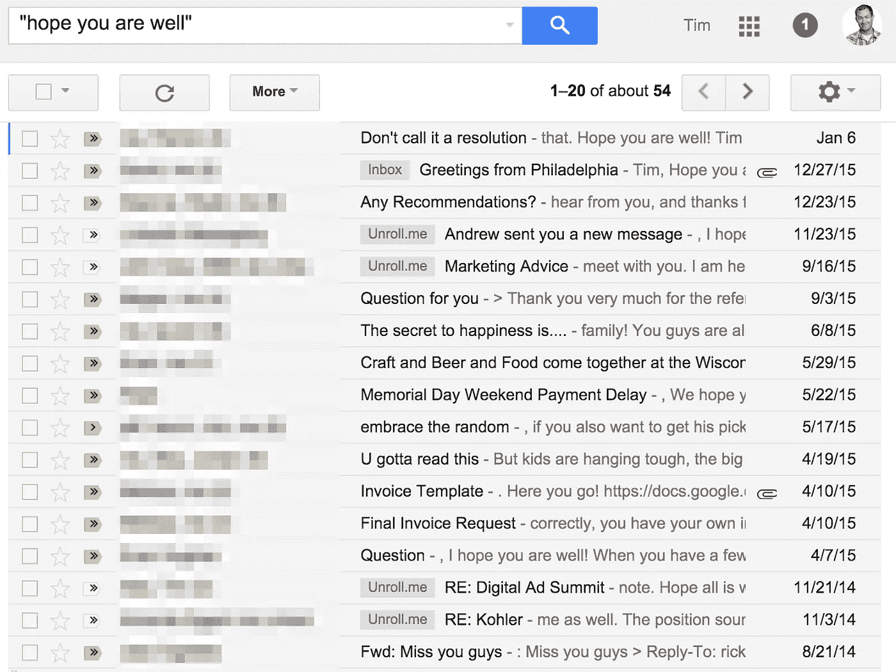

# 你寻求帮助的方式是落后的

> 原文：<https://medium.com/swlh/how-you-ask-for-favors-is-backward-7f40579261f1>

## 直接说吧

Photo by [Noah Buscher](https://unsplash.com/@noahbuscher?utm_source=medium&utm_medium=referral)

这是大多数人在电子邮件中请求帮助的方式:

> 亲爱的[插入姓名]:
> 
> 希望你一切都好。我好几年没见你了。祝贺你所做的一切，真的很棒。
> 
> 如果你能帮我一个忙，请在这个网站上为我投票。我希望我的设计能赢得几千美元的奖励。
> 
> 我们应该找个时间喝杯咖啡。

对于这样的邮件，我们通常会有什么反应呢？

当西蒙·西内克在他的创意早间谈话中展示这个电子邮件模板时，我立刻认出了它。

我做到了。我在我的 Gmail 中搜索“希望你一切都好”这句话，发现了大量来自我和其他人的例子。那甚至不是我的工作邮箱。

其他人甚至有更多的例子，大多来自供应商和合作伙伴。

当然，希望某人健康没有错。但这往往是一句空洞的客套话，暗示着“我正要请你帮个忙。”

“如果我每次你为我做好事时，我都认为你是为了得到你想要的东西，我就不会信任你，”Sinek 说。

那么你应该做些什么改变呢？

根据 Sinek 的说法， ***简单来说就是提前告知*** 你想要什么。个人化是可以的，但是不要试图通过先讨好某人来讨好别人。

请尝试此方法。

> 亲爱的[插入姓名]
> 
> 希望你能在这个网站上为我投票。我正在努力赢得一个设计竞赛的奖项。
> 
> 好几年没见你了。希望你一切都好。
> 
> 祝贺你所做的一切。我们应该找个时间喝杯咖啡。
> 
> 谢了。

**完全不同。**

“当我们知道你为什么发电子邮件时，它首先出现，这将产生显著的影响，”Sinek 说。“如果你直截了当地说出你想要的，我们其实非常感谢这些客套话。”

“在人际交往中也是如此，”他继续说道。“如果你需要帮助，不要给别人一杯咖啡。请他们帮忙。它能建立信任。”

可以看下面的谈话全文。希望你一切都好！

## 这篇文章发表在 [The Startup](https://medium.com/swlh) 上，这是 Medium 最大的创业刊物，拥有+430，678 名读者。

## 在此订阅接收[我们的头条新闻](https://growthsupply.com/the-startup-newsletter/)。

