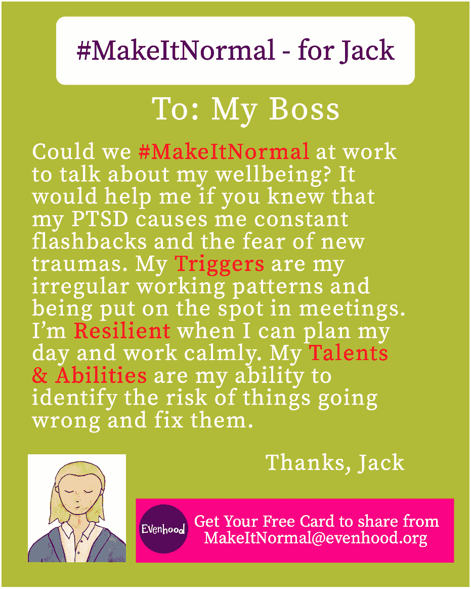

# 你如何在工作中改变对心理健康的态度——乔纳森·费伦访谈

> 原文：<https://medium.com/swlh/how-you-can-change-attitudes-to-mental-health-at-work-an-interview-with-jonathan-phelan-a89a4ca81712>

你见过一幅 [**太史慈**](http://tardigrades.bio.unc.edu/tardigrades/) 的画面吗？它看起来像一个外星人。但是缓步动物，也被称为水熊，是地球上的居民——也是我们星球上最强悍的动物。缓步动物可以承受极热和极冷，脱水和饥饿，以及强大的压力。令人难以置信的是，甚至太空旅行对他们来说都不成问题。缓步动物也是多产的——你可以在世界各地找到它们，从极地到赤道。我们会从这些神奇的生物身上学到很多东西。

我通过中介找到了心理健康教练、《心理健康对话的艺术》*的作者乔纳森·费伦，并联系他进行了采访。我很想和他谈谈他为改善我们在工作场所谈论精神疾病的方式所做的努力。费伦似乎对面临心理健康挑战、对最佳前进道路感到不确定的员工和老板的需求非常敏感。*

*费伦先生告诉我，当他发现缓步动物时，它们的适应力的体现立即给了他灵感。然后，他用缓步动物(以其顽强的生命力)来打开他的书的第一章，并定期“使用”它们来介绍他鼓舞人心的讲座。如果费伦先生如愿以偿，迟到将成为那些寻求将精神健康对话引入我们职业的人的标志。然而，对于那些处理心理健康问题的人来说，受耻辱感支配的工作环境可能比极地冰或火山更极端。*

# *你的幸福、你的弹性和你的老板*

*我可以在这里暂停一下，提供关于精神疾病**患病率的令人印象深刻的统计数据，但我怀疑你已经听说过这些报告。此外，美国面临着与治疗精神疾病的药物有关的成瘾和过早死亡事件的上升。面对所有这一切，费伦先生认为，如果精神健康挑战被去污名化，关于它们的富有同情心的谈话被正常化，我们不仅会使那些受他们摆布的人受益，而且会解决多种问题并使许多家庭受益。***

***在我看来，我们可以继续并加倍我们目前对精神疾病的回避方法，并保持我们基于恐惧的污名化，或者，像我们的朋友缓步动物一样，我们可以弯曲我们的弹性。那么，我们如何才能让那些必须应对工作中的精神疾病的人过得更好呢？在回答这个问题时，费伦先生提供了深思熟虑的和容易理解的指导。***

***对于患有精神疾病的人来说，最大的挑战之一是向老板或同事提起。太多时候，谈话集中在疾病及其可能的致残影响。相比之下，费伦提供了一张免费的健康卡，为任何面临心理健康挑战的人提供了一个积极的框架，与老板或同事展开对话，这种对话植根于他们的优势，比如他们的诚实、奉献和智慧。对费伦先生来说，一个人的优势是他们的弹性资源。健康卡概括了费伦先生的哲学，即当我们经历精神疾病时，我们不会崩溃，而是有能力和容易获得力量。***

***“健康卡与疾病无关，”费伦告诉我，他接着解释说，大多数老板都没有能力处理员工精神疾病的话题。但是，与尴尬或耻辱的规范相反，老板和员工可以选择“将话题从精神疾病转移到(我们的老板)可以做些什么来让我们变得更强大。”***

# ***如何#让它变得正常***

***一张健康卡涉及三个重要的讨论话题:疾病的触发因素、弹性资源以及关注天赋和能力。我问费伦，健康卡是不是一种有形的东西，他说是的，但不一定。这张“卡片”提供了谈话要点，而在此之前是没有的。一个人可以打印出来，或者在与老板或同事交谈时记住谈话要点。下面是费伦先生网站上的一个例子，[**Evenhood.org**](https://www.evenhood.org/blog)，他在网站上领导了一个#MakeItNormal 活动，旨在让关于工作中精神健康的对话成为常态:***

******

***“除了我晚上做的事情，我还是一家大型金融机构的领导者，”费伦说。“在我有很多心理健康方面的经验之前，如果有人走到我面前，开始谈论抑郁，或者经历丧亲之痛……厌食症……自残……我知道作为一个老板，很难知道该做些什么。”***

***相比之下，“杰克”(如上例)用一张健康卡向他的老板确认，尽管他面临着精神疾病，但他打算保持能力。此外，卡片还鼓励他的老板让杰克在工作中表现出色，而不是贬低或羞辱他。我想知道卡片的模板如何适用于在工作中经历悲伤的人(我在 之前已经写了 [**),所以我就我办公室的现状向费伦先生征求意见。**](http://authoralisawilson.com/2018/04/25/this-made-me-better-at-dealing-with-grieving-coworkers/)***

# ***不用言语的安慰，不用忠告的引导***

***一天，我看到一个同事朱迪在另一个同事的办公室里流泪。我的另一位同事小声安慰朱迪。我想，也许朱迪的哥哥患了绝症，已经去世了。当时我不想问朱迪这个问题，但我想做点什么来帮助她。我给朱迪拿来一盒纸巾，把手放在她的背上，揉了揉，然后离开了。朱迪感谢了我，但我不确定我是否帮了忙。我问费伦先生，将来我该如何处理朱迪的情况。***

***“你能向受到伤害的人发出的最好邀请之一，”费伦先生说，“就是说你会倾听，你会倾听*的话，但不提供建议。”费伦先生敦促说，如果你说除非有人邀请你，否则你不会提供建议，那么这种邀请就比期待地询问某人是否需要交谈要少得多。在这种情况下，除非来自专业顾问的建议，“建议是毫无用处的，”费伦先生继续说。“没有人知道数十亿个脑细胞和数百万次经历对你产生了什么影响。所以，别人能为你做的最好的事情就是倾听你的心声……这也是你能为同事做的最好的事情。”****

***在结束我们的采访时，我问费伦先生，他希望人们了解他目前的努力。费伦先生说，在回答关于健康卡的请求时，他意识到他可以通过创建一个指南，或“发现你自己的弹性资源的九个步骤”，来提供进一步的好处根据费伦先生的说法，适应力在很大程度上取决于我们的环境——我们生活、睡觉、工作的地方，等等。但是如果我不能轻易地改变一个“糟糕”的环境，比如一个难相处的老板，那该怎么办呢？费伦先生的指南提供了这种细致入微的指导。***

***该指南可在 Evenhood.org 网站上获得。费伦先生强调，他将继续应要求免费制作健康卡，“只要我有时间”。我很乐意为人们做这些。”如果你想扩大你的同情心，变得更有弹性，并在工作中进行心理健康的谈话，费伦先生是一个宝贵的资源。和费伦先生一起，我相信你和我可以改变工作中关于精神健康的讨论，并让缓步动物对人类的适应力有所钦佩。***

***这篇文章是我在古怪的职业生涯中学到的经验系列之一。主题包括工作面试失误，如何处理冲突，以及对错误更好的心态，等等。***

****在工作中感到不知所措或没有成就感？或者，不敢相信自己在事业上有多幸运？我去过那里，我有经验可以分享。我希望它们对你有所帮助。****

****原载于 2019 年 6 月 20 日*[*http://authoralisawilson.com*](http://authoralisawilson.com/2019/06/20/how-you-can-change-attitudes-to-mental-health-at-work-an-interview-with-jonathan-phelan/)*。****