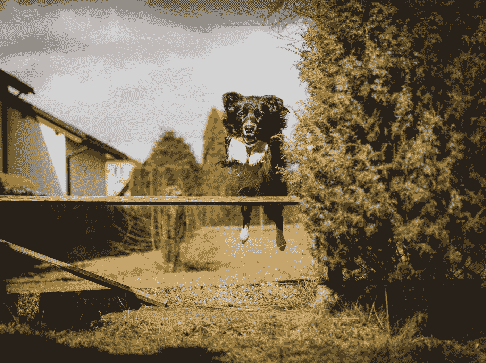

# 你最大的障碍如何变成你最大的财富

> 原文：<https://medium.com/swlh/how-your-biggest-obstacles-can-become-your-biggest-assets-12a4593054db>

## 化劣势为优势。

Photo by [Tadeusz Lakota](https://unsplash.com/@tadekl?utm_source=medium&utm_medium=referral) on [Unsplash](https://unsplash.com?utm_source=medium&utm_medium=referral)

如果你改变你的思维方式，那些在生活中阻碍你前进的事情会变成推动你前进的力量。

这里有一个例子:我每天早上骑自行车去上班，不管是刮风、下雪、下雨，还是非常热的天气。

> 最近好冷啊…