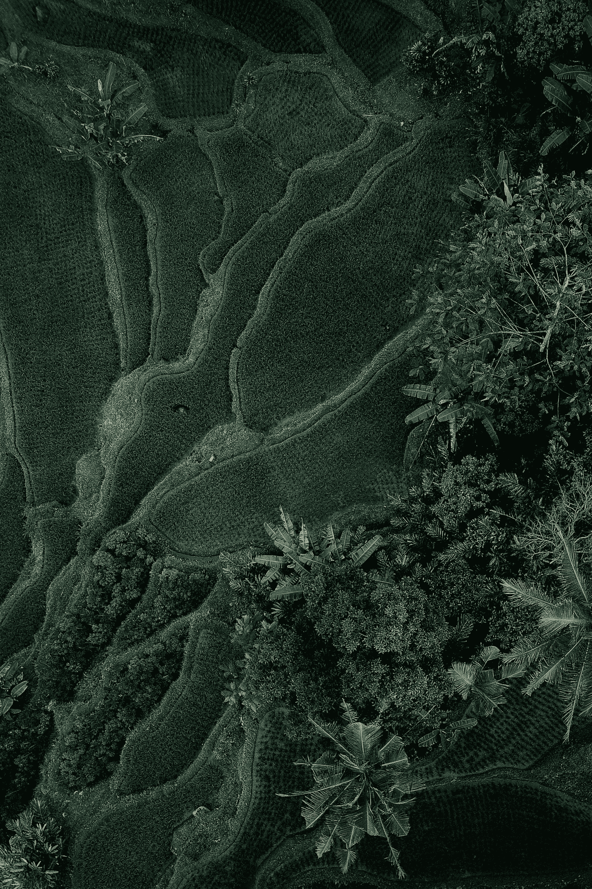

# 您的公司如何在复杂的世界中保持领先

> 原文：<https://medium.com/swlh/how-your-company-can-keep-up-in-a-complex-world-33c1cd1eb023>

弗雷德里克·泰勒是第一批商业管理顾问之一。泰勒是工业时代的管理思想家，他与工厂合作，以确保生产过程的最大效率。通过将高度专业化的任务分配给工厂的员工，他成功地从整体生产中节省了大量时间。

泰勒将科学原理应用于他对生产过程的观察。根据这些观察，他写了《科学管理原理》，于 1911 年出版。在这个过程中，他的思想帮助塑造了当前的管理理论。

作为管理者，我们是泰勒概念框架的后代，这一框架在管理领域产生了广泛的影响。我们重视生产力和效率，并充分利用我们拥有的资源。然而，泰勒生活在一个与我们今天居住的世界非常不同的世界。沟通的速度和世界的互联意味着我们可以做更多的事情，但这也使我们更加相互依赖，因此成为复杂网络的一部分。

[Photo: Iswanto Arif/Unsplash]

我在洪都拉斯一家名为 [Celaque](http://www.celaque.net) 的物业管理和开发公司工作。对于我们开发的第一栋公寓楼，我们选择了一家与哥伦比亚一家工厂合作了几十年的厨房台面供应商。这家工厂为他们提供了我们在厨房使用的乳白色石英台面。

项目结束前几个月，工厂破产了。该事件与我们或我们选择的供应商无关，完全出乎意料。它超出了我们的控制，但它对我们产生了深远的影响。我们与供应商举行每周更新和会议，以确保我们尽快对问题做出回应。工厂的失败意味着我们不得不从西班牙的另一家工厂订购替代品，并尽快将石英运出。几经周折，厨房终于安装好了——比预定时间晚了三个月。

在现代通信和互联网出现之前，可能很难找到一家本地供应商，向我们出售来自哥伦比亚一家工厂的石英。我们可能无法与我们的供应商协商价格，这样他们反过来就可以与工厂协商，以确保我们能够负担得起新的台面。我们不会收到现有产品的图片和报价。然而与此同时，这种优势也让我们变得更加脆弱。现在存在的世界各地不同党派之间的联系堪称奇迹，但它们也更加脆弱，因为我们都相互依赖。如果链条中的一个环节断裂，后果很难预见，因为这是相互依赖的。

我们周围的环境现在可以用复杂来形容，而不是复杂。复杂的环境可能很难理解，但它会对因果做出反应。复杂工作的一个例子是设计一栋建筑。由建筑师、不同的工程师(土木、电气、水力、岩土和结构)、物业经理和财务专家等组成的团队一起设计一栋建筑。所有这些合作都需要特殊的知识和培训，但通过适当的教育，因果是可以辨别的，建筑的设计可以完成。

另一方面，复杂的环境受到许多不同因素的影响。例如，房地产市场依赖于所有参与者的个人行为。他们对彼此和一个行动的行动作出反应，并对下一个行动者的行动作出反应，这使得人们无法预测下一个行动会是什么。

[Photo: Andrew Neel/Unsplash]

我们如何处理这种复杂性？回应它并不意味着我们必须抛出效率的概念。我们的工作是将两者结合起来:创建旨在提高复杂环境中工作部分效率的策略，以及创建旨在应对复杂性的策略。处理复杂性的一些方法包括全面共享信息和授权给团队。自治团队工作得最好。尽可能分散是一种策略，它将帮助那些遇到这种情况的人有效地应对。

首先，我们必须认识到，我们周围的世界已经发生了变化，而且还在不断变化。世界的进化有很多优势，比如信息可以传播到任何地方，但也有很多挑战，包括它的脆弱性。有了这些知识，我们就能设计出主动应对周围世界的方法。

## 这篇文章发表在 [The Startup](https://medium.com/swlh) 上，这是 Medium 最大的创业刊物，拥有+442，678 名读者。

## 订阅接收[我们的头条](https://growthsupply.com/the-startup-newsletter/)。

