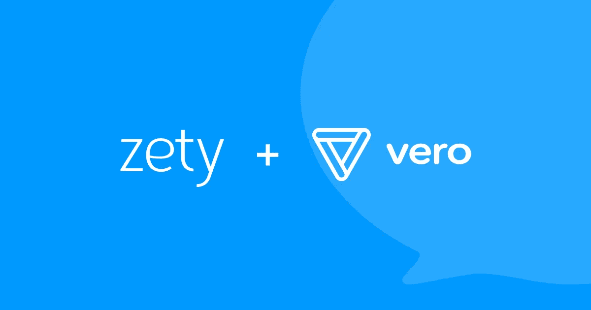
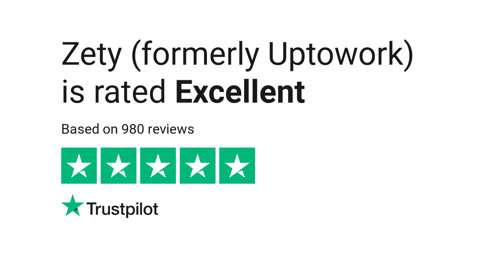

# Zety 如何使用电子邮件来提高客户参与度并增加收入

> 原文：<https://medium.com/swlh/how-zety-uses-email-to-drive-customer-engagement-and-increase-revenue-9fd8808daf65>

[Zety](http://zety.com) 帮助求职者在几分钟内创建一份专业简历。Kuba Koziej、Piotr Sosnowski 和 Kacper Brzozowski 成立于 2013 年，创建了在线简历生成器，旨在帮助人们找到他们梦想的工作。

第一次迭代， [InterviewMe](https://interviewme.pl/) ，是专门为波兰市场设计的。专注于一个受众使创始人能够在向更多受众推出产品之前，找到可扩展的渠道来推广 Zety 并获得客户。

在波兰市场取得初步成功后，创始人于 2016 年 7 月推出了 Uptowork(现为 [Zety](https://zety.com/) )，这是一款面向全球公司和求职者的在线简历软件。

# *“我们的使命是建立一个平台，简化全球求职者和公司的招聘流程”——KAC per*

使用 Zety 的软件已经制作了超过 450 万份简历。此外，凭借 800 多条评论和 Trustpilot 上的[五星评级，Zety 是业内最值得信赖的品牌之一。](https://www.trustpilot.com/review/zety.com)

Zety 还提供了一个庞大的人力资源知识库，提供“操作”指南、专业职业建议和简历模板示例，以激励客户并帮助他们开始使用该软件。超过 5000 万人阅读 Zety 的博客并依赖职业专家提供的建议。

Zety 的目标之一是帮助求职者回答那些棘手的面试问题，并获得他们梦想中的工作。为了帮助他们实现这一目标，该团队推出了每周简讯和基于事件的电子邮件活动，为他们的客户提供有用、相关和可操作的内容。

我很高兴听到 Zety 的技术创始人 Kacper Brzozowski 和自动化经理 Ania Litwinska 如何将他们的信息战略提升到一个新的水平，并增加了客户参与度。

# 将我们的信息战略提升到一个新的高度

我们的第一个简历生成器 InterviewMe 是一个 bootstrapped，所以在一开始，我们专注于产品开发。我们使用了一个简单的电子邮件工具，它具有基本的列表分段和自动化功能，可以与订阅者进行交流。

随着产品、团队和客户数量的持续增长，我们意识到是时候将我们的客户信息战略提升到下一个层次了。

# *“为了提高参与度，我们需要一个数据优先的解决方案来处理个性化的电子邮件活动和高级电子邮件交付计划”——KAC per*

对我们来说，推出国际职业网站和简历生成器应用程序 Zety 是一个重要的突破。它扩展了整个团队的优先级。一切都开始快速进行，团队很快就开始处理多个项目。

就确定正确的消息传递平台而言，这是一个重要的时刻。我们希望在不影响客户体验的情况下，大规模发送个性化信息，以吸引、转化和留住客户。

# 选择数据优先的解决方案

早期，我们的 CEO 库巴带领营销团队。在他永无止境地寻找伟大的营销内容的过程中，他偶然发现了 Vero 的指南，这使他了解了更多关于事件驱动的电子邮件营销的知识，并与团队分享了这些见解。

该团队后来确定了他们的消息平台的三个关键需求，这将有助于他们向前发展。

*   首先，我们需要一个可靠的解决方案，以一种对整个团队来说可读和可管理的方式收集和组织我们的客户数据。
*   其次，我们希望与客户建立更有益、更友好的关系。我们的团队需要一个解决方案，使他们能够设计和实施个性化的、[事件驱动的客户旅程](https://www.getvero.com/event-manager/)。
*   第三，我们需要一个灵活的解决方案，可以轻松地与外部 webhooks 和插件集成，在一个地方从博客、网站和应用程序中收集通用的行为数据。

我们很高兴地说，Vero 成功地满足了所有三个要求。

# 管理我们的客户数据和事件

我们从许多来源收集客户数据，因此我们需要确保这些数据在我们所有的系统中准确同步。在使用 Vero 之前，我们遇到过客户不止一次收到相同内容的问题。在 Vero 中，如果找不到唯一的 ID 号，客户资料会自动按电子邮件地址合并，因此我们再也不用担心客户会收到重复的内容。

Vero 还让我们团队中的每个人都可以轻松地看到由客户触发的[实时事件](https://www.getvero.com/event-manager/)，并使用这些数据来构建和优化活动。

# 创建个性化的电子邮件体验

我们团队现在有 60 人，几乎所有人都使用 Vero:来自开发电子邮件内容的作者；向负责设计和发送电子邮件营销活动的营销团队提取重要数据、指标和见解的分析师。我们的开发人员和测试人员也使用 Vero，他们负责整个业务中客户数据和软件集成的流动。

行为电子邮件活动由营销团队设计和管理。我们使用 [Liquid](https://help.getvero.com/articles/inserting-merge-tags-using-liquid-in-my-emails.html) 来显示电子邮件中的动态内容，并向客户传递相关的个性化信息。这是一个非常有用的功能，因为我们可以针对特定目的使用一个模板，而不是仅在一些细节上有所不同的多个活动。Vero 的数据检查器直观易用。

# *“我们的活动是一个活的有机体，我们向数百万客户发送电子邮件，所以问题经常会出现，我们总是可以依靠 Vero 的支持团队快速响应，并与我们合作找到一个好的解决方案”——Ania*

# 推动客户参与并增加收入

一系列自动化的电子邮件一步一步地引导客户完成特定的旅程。通过 Vero 的 [A/B 测试](https://help.getvero.com/articles/a-b-testing-email-campaigns)，我们专注于提高电子邮件的打开、点击和转换率。我们经常对主题行、正文、布局和 CTA 进行 A/B 测试。这是一个迭代过程，使我们能够优化电子邮件性能，并提高应用程序的参与度。

使用 Vero 的 AB 测试，我们观察到我们的客户对我们的纯文本电子邮件的参与度始终高于 HTML 电子邮件。此后，我们推出了所有纯文本电子邮件活动，并继续看到积极的结果。

我们表现最好的 AB 测试是一个后续的时事通讯活动，其中我们保留了与两天前发送的初始电子邮件相同的内容，AB 测试了主题行。后续活动只发送给没有打开第一封邮件的人。

有趣的是，**主题行 A** : *“几乎每个人都做错的一件事”*没有透露内容是什么，但观察到的打开率明显高于**主题行 B** : *“顶级职业专家解释如何让你的电梯推销奏效”*，后者解释了该主题。

# *“我们观察到电子邮件打开率增加了 73.96%”-Ania*

我们的“废弃购物车”电子邮件活动是我们转化率最高的活动之一。当客户在购买过程的最后一步退出时，我们会在 Vero 中触发一个事件，并向他们发送一条及时的消息以促使他们采取行动。

# *“Vero 让我们能够轻松地向目标用户提供个性化、及时的信息，并成功地将他们带回 Zety。这些活动对我们的底线有很大影响”——Ania*

Vero 的细分使我们能够锁定特定的用户群，并保持良好的域名声誉，以确保高投递率。我们使用 Vero 的细分来确保我们只向积极参与的联系人发送电子邮件，Vero 对 Liquid 的支持使我们能够添加动态内容，以确保我们的消息对所有客户都是相关的和个性化的。

我们还将 Vero 用于我们的交易电子邮件活动，如购买确认或密码重置。这些是我们需要发送给用户的最重要的电子邮件，Vero 会在事件触发后立即发送这些电子邮件。从一个平台发送交易和行为电子邮件让我们能够全面了解电子邮件性能和客户参与度，并为我们提供进一步的细分选项。

# “事实证明，Vero 在吸引客户和增加收入方面具有不可估量的价值。它使我们能够以个性化的方式帮助客户完成他们旅程的每一步，这是可扩展的”——Ania

想要建立更好的电子邮件体验并提高用户参与度？[了解 Vero](https://www.getvero.com/) 。

*原载于 2019 年 2 月 13 日*[*www.getvero.com*](https://www.getvero.com/resources/increasing-customer-engagement-and-revenue-with-email)*。*

## 这篇文章发表在 [The Startup](https://medium.com/swlh) 上，这是 Medium 最大的创业刊物，拥有+426，678 名读者。

## 在此订阅接收[我们的头条新闻](https://growthsupply.com/the-startup-newsletter/)。

