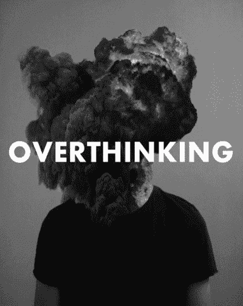

# 如何做每件事都很糟糕

> 原文：<https://medium.com/swlh/https-medium-com-blakekbailey-how-to-be-terrible-at-everything-36e0bb2f1277>

在专家的世界里，一个多面手痛苦而又值得的生活。

从小到大，我总是被告知要找到自己的激情。这是我余生唯一的追求。他们说，做你喜欢做的事，你一生中一天也不会工作。但是如果你喜欢什么都做一点呢？那么，你可能只是一个多面手。

## 通才是什么鬼？

大多数人都是专家，他们一生都专注于一个特定的领域。他们在一个领域积累了相当多的知识，然后就死了。这完全没有任何问题。做你喜欢的事情很可能是一件特别的事情，这很好，但对我来说不是。

我发现我会对某件事着迷，积累中等深度的知识，然后感到无聊，继续做下一件事。

大多数人在一两个非常具体的事情上有非常深刻的知识，而我在一系列事情上有中等水平的知识。

Appropriate GIF is, well……appropriate.

## 一般化的好处

如果你让一个多面手在任何一个领域与专家对抗，专家总是会赢。但是，多面手可以在更多的领域发挥作用，并看到这些领域之间的联系，而专家却不知道。

这也意味着多面手可以管理一个比他们聪明得多的团队(在他们各自的领域)，就他们的工作进行理性的对话，但让专家去深入研究细节。

多面手擅长发现不同想法之间隐藏的联系和潜在的关系。这就是为什么多面手往往是企业家和创新者。

## 一般化的缺点

不过，这肯定是有代价的。首先，雇主不想要多面手。他们希望有人能比任何人都更好地满足他们的特定需求。这完全说得通，为什么要付钱给一个在某个特定职位上不是最优秀的人呢？

初创企业是个例外。由于初创公司手头没有资金支付一群专家，第一批员工(和创始人)总是多面手。

这些人可以“身兼数职”，有效地做很多事情，足以完成工作。专业人士往往讨厌初创企业，需要更严格、更明确的结构才能取得成功。

Photo by [JOSHUA COLEMAN](https://unsplash.com/@joshstyle?utm_source=medium&utm_medium=referral) on [Unsplash](https://unsplash.com?utm_source=medium&utm_medium=referral)

另一方面，虽然多面手确实倾向于成为企业家和创新者，但前提是他们能够真正推动自己去做这些事情。

通常，拥有多种能力的人会因为不去运用它们而浪费它们。有时这是因为找工作很难，或者只是因为在一个专为专家构建的世界里，平衡如此多的利益已经完全耗尽。

## 旅程

在整个学校里，你被告知最多只能成为一名医生或律师。学校的全部目的是向你展示一大堆不同的学科，并指导你只选择一门永远做下去。

对我来说，这意味着我不断进化，并朝着不同的职业方向发展。我已经从神经科学(我可能会添加三个不同的版本)到非营利组织，到技术，最后到商业，技术和心理学的怪异网络。

试图适应“单一职业”的污名意味着这些转变压力极大，充满了自我怀疑和个人判断。为什么我就不能满足于一件事呢？

因为我不应该这样。

## 看到光明

几周前，我深陷自我怀疑之中。许多年后，我正处于决定离开我的创业公司的边缘。虽然我仍然相信这个使命和需要，但我知道我已经失去了对它的热情。

立刻，我的大脑跳入了下一步该做什么的问题中。如果这个公司不是我的大使命，那是什么？像往常一样，我想多了。

How I often feel.

这一天，我碰巧在老城亚历山大闲逛，无意中发现了我最喜欢的地方，鱼雷工厂艺术中心。在某些背景下，这是一个二战鱼雷和军火工厂，后来被改造成约 100 个艺术工作室，这是非常可怕的。

在我闷闷不乐的时候，我碰巧路过[马修·约翰斯顿](https://www.talltulips.com/)的工作室。这幅画立刻吸引了我的注意力，把我吸引了进去:

Summer Pond by Matthew Johnston ([https://www.talltulips.com/galleries/abstract-4](https://www.talltulips.com/galleries/abstract-4))

对我来说，它看起来像不同的皮层相互连接和染色。这让我想起了我从事神经科学研究的日子。

当我站在他的工作室里时，我注意到他有一大堆[不同的作品。与所有其他艺术家相比，他们的作品都趋向于一致的风格，这就引出了一个问题，他是如何进行这些转变的？所以我问他。](https://www.talltulips.com/galleries)

他说，这种转变不是立即发生的，在他的职业生涯中，随着他的热情，他逐渐从一个兴趣转向另一个兴趣。这不是一次消极的经历，而是一次积极的经历，随着他的兴趣不断发展。

这个概念对我来说是新的，它立即击中了要害。我在这里，试图强迫自己做一件事，寻找一个伟大的目的地。然而，在前进的道路上，我看不到真正驱动我的是什么，旅程。也许我的人生目标不是做一件事，而是做很多。

## 概括起来

想想看，达芬奇，历史上最伟大的学者之一，是画家、科学家、工程师、作家、植物学家、解剖学家、音乐家等等。如果有人强迫他一辈子做一件事，我们可能会被剥夺他的发明或蒙娜丽莎。

Photo by [Juan Di Nella](https://unsplash.com/@juandinella?utm_source=medium&utm_medium=referral) on [Unsplash](https://unsplash.com?utm_source=medium&utm_medium=referral)

接受你自然的思维方式同样重要，也同样困难。我们的社会偏爱专家，因为他们能发挥作用并很好地融入社会。正因为如此，我们周围的一切都在朝着这个方向推进。

如果你是这些人中的一员，你感觉不到你的归属或者没有找到你的职业，你可能只是一个多面手。你越早认识到这一点，你就能越早从中受益。

利用你独特的经验组合，让它为你服务。你可能会成为下一个达芬奇，所以不要想太多，让它发生吧。