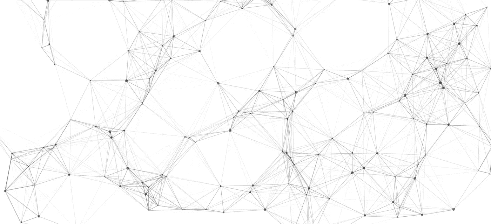

# Hotspot 在垃圾收集时如何扫描根集？

> 原文：<https://medium.com/swlh/https-medium-com-dredwardhyde-how-does-hotspot-jvm-scan-the-root-set-31c0bdbf3271>

*注意:我没有以任何方式参与 OpenJDK 开发。下面表达的所有观察* *都是我自己的。*

在我的第一篇文章中，我想谈谈一些有趣的解决方案，它们已经成为世界上最流行的 JVM 实现——Hotspot，最初由 Sun Microsystems 开发，然后由 Oracle 完善到目前的状态。

典型的 JVM 实现由多个子系统组成，比如各种解析器、类加载器、解释器、JIT 编译器等等，但是最复杂的子系统可能都与垃圾收集有关。

**首先**，JVM 运行时的唯一目的是执行兼容的字节码，也就是严格遵循 JLS 规则来分配和销毁对象、调用方法和提供系统资源——以及所有这些。所以，运行时就是以最有效的方式操作和执行字节码，而字节码本身由类和方法组成。在实践中，你必须解决许多奇妙的工程问题才能正确地操纵它。挑战之一是清理垃圾——不可及的对象——因为 Java 是一种具有自动内存管理的语言。类实例——对象——分配给堆的小区域，有自己的头和指向它的指针——在运行时无处不在，因此垃圾收集器必须了解字节码执行期间发生的一切，并且必须了解各种代码操作，如 JIT 编译、优化和对象锁定。因此，与垃圾收集相关的代码在 JVM 实现中几乎无处不在，工程师在实现新特性时必须牢记这一点。

**其次**，运行时环境必须非常有效地执行代码——以最小的性能损失且没有明显的停顿——甚至以某种方式更改代码以使其执行更快，因为，通常情况下，开发人员不会考虑性能，直到为时已晚。垃圾收集的优化有两种方式——尽量不要产生新的垃圾，或者尽可能快地消除垃圾。第一种类型可以由 JIT 编译器完成——它被称为*转义分析*,它允许 JIT 在堆栈上而不是堆上分配一些对象——因此对象将与封闭方法框架一起被销毁。但是第二类优化的负担完全落在垃圾收集器解决方案架构师和开发人员的肩上。

## 典型的 GC 循环包括哪些步骤？

例如，对于并发标记清除(CMS)收集器，并发收集周期通常包括以下步骤:

*   **停止所有应用程序线程，识别从根可达的对象集，然后恢复所有应用程序线程。**
*   当应用程序线程正在执行时，使用一个或多个处理器并发地跟踪可到达对象图。
*   使用一个处理器，同时重新跟踪自上一步跟踪以来修改过的对象图部分。
*   停止所有应用程序线程，并重新跟踪根和对象图中自上次检查以来可能已被修改的部分，然后恢复所有应用程序线程。
*   使用一个处理器，同时将不可到达的对象清除到用于分配的自由列表中。
*   使用一个处理器，同时调整堆的大小并为下一个收集周期准备支持数据结构。

今天我想谈谈 GC 循环的第一步——识别和标记根对象。这是 Hotspot 中所有垃圾收集器的共同步骤——串行、并行、CMS、G1 和 Shenandoah，它没有什么特殊的实现细节值得一提。

## 什么是根？

好吧，引用**垃圾收集手册**，*“有一些有限的赋值函数根集合，表示存放在存储器中的指针，赋值函数可以直接访问这些指针，而不需要通过其他对象”*。这是一个正确的定义，但是有更多的根源。在热点中，根是以下对象:

*   所有 JNI 全球参考
*   所有充气显示器
*   由引导类加载器加载的所有类(或禁用类卸载时的所有类)
*   所有 java 线程
*   对于每个 java 线程，线程执行堆栈上的所有局部变量和 JNI 局部变量引用
*   来自**宇宙的所有可见/可解释的物体::oops_do()**

稍后我将以并行垃圾收集器为例详细解释每一步，因为它的实现非常简单易读。

在并行 GC 中标记根从方法 **do_it():** 开始

**上述方法的第一步**是在 **Universe —** namespace 中标记一些对象，这些对象包含 VM 中已知的系统类和对象。整个初始世界初始化，像加载基类，调用**VM symbols::initialize()**，**system dictionary::initialize()**以及各种必要的对象分配都发生在 **Universe::genesis()** 中。所以我们需要在 **oops_do()** 方法中标记其中的一些:

**第二步**是在全局 JNI 句柄中标记引用:

全局 JNI 句柄列表驻留在 **JNIHandles** 类中:

一般来说， **OopStorage** 是线程安全(有时是并发的)交互的容器，它与 Java 堆中分配的对象的堆外引用进行交互。 **_global_handles** 包含用于 ArrayOutOfBoundsException、ArrayStoreException、ClassCastException、类加载器、JIT 编译器使用的 oop 包装器、编译器线程本身等的 JNI 句柄。在内部，每个 **OopStorage** 包含一组 **Blocks** 对象，而 **Block** 本身包含一个 **oop[]** 数组和一个指示哪些条目正在使用(已经分配但尚未释放)的位掩码。在垃圾收集期间，收集器必须知道所有的 **OopStorage** 对象及其引用强度，每个 **OopStorage** 为垃圾收集器提供对所有分配条目的迭代支持。所以 **oops_do()** 在 **OopStorage** 上最终调用 **iterate_impl()** 方法，该方法遍历**块**:

然后每个**块**迭代所有存储在 **_data** 数组中的 **oops** :

**下一步**很棘手——我们需要标记存储在线程堆栈上的所有 Java 对象引用以及与线程相关的内部 JVM 对象。进程从**线程开始::oops_do()** 方法:

我们使用*“史上最丑的 for 循环”*遍历所有线程:

并调用 **JavaThread::oops_do()** :

在 **Thread::oops_do()** 中，我们标记所有活动的 JNI 句柄、可能的 **_pending_exception** 、在**handle area * _ handle _ area**中的所有线程本地句柄，保留用于在 VM 和线程本地监视器内分配句柄:

在**active _ handles()->oops _ do(f)**中，我们遍历并标记每个线程的所有活动 JNI 句柄，因为**JNIHandleBlock * _ active _ handles**中的每个 **JNIHandleBlock** 都包含强根——对作为参数传递给 JNI 方法的 Java 对象的引用:

JNI 方法是非托管区域，所以作为参数传递的对象被认为是活动的，我们需要标记它们:

每个线程也可以持有任意数量的本地胖锁— **ObjectMonitor** 对象。它们都必须用**object synchronizer::thread _ local _ used _ oops _ do()**方法进行标记，因为它们包含向后对象指针:

JavaThread::oops_do() 中的下一个主要步骤是遍历当前线程的执行堆栈。什么是执行堆栈？这是一组帧，其中一些来自本机方法(如 JIT 编译)，一些来自解释器，其他的只是 **StubRoutine** 条目。每个这样的帧都包含局部变量和传递的参数，它们在垃圾收集期间就像强根一样。所以我们需要识别他们并做好标记。在**帧**中标记根开始于**帧::oops_do_internal()** 方法:

如果 frame 是 **StubRoutine** 条目，那么我们需要标记传递的参数、调用的接收者(如果是非静态调用)和保存在 **JNIHandleBlock** 块中的对象:

如果 frame 被解释，那么调用**frame::oops _ interpreted _ do()**方法。这里我们标记 **BasicObjectLock** 对象，因为它们包含对 Java 对象的引用，就像胖锁一样。然后我们需要标记当前帧中的所有局部引用。这就是使用 **OopMapCache** 的地方——这个缓存保存了解释帧中对象引用的位置:

每个**instance klass**(Java 类的 VM 级表示)只有一个 **OopMapCache** 实例，并且必须在第一次请求时被延迟分配。然后在 **OopMapCache::lookup()** 方法中查询并填充。但是在 **OopMapCache** 的查找中有一个微妙的细节——它发生在**全局安全点**。这意味着执行堆栈的平均深度极大地影响了由根标记引起的停顿持续时间。这种模式甚至被用在最现代的垃圾收集器中，如 G1 和谢南多厄。

对于编译帧，我们有一套稍微不同的工具。首先， **CodeCache** 保存各种生成的代码——编译的 java 方法、运行时存根、转换帧等。 **CodeCache** 中的条目都是 **CodeBlob** 的。 **CodeCache** 可以更新，例如在 C1 用**Compilation::install _ code()**方法编译之后或者在去优化事件期间。因此，概要分析和非概要分析的 JIT 生成的方法(nmethods)都存储在这里。通过检查**frame::oops _ do _ internal()**中的**code cache::contains(PC())**，我们可以判断它是否是本机方法，并在**frame::oops _ code _ blob _ do()**中适当地处理它:

每个**代码块**保存**不可变的 OOP mapset * _ OOP _ maps—**OOP map**条目的**集合。 **OopMapValue** 代表一个单独的 **OopMap** 条目，并为特定 pc 描述每个寄存器和帧堆栈槽是否是对 Java 对象的引用。如果它是一个引用( **oop** )，那么我们必须像往常一样将其标记为强根。

**markfrorootstask::do _ it()**中根标记的下一步是通过调用**object synchronizer::oops _ do()**来标记所有全局 **ObjectMonitor** 对象。这一过程也发生在全球安全点。

在 **Management::oops_do()** 中，我们标记了存储在 **MemoryService** 和 **ThreadService** 中的所有根。 **MemoryService** 提供虚拟机端的监控和管理支持，并保存对**内存池**和**内存管理器**实例的引用。每个**内存池**保存从**内存池 Impl.setUsageThreshold()** 方法传递的对**传感器** Java 对象— **_usage_sensor** 和 **_gc_usage_sensor** 的引用。**线程服务**包含引用 Java 线程的**线程快照**对象。上述所有对象也必须标记为强根。

在 **JvmtiExport::oops_do()** 中，我们标记了所有 Java 对象，这些对象的引用被过渡性地存储在 **JvmtiBreakpointCache** 中，并直接从 JVM TI 分配。

**根标记过程的下一个重要步骤**是从**系统字典**中识别所有引用的强根。在**system dictionary::oops _ do()**中，我们标记了系统和平台 **ClassLoader** s 等的 VM 端镜像。请参见下面代码片段中的注释:

**invoke_method_table()** 在**SymbolPropertyTable * _ invoke _ method _ table**上被调用。**符号属性表**是系统内部符号到指针的映射。例如，这个表保存了对 JVM 定义的低级内部方法的引用。例如，在调用点的多态方法查找期间，可以在**system dictionary::find _ method _ handle _ intrinsic()**方法中添加 **SymbolPropertyTable** 的条目。

**ClassLoaderDataGraph::always _ strong _ CLD _ do()**标记来自**块**的所有 Java 对象引用。这些对象是与当前 **ClassLoaderData** 相关联的 java/lang/ClassLoader 实例、常量池数组、模块等。所有对象都有相应的**类加载器**的相同生命周期。

而作为标记根的最后一步， **AOTLoader::oops_do()** 必须标记所有引用的 Java 对象。 **AOTLoader** 用于 [JEP 295](https://openjdk.java.net/jeps/295) 中增加的提前编译。 **AOTCompiledMethod** 对象包含对封闭类的引用，而 **AOTCodeHeap** 包含 Java 对象指针 **_oop_got** ，由 Hotspot 修补:

# 结论

甚至 GC 循环的开始——标记根的过程——也相当复杂。大多数时候，人们在谈论 Hotspot 中的垃圾收集器时，更愿意几乎不提这个事实。它的设计者和实施者决定在 global safepoint 采取上述一些步骤。这些步骤的持续时间(safe point 也是，没有与垃圾收集无关的额外步骤)很大程度上取决于你的代码风格和应用程序的结构。更多的线程和更高的执行堆栈平均深度，更多的局部变量——将使全局安全点变得更长。
在企业部署中，这些数字很容易实现 Wildfly 等服务器上的所有应用程序共享同一个堆，最多可以有 1000 个线程，平均深度为 20-40 帧。

例如，在以下 OpenJDK 版本中:

那些 JVM 选项:

运行 4 个应用程序的单个 Wildfly 10.1 实例总共有 304 个 Java 线程，平均执行堆栈深度约为 20 帧，我得到了这些结果:

触发:自上次 GC 以来的时间(300001 ms)大于保证间隔(300000 ms)
【并发复位 1222M- > 1222M(1678M)，2.952 ms】
**【暂停初始化标记，14.636 ms】**
【并发标记 1222M- > 1222M(1678M)，102.393 ms】

**触发:自上次 GC 以来的时间(300001 ms)大于保证间隔(300000 ms)
【并发复位 1242M- > 1242M(1257M)，3.026 ms】
**【暂停初始化标记，12.033 ms】**
【并发标记 1242M- > 1242M(1257M)，104.882 ms】
**【暂停结束标记】****

**如你所见，**初始化标记**暂停(包括扫描根集)是这里的主要暂停。**

**在当前状态下，有进一步改进的空间，可以通过单独停止每个线程来使扫描根集的过程并行进行。在我个人看来，GC 周期中暂停的持续时间应该取决于堆的一些内部指标，比如它的大小，或者活动对象的数量。在使用最先进的收集器(如 Shenandoah)时，使用 mutator 同时扫描根集将减少 GC 周期中最大的 STW (stop-the-world)暂停的持续时间。**

**目前，这种 STW 技术在 **Hotspot** 和 **OpenJ9** 实现中都有使用，但我希望这种情况在未来会有所改变。**