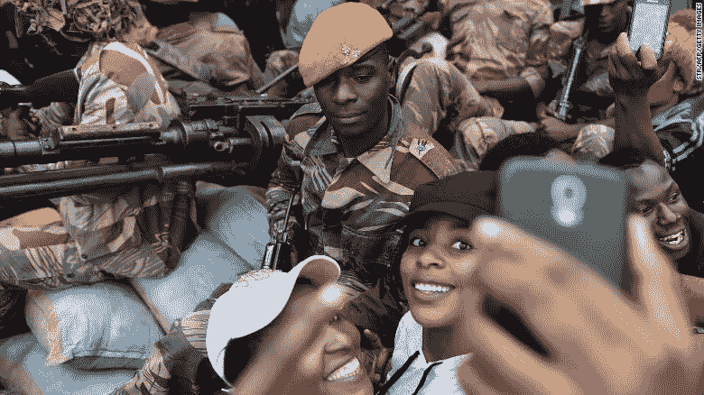

# 我在一场军事政变中睡着了

> 原文：<https://medium.com/swlh/https-medium-com-i-slept-through-a-military-coup-ea3853bcea1f>

Zimbabwe Coup in action (Photo credit [Reuters](https://www.reuters.com/))

## 如果看起来**像鸭子**，游起来**像鸭子**，呱呱叫**像鸭子**，**那么**很可能**就是**一只**鸭子**。这是一场政变！

当军事接管的剧本被写出来时，通常没有普通人的角色。

这主要是因为两个原因；政变在很大程度上依赖于秘密，直到他们最终成功，政变的暴力性质不是由普通人在街上进行的。

2017 年 11 月**14 日，星期二**，我照常上班。

直到中午时分，这一天一直进展得相当平静。关于看到军用坦克从津巴布韦首都哈拉雷郊区向城市移动的报道开始在推特上的相关市民中流传。

就在一天前，陆军参谋长在向媒体发表的声明中谴责总统解雇了他的盟友副总统 Mnangagwa。

这位副总统曾被许多人视为接替 93 岁高龄的罗伯特·穆加贝的热门人选，但据说穆加贝的妻子格蕾丝也怀有当总统的野心。

当我看到这些报道时，我认为它们只是来自那些想要描绘一幅不存在的画面的巨魔的假新闻。你不会想到在穆加贝政权下会发生政变，更不用说去想了。此外，军方公关团队淡化了这些报道，称坦克正在进行自动恢复演习，以恢复该地区发生故障的机器。

下班后，我驱车 40 公里回家，我没有看到任何军事行动即将发生的迹象——现在我想起来了，人们可以用什么迹象来判断这种性质的事情即将发生？

我到家时相当累，大约晚上 9 点左右，我上床睡觉了。

以下是一天中发生的事件的时间表，我认为这些事件是假新闻，以及我睡觉时发生的事情。我只能在与通过 WhatsApp 了解最新消息的朋友交谈后，以及随着事件的发展，关注同胞们整夜发布的推文和脸书警报后，整理出这个时间表。

# 好消息！！！

正如之前所承诺的，这本书更深入地探讨了这个话题，现在已经为你准备好了。

Purchase the book: |[Amazon](https://t.co/s9z9MLp7LT?amp=1) |[Gumroad](https://gum.co/iDLha) | [Bitcoin](https://t.me/Blockchain_Agriculture)|

**时间线从周二中午到周三上午:**

**周二中午；军用装甲车出现在通往津巴布韦首都哈拉雷的高速公路上，傍晚时分，它们抵达并组成车队穿过这座城市。**

**星期二下午；**穆加贝出席津巴布韦内阁的每周会议。内阁会议后的傍晚，执政党发言人指控陆军参谋长叛国和煽动叛乱。

**星期二晚上；**与格雷斯·穆加贝结盟的执政党 ZANU-PF 党青年团的领导人发表了一份新闻声明，称青年团“*准备好去死*”试图阻止军队罢免 Mugabe。

**晚上十点半；**情报组织[的安全主管](https://en.wikipedia.org/wiki/Central_Intelligence_Organisation)在离开穆加贝的家后被士兵逮捕。

**晚上 11 点—凌晨 04 点；**士兵接管津巴布韦广播公司(ZBC)的办公室。

在哈拉雷的北郊可以听到枪声和炮声，这里是包括总统在内的许多政府官员的住所。

士兵们还封锁了津巴布韦议会、政府大楼、法院和哈拉雷的总统官邸。

然后，军队开始搜查高等教育部长、地方政府部长及其家人的家。这些房屋在凌晨 2:30 左右遭到军队的枪击，之后停火协议允许这两个家庭逃到穆加贝的家中。

军队也突袭了财政部长的家，但是他们遭到了他的私人以色列保安的攻击。一名警卫被杀。部长被军队拘留，在他的房子里发现了 1000 万美元的现金。

> 警察的职责受到了限制

**周三早上 5 点；身着迷彩服、头戴贝雷帽的津巴布韦陆军参谋长少将在 ZBC 的一次广播中代表津巴布韦国防军发表讲话。**

Major General Sibusiso Moyo on ZBC (Al Jazeera )

**星期三早上 6 点**；我醒来。周三上午的大部分时间里，国家控制的电视台和电台只是重播了莫约的声明，没有进一步的新闻更新，并在正常节目的同时播放了上世纪 80 年代关于独立的爱国歌曲。

国有报纸 [*《先驱报》*](https://www.herald.co.zw/business-as-usual-countrywide/) 用头条新闻淡化军方的行动，其网站以“生存与发展:津没有军事接管”为题开设了一个博客。

**余波**

军方、南部非洲发展共同体(SADC)地区集团的特使和教会的谈判代表随后试图说服穆加贝在和平辞职过程中下台。穆加贝是一个很难与之谈判的人，他坚持己见。

他拒绝下台。

Mugabe, centre, presides a graduation ceremony at Zimbabwe Open University on Friday 17 N0v 2017 ([Reuters](https://www.reuters.com/))

津巴布韦脱离英国独立战争的退伍军人随后呼吁在 2018 年 11 月 18 日星期六举行大规模反穆加贝街头抗议活动。成千上万的抗议者涌上津巴布韦街头，要求穆加贝辞职。

A soldier poses for a selfie with two women at a march in Harare on Saturday 19 Nov 2017 ([Reuters](https://www.reuters.com/))

和平示威由独立战争老兵组织，并得到 ZANU-PF 大佬和军队的支持，包括在距离州议会 200 米内的静坐抗议，州议会是穆加贝独裁统治的神经中枢。

执政党坚持要求穆加贝在周一中午前辞去总统职务，否则将面临弹劾。但是在一次电视直播讲话中，穆加贝出乎意料，没有说他将在 12 月主持非洲民族联盟-爱国阵线的代表大会。

只是在 11 月 21 日，当 ZANU-PF 和主要反对党民主变革运动(MDC)在议会启动弹劾计划时，这位老人就投降了！

> 当议会发言人宣读他的辞职信时，整个议会沉浸在一片欢腾之中——这种欢腾后来蔓延到大街上和乡村。

最后，只要一个暴君最终倒台了，我在历史展开时睡觉的事实就不再重要了。

*Asante Sana*

*如果你喜欢这篇文章，请关注我的*[*Twitter*](https://twitter.com/Tendy263)*/*[*Linkedin*](https://www.linkedin.com/in/tendai-tomu-75903612/)*。你也可以在这里给我买一杯***！**