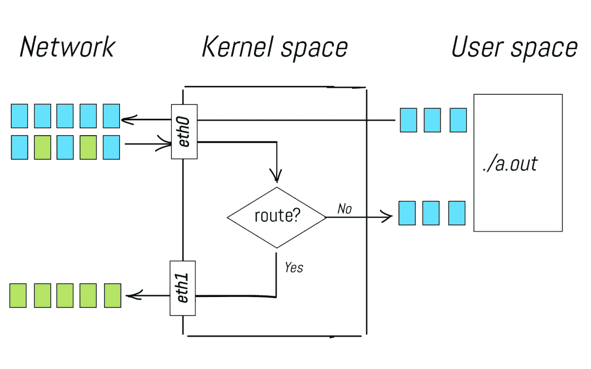
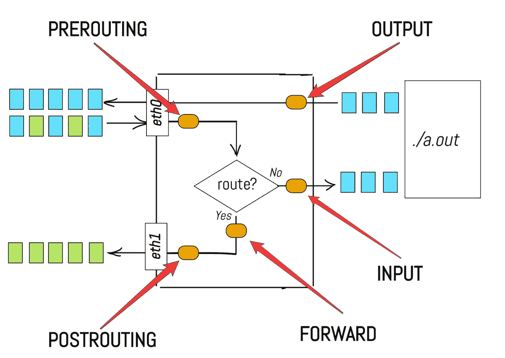
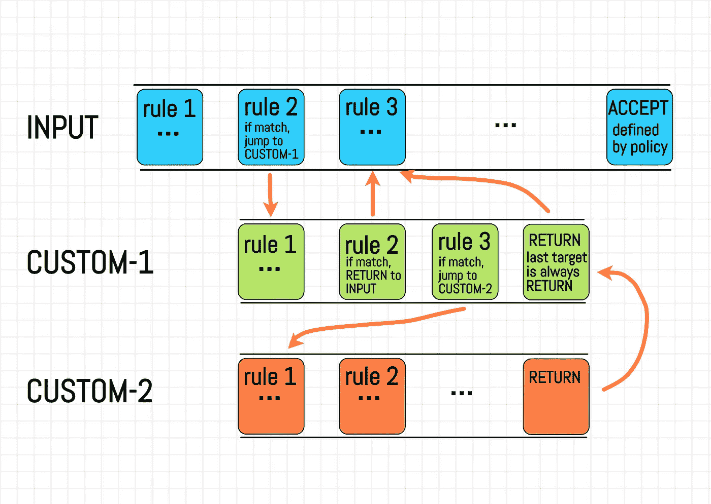
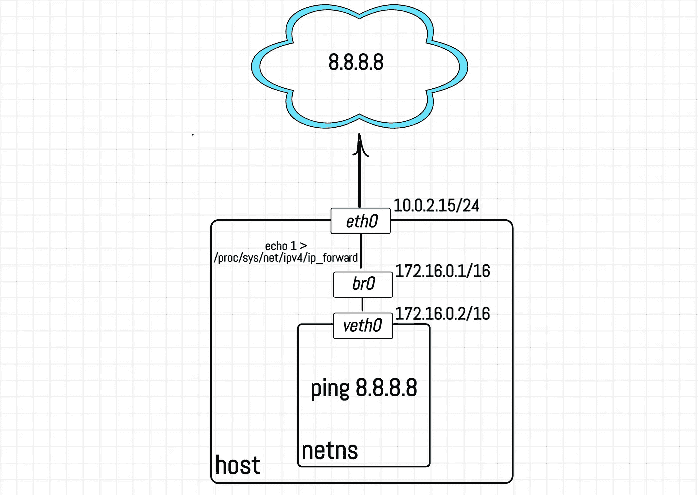
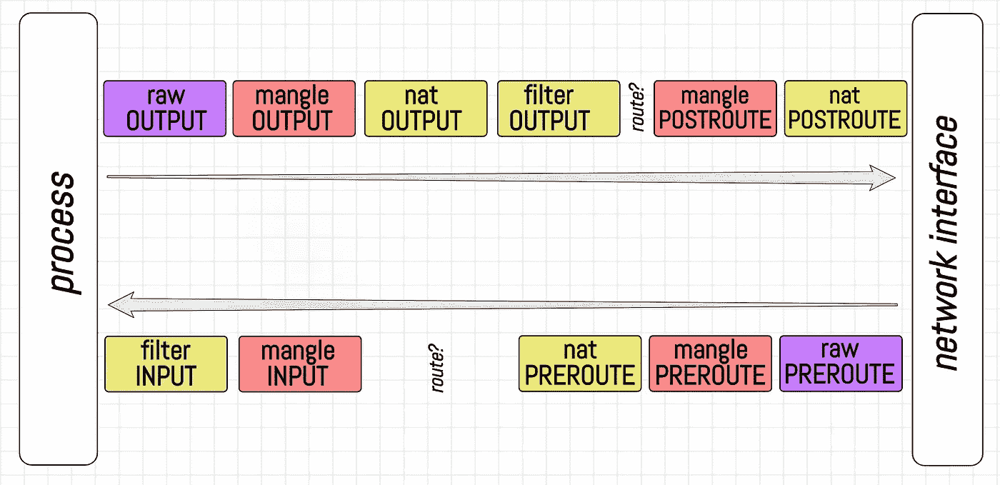
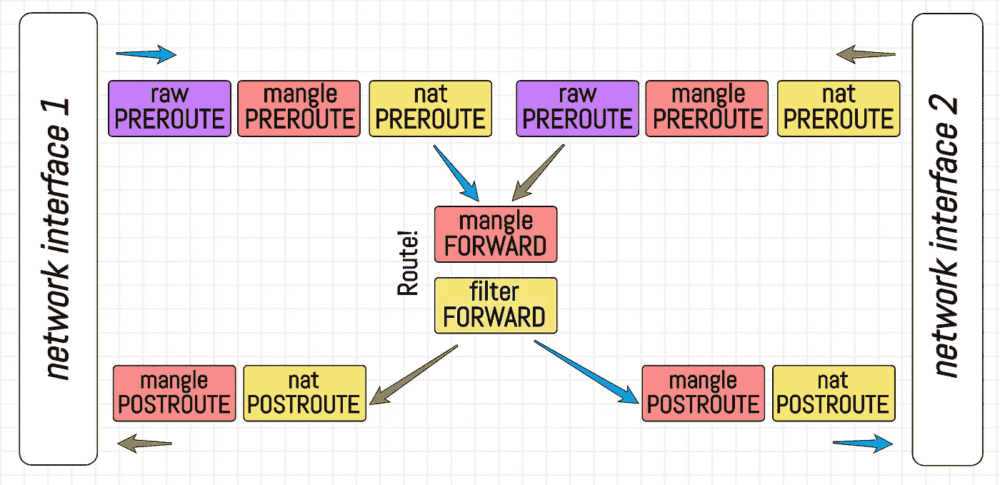

# 外行人的 iptables 101

> 原文：<https://medium.com/swlh/https-medium-com-iximiuz-laymans-iptables-101-9277f9072afb>

# 序

哎呀，现在轮到我来介绍 iptables 了！有数百甚至数千篇关于这个主题的文章，包括介绍性的文章。我不会把正式的[定义](https://www.netfilter.org/projects/iptables/index.html)放在这里，也不会把[有用命令](https://www.digitalocean.com/community/tutorials/how-to-list-and-delete-iptables-firewall-rules)的列在[里。在阅读所有这些*表格*、*规则*、*目标*和*政策*之前，我宁愿尝试使用外行的术语并尽可能地潦草地给你一些关于该领域的见解。顺便说一下，当我第一次面对这个工具时，我也被这个术语搞糊涂了！](https://www.digitalocean.com/community/tutorials/iptables-essentials-common-firewall-rules-and-commands)

大概你已经知道 **iptables** 跟 **IP** 包有关系。也许更深一层——数据包过滤。还是最深的——包修改！也许你已经听说过，一切都发生在内核端，不涉及用户空间代码。为此，iptables 提供了一种特殊的语法来编码不同的影响包的规则…

# Linux 网络堆栈

…但是在试图对内核空间中的数据包的幸福生活产生影响之前，让我们试着理解它们的世界。当包被创建时，它们在内核中的路径是什么，它们的来源和目的地是什么，等等？看看下面的场景:

*   数据包到达网络接口，通过网络堆栈，到达用户空间进程。
*   数据包由用户空间进程创建，发送到网络堆栈，然后传送到网络接口。
*   数据包到达网络接口，然后根据某些路由规则被转发到另一个网络接口。

所有这些场景中的*共性*是什么？基本上，它们都描述了从一个网络接口通过网络栈到一个用户空间进程(或另一个接口)的数据包路径的铺设和返回。当我在这里说*一个网络栈*时，我只是指由 Linux 内核提供的处理网络数据传输和接收的一堆层。



中间的路由部分由 Linux 内核的内置能力提供，也称为 *IP 转发*。向`/proc/sys/net/ipv4/ip_forward`文件发送一个非零值激活不同网络接口之间的数据包转发，有效地将 Linux 机器转变为虚拟路由器。

显而易见，设计合理的网络堆栈应该具有不同的数据包处理逻辑阶段。例如，*预路由*阶段可以位于数据包接收和实际路由过程之间。另一个例子是*输入*阶段，它位于用户空间进程之前。



事实上，Linux network stack 确实提供了这种阶段的逻辑分离。现在，让我们回到我们的主要任务—数据包过滤和/或更改。如果我们想丢弃一些到达 *a.out* 进程的数据包，该怎么办？例如，我们可能不喜欢带有某个特定源 IP 地址的数据包，因为我们怀疑这个 IP 地址属于某个恶意用户。如果在网络堆栈中有一个钩子，对应于输入阶段，并允许一些额外的逻辑应用于输入包，那就太好了。在我们的例子中，我们可能希望注入一个函数来检查数据包的源 IP 地址，并根据这个信息决定是丢弃还是接受数据包。

概括地说，我们需要一种方法来注册一个任意的回调函数，以便在给定阶段对每个传入的包执行。幸运的是，有一个名为 [**netfilter**](https://www.netfilter.org/) 的项目正好提供了这种功能！netfilter 的代码驻留在 Linux 内核中，并将所有这些扩展点(*即钩子*)添加到网络堆栈的不同阶段。值得注意的是， *iptables* 只是配置 netfilter 钩子的几个用户空间前端工具之一。这里还要注意的是，netfilter 的功能不受网络(即 IP)层的限制，例如，修改以太网帧也是可能的。然而，顾名思义， **ip** tables 关注的是从[网络](https://en.wikipedia.org/wiki/Network_layer) ( **IP** )开始的层及以上。

# 链条(开始)

现在，让我们最终尝试理解 iptables 术语。您可能已经注意到，我们在网络堆栈中使用的名称对应于 iptables。但是究竟为什么有人会用*链*这个词呢？我不知道背后有什么趣闻，但解释这种命名的一种方法是看一下用法:

```
*# add rule "LOG every packet" to chain INPUT* 
$ iptables --append INPUT --jump LOG *# add rule "DROP every packet" to chain INPUT* 
$ iptables --append INPUT --jump DROP
```

在上面的代码片段中，我们向输入*阶段*添加了多个回调，这绝对是合法的 iptables 用法。这意味着回调的执行顺序必须被定义。实际上，当一个新的包到达时，首先执行第一个添加的回调(记录包)，然后执行第二个回调(丢弃包)。因此，我们所有的回调都在一个！但是这个链是由它所在的逻辑阶段命名的。现在，让我们结束链，转到 iptables 的其他部分。稍后，我们将会看到，在链抽象中有一些模糊性。

# 规则、目标和政策

接下来,*是规则*。我们在上面的例子中使用的规则是基本的。首先，我们无条件地为输入链中的每个数据包记录一个内核消息，然后我们无条件地从网络堆栈中丢弃每个数据包。然而，规则可以更复杂。一般来说，规则为数据包和*目标*指定标准。为了简单起见，现在让我们将*目标*定义为一个动作，如记录、接受或丢弃，并看一些例子:

```
*# block packets with source IP 46.36.222.157 
# -A is a shortcut for --append 
# -j is a shortcut for --jump* 
$ iptables -A INPUT -s 46.36.222.157 -j DROP *# block outgoing SSH connections*
$ iptables -A OUTPUT -p tcp --dport 22 -j DROP *# allow all incoming HTTP(S) connections*
$ iptables -A INPUT -p tcp -m multiport --dports 80,443  \ 
    -m conntrack --ctstate NEW,ESTABLISHED -j ACCEPT 
$ iptables -A OUTPUT -p tcp -m multiport --dports 80,443 \ 
    -m conntrack --ctstate ESTABLISHED -j ACCEPT
```

正如我们所看到的，规则的标准可能相当复杂。在决定采取行动之前，我们可以检查数据包的多个属性，甚至 TCP 连接的一些属性(由于 *conntrack* 模块，这意味着 netfilter 是有状态的)。对此我很抱歉，但作为一名程序员，我需要编写一些代码:

```
def handle_packet(packet, chain): 
    for rule in chain: 
        modules = rule.modules 
        for m in modules: 
            m.ensure_loaded()         conditions = rule.conditions 
        if all(c.apply(packet) for c in conditions): 
            *# terminal target, break the chain* 
            if rule.target in ('ACCEPT', 'DROP'): 
                return rule.target             *# TODO: handle other targets*  *# TODO: what shall we do if there is no single 
    #       terminal target in the whole chain?*
```

这个想法很简单。按顺序应用链中的所有规则，直到遇到终端目标或到达链的末尾。这里我们可以注意到伪代码中一个未覆盖的分支。我们需要一个默认的*动作*(即目标)，用于设法到达链末端而没有同时被分派到任何终端目标的数据包。而设置它的方式叫做**策略**:

```
*# check the default policies*
$ sudo iptables --list-rules # or -S
-P INPUT ACCEPT 
-P FORWARD ACCEPT 
-P OUTPUT ACCEPT *# change policy for chain FORWARD to target DROP*
$ iptables --policy FORWARD DROP # or -P
```

# 链条(续)

最后，让我们了解一下为什么目标被称为*目标*，而不是行动或其他什么。让我们看看我们用来设置规则`iptables -A INPUT -s 46.36.222.157 -j DROP`的命令，其中`-j`代表`--jumps`。也就是说，作为规则的结果，我们可以*跳跃*到一个目标。从`man iptables`开始:

```
-j, --jump target This specifies the target of the rule; i.e., 
        what to do if the packet matches it. The target 
        can be a user-defined chain (other than the one 
        this rule is in), one of the special builtin 
        targets which decide the fate of the packet 
        immediately, or an extension (see EXTENSIONS below).
```

在这里！**用户自定义链！像往常一样，首先让我们来看看这个例子:**

```
$ iptables -P INPUT ACCEPT
*# drop all forwards by default*
$ iptables -P FORWARD DROP 
$ iptables -P OUTPUT ACCEPT *# create a new chain*
$ iptables -N DOCKER *# or --new-chain* *# if outgoing interface is docker0, jump to DOCKER chain*
$ iptables -A FORWARD -o docker0 -j DOCKER *# add some specific to Docker rules to the user-defined chain*
$ iptables -A DOCKER ... 
$ iptables -A DOCKER ... 
$ iptables -A DOCKER ... *# jump back to the caller (i.e. FORWARD) chain*
$ iptables -A DOCKER -j RETURN
```

但是为什么呢？正如我们在上面看到的，链与网络堆栈的预定义逻辑阶段有着一一对应的关系。用户可以定义自己的链这一事实是否意味着我们可以为内核的处理管道引入新的阶段？我不这么认为。我可能完全错了，但对我来说，这似乎违反了[单一责任原则](https://en.wikipedia.org/wiki/Single_responsibility_principle)。一个*链*似乎是一个命名规则序列的很好的抽象。在传统编程语言中，链和[命名的子程序](https://en.wikipedia.org/wiki/Subroutine)(又名函数，又名过程)有一些相似之处。从一个链中的任意位置跳到另一个链的开头，然后返回到调用方链的能力使得相似性更强。但是，*预路由*、*输入*、*正向*、*输出*和*后路由*链具有特殊含义，不能被覆盖。我可以在一些具有特殊用途的编程语言中看到与 *main()* 函数的一些相似之处，但是链的这种双端性质使得 iptables 的学习曲线对我来说相当陡峭。

总而言之，用户定义的链是一种特殊的目标，用作规则的命名序列。用户定义链的功能相当有限。例如，用户定义的链不能有策略。从`man iptables`开始:

```
-P, --policy chain target         Set the policy for the chain to the given target. 
        See the section TARGETS for the legal targets. Only 
        built-in (non-user-defined) chains can have policies, 
        and neither built-in nor user-defined chains can be 
        policy targets.
```



显然，上面的代码片段应该进行重大重写，以包含用户定义链的处理。

# 桌子

嗯，我们快到了！我们已经讨论了*链条*、*规则*和*政策*。现在终于到了学习桌子的时候了。毕竟这个工具叫 ip **表**。

实际上，在上面的所有例子中，我们都隐式地使用了一个名为`filter`的表。我不确定一个*表*的官方定义，但是我总是把一个表称为一个逻辑分组和链的隔离。正如我们已经知道的，有一个管理数据包过滤的链表。但是，如果我们要修改一些包，还有另外一个表，叫做 *mangle* 。能够在转发阶段过滤数据包是绝对合理的要求。然而，在那个阶段修改包也是可以的。因此，*过滤器*和*轧车*工作台都将有前进链。然而，这些链是完全独立的。

不同版本的内核支持的表的数量会有所不同，但最突出的表通常都在这里:

```
filter:
    This is the default table (if no -t option is passed). 
    It contains the built-in chains INPUT (for packets destined 
    to local sockets), FORWARD (for packets being routed through 
    the box), and OUTPUT (for locally-generated packets).nat: 
    This table is consulted when a packet that creates a new
    connection is encountered. It consists of three built-ins: 
    PREROUTING (for altering packets as soon as they come in), 
    OUTPUT (for altering locally-generated packets before routing),
    and POSTROUTING (for altering packets as they are about to go 
    out). IPv6 NAT support is available since kernel 3.7.mangle: 
    This table is used for specialized packet alteration. Until 
    kernel 2.4.17 it had two built-in chains: PREROUTING (for 
    altering incoming packets before routing) and OUTPUT (for 
    altering locally-generated packets before routing). Since 
    kernel 2.4.18, three other built-in chains are also supported:
    INPUT (for packets coming into the box itself), FORWARD (for 
    altering packets being routed through the box), and POSTROUTING 
    (for altering packets as they are about to go out).raw:
    This table is used mainly for configuring exemptions from 
    connection tracking in combination with the NOTRACK target. It 
    registers at the netfilter hooks with higher priority and is 
    thus called before ip_conntrack, or any other IP tables. It 
    provides the following built-in chains: PREROUTING (for packets 
    arriving via any network interface) OUTPUT (for packets 
    generated by local processes).
```

这里真正有趣的是桌子之间链条的碰撞。如果*过滤，一个数据包会发生什么？输入*链有一个掉落目标，但*损坏。输入*链有一个接受目标，两者都在肯定规则内？哪个链优先级更高？我们试着去看看吧！

为此，我们需要将日志目标添加到所有表的所有链中，并进行以下实验:



我们需要同一流上的客户机和路由器网络栈的日志，以便对表和链之间的关系有一个全面的了解。为此，我们将通过使用[网络名称空间](https://en.wikipedia.org/wiki/Linux_namespaces#Network_(net))特性在一台 Linux 主机上模拟 2 台机器。实验的主要部分是记录 IP 数据包。长期以来，非根命名空间的日志目标被禁用，以防止潜在的主机拒绝来自隔离进程的服务。幸运的是，从 Linux 内核 4.11 开始，有一种方法可以通过向`/proc/sys/net/netfilter/nf_log_all_netns`发送一个非零值来启用名称空间的 netfilter 日志。**但是生产上不要这样！**

首先，让我们创建一个网络名称空间:

```
*# run on host:* $ unshare -r --net bash*# namespace (same terminal session):*
$ echo $$ 2979 *# remember this PID*
```

在第二个终端中，我们需要配置主机:

```
*# run on host:*$ sudo -i*# create a veth interface*
$ ip link add vGUEST type veth peer name vHOST*# move one of its peers to network namespace*
$ ip link set vGUEST netns 2979  # PID from above*# create linux bridge*
$ ip link add br0 type bridge*# wire vHOST to br0*
$ ip link set vHOST master br0*# set IP addresses and bring devices up*
$ ip addr add 172.16.0.1/16 dev br0
$ ip link set br0 up $ ip link set vHOST up*# turn the host into a virtual router*
$ iptables -t nat -A POSTROUTING -o eth0 -j MASQUERADE
$ echo 1 > /proc/sys/net/ipv4/ip_forward*# and don't forget to enable netfilter logs in namespaces*
$ echo 1 > /proc/sys/net/netfilter/nf_log_all_netns
```

现在完成名称空间端的网络接口设置:

```
*# run in network namespace:**# bring devices up*
$ ip link set lo up
$ ip link set vGUEST up*# configure IP address*
$ ip addr add 172.16.0.2/16 dev vGUEST*# set default route via br0*
$ ip route add default via 172.16.0.1
```

签出并更新命名空间中的 iptables 规则:

```
*# run in network namespace:*$ iptables -S -t filter
-P INPUT ACCEPT
-P FORWARD ACCEPT
-P OUTPUT ACCEPT$ iptables -S -t nat
-P PREROUTING ACCEPT
-P INPUT ACCEPT
-P OUTPUT ACCEPT
-P POSTROUTING ACCEPT$ iptables -S -t mangle
-P PREROUTING ACCEPT
-P INPUT ACCEPT
-P FORWARD ACCEPT
-P OUTPUT ACCEPT
-P POSTROUTING ACCEPT$ iptables -S -t raw
-P PREROUTING ACCEPT
-P OUTPUT ACCEPT$ iptables -t filter -A INPUT \
    -j LOG --log-prefix "NETNS_FILTER_INPUT "
$ iptables -t filter -A FORWARD \
    -j LOG --log-prefix "NETNS_FILTER_FORWARD "
$ iptables -t filter -A OUTPUT \
    -j LOG --log-prefix "NETNS_FILTER_OUTPUT "$ iptables -t nat -A PREROUTING \
    -j LOG --log-prefix "NETNS_NAT_PREROUTE "
$ iptables -t nat -A INPUT \
    -j LOG --log-prefix "NETNS_NAT_INPUT "
$ iptables -t nat -A OUTPUT \
    -j LOG --log-prefix "NETNS_NAT_OUTPUT "
$ iptables -t nat -A POSTROUTING \
    -j LOG --log-prefix "NETNS_NAT_POSTROUTE "$ iptables -t mangle -A PREROUTING \
    -j LOG --log-prefix "NETNS_MANGLE_PREROUTE "
$ iptables -t mangle -A INPUT \
    -j LOG --log-prefix "NETNS_MANGLE_INPUT "
$ iptables -t mangle -A FORWARD \
    -j LOG --log-prefix "NETNS_MANGLE_FORWARD "
$ iptables -t mangle -A OUTPUT \
    -j LOG --log-prefix "NETNS_MANGLE_OUTPUT "
$ iptables -t mangle -A POSTROUTING \
    -j LOG --log-prefix "NETNS_MANGLE_POSTROUTE "$ iptables -t raw -A PREROUTING \
    -j LOG --log-prefix "NETNS_RAW_PREROUTE "
$ iptables -t raw -A OUTPUT \
    -j LOG --log-prefix "NETNS_RAW_OUTPUT "
```

请注意，主机上的 iptables 规则不受名称空间设置的影响:

```
# run on host:$ iptables -S -t filter
-P INPUT ACCEPT
-P FORWARD ACCEPT
-P OUTPUT ACCEPT$ iptables -S -t nat
-P PREROUTING ACCEPT
-P INPUT ACCEPT
-P OUTPUT ACCEPT
-P POSTROUTING ACCEPT
-A POSTROUTING -o eth0 -j MASQUERADE$ iptables -S -t mangle
-P PREROUTING ACCEPT
-P INPUT ACCEPT
-P FORWARD ACCEPT
-P OUTPUT ACCEPT
-P POSTROUTING ACCEPT$ iptables -S -t raw
-P PREROUTING ACCEPT
-P OUTPUT ACCEPT
```

更新主机上的 iptables 规则:

```
*# run on host:*$ iptables -t filter -A INPUT \
    -j LOG --log-prefix "HOST_FILTER_INPUT "
$ iptables -t filter -A FORWARD \
    -j LOG --log-prefix "HOST_FILTER_FORWARD "
$ iptables -t filter -A OUTPUT \
    -j LOG --log-prefix "HOST_FILTER_OUTPUT "$ iptables -t nat -A PREROUTING \
    -j LOG --log-prefix "HOST_NAT_PREROUTE "
$ iptables -t nat -A INPUT \
    -j LOG --log-prefix "HOST_NAT_INPUT "
$ iptables -t nat -A OUTPUT \
    -j LOG --log-prefix "HOST_NAT_OUTPUT "
$ iptables -t nat -A POSTROUTING \
    -j LOG --log-prefix "HOST_NAT_POSTROUTE "$ iptables -t mangle -A PREROUTING \
    -j LOG --log-prefix "HOST_MANGLE_PREROUTE "
$ iptables -t mangle -A INPUT \
    -j LOG --log-prefix "HOST_MANGLE_INPUT "
$ iptables -t mangle -A FORWARD \
    -j LOG --log-prefix "HOST_MANGLE_FORWARD "
$ iptables -t mangle -A OUTPUT \
    -j LOG --log-prefix "HOST_MANGLE_OUTPUT "
$ iptables -t mangle -A POSTROUTING \
    -j LOG --log-prefix "HOST_MANGLE_POSTROUTE "$ iptables -t raw -A PREROUTING \
    -j LOG --log-prefix "HOST_RAW_PREROUTE "
$ iptables -t raw -A OUTPUT \
    -j LOG --log-prefix "HOST_RAW_OUTPUT "
```

最后从名称空间 ping *8.8.8.8*，同时在主机上 ping`tailf`内核消息:

```
*# run in network namespace:*
$ ping 8.8.8.8*# run on host:*
$ tail -f /var/log/messages
```

现在，如果我们开始 ping 一个外部地址，比如*8.8.8.8*，我们可以注意到 netfilter 日志中出现了一个有趣的模式:

```
Jun 21 13:25:19 localhost kernel: NETNS_RAW_OUTPUT IN= OUT=vGUEST SRC=172.16.0.2 DST=8.8.8.8 LEN=84 TOS=0x00 PREC=0x00 TTL=64 ID=2089 DF PROTO=ICMP TYPE=8 CODE=0 ID=3197 SEQ=34
Jun 21 13:25:19 localhost kernel: NETNS_MANGLE_OUTPUT IN= OUT=vGUEST SRC=172.16.0.2 DST=8.8.8.8 LEN=84 TOS=0x00 PREC=0x00 TTL=64 ID=2089 DF PROTO=ICMP TYPE=8 CODE=0 ID=3197 SEQ=34
Jun 21 13:25:19 localhost kernel: NETNS_FILTER_OUTPUT IN= OUT=vGUEST SRC=172.16.0.2 DST=8.8.8.8 LEN=84 TOS=0x00 PREC=0x00 TTL=64 ID=2089 DF PROTO=ICMP TYPE=8 CODE=0 ID=3197 SEQ=34
Jun 21 13:25:19 localhost kernel: NETNS_MANGLE_POSTROUTE IN= OUT=vGUEST SRC=172.16.0.2 DST=8.8.8.8 LEN=84 TOS=0x00 PREC=0x00 TTL=64 ID=2089 DF PROTO=ICMP TYPE=8 CODE=0 ID=3197 SEQ=34
Jun 21 13:25:19 localhost kernel: HOST_RAW_PREROUTE IN=br0 OUT= MAC=c2:96:cf:97:f4:12:c2:31:a8:8b:d7:f8:08:00 SRC=172.16.0.2 DST=8.8.8.8 LEN=84 TOS=0x00 PREC=0x00 TTL=64 ID=2089 DF PROTO=ICMP TYPE=8 CODE=0 ID=3197 SEQ=34
Jun 21 13:25:19 localhost kernel: HOST_MANGLE_PREROUTE IN=br0 OUT= MAC=c2:96:cf:97:f4:12:c2:31:a8:8b:d7:f8:08:00 SRC=172.16.0.2 DST=8.8.8.8 LEN=84 TOS=0x00 PREC=0x00 TTL=64 ID=2089 DF PROTO=ICMP TYPE=8 CODE=0 ID=3197 SEQ=34
Jun 21 13:25:19 localhost kernel: HOST_MANGLE_FORWARD IN=br0 OUT=eth0 MAC=c2:96:cf:97:f4:12:c2:31:a8:8b:d7:f8:08:00 SRC=172.16.0.2 DST=8.8.8.8 LEN=84 TOS=0x00 PREC=0x00 TTL=63 ID=2089 DF PROTO=ICMP TYPE=8 CODE=0 ID=3197 SEQ=34
Jun 21 13:25:19 localhost kernel: HOST_FILTER_FORWARD IN=br0 OUT=eth0 MAC=c2:96:cf:97:f4:12:c2:31:a8:8b:d7:f8:08:00 SRC=172.16.0.2 DST=8.8.8.8 LEN=84 TOS=0x00 PREC=0x00 TTL=63 ID=2089 DF PROTO=ICMP TYPE=8 CODE=0 ID=3197 SEQ=34
Jun 21 13:25:19 localhost kernel: HOST_MANGLE_POSTROUTE IN= OUT=eth0 SRC=172.16.0.2 DST=8.8.8.8 LEN=84 TOS=0x00 PREC=0x00 TTL=63 ID=2089 DF PROTO=ICMP TYPE=8 CODE=0 ID=3197 SEQ=34
Jun 21 13:25:19 localhost kernel: HOST_RAW_PREROUTE IN=eth0 OUT= MAC=52:54:00:26:10:60:52:54:00:12:35:02:08:00 SRC=8.8.8.8 DST=10.0.2.15 LEN=84 TOS=0x00 PREC=0x00 TTL=62 ID=17376 DF PROTO=ICMP TYPE=0 CODE=0 ID=3197 SEQ=34
Jun 21 13:25:19 localhost kernel: HOST_MANGLE_PREROUTE IN=eth0 OUT= MAC=52:54:00:26:10:60:52:54:00:12:35:02:08:00 SRC=8.8.8.8 DST=10.0.2.15 LEN=84 TOS=0x00 PREC=0x00 TTL=62 ID=17376 DF PROTO=ICMP TYPE=0 CODE=0 ID=3197 SEQ=34
Jun 21 13:25:19 localhost kernel: HOST_MANGLE_FORWARD IN=eth0 OUT=br0 MAC=52:54:00:26:10:60:52:54:00:12:35:02:08:00 SRC=8.8.8.8 DST=172.16.0.2 LEN=84 TOS=0x00 PREC=0x00 TTL=61 ID=17376 DF PROTO=ICMP TYPE=0 CODE=0 ID=3197 SEQ=34
Jun 21 13:25:19 localhost kernel: HOST_FILTER_FORWARD IN=eth0 OUT=br0 MAC=52:54:00:26:10:60:52:54:00:12:35:02:08:00 SRC=8.8.8.8 DST=172.16.0.2 LEN=84 TOS=0x00 PREC=0x00 TTL=61 ID=17376 DF PROTO=ICMP TYPE=0 CODE=0 ID=3197 SEQ=34
Jun 21 13:25:19 localhost kernel: HOST_MANGLE_POSTROUTE IN= OUT=br0 SRC=8.8.8.8 DST=172.16.0.2 LEN=84 TOS=0x00 PREC=0x00 TTL=61 ID=17376 DF PROTO=ICMP TYPE=0 CODE=0 ID=3197 SEQ=34
Jun 21 13:25:19 localhost kernel: NETNS_RAW_PREROUTE IN=vGUEST OUT= MAC=c2:31:a8:8b:d7:f8:c2:96:cf:97:f4:12:08:00 SRC=8.8.8.8 DST=172.16.0.2 LEN=84 TOS=0x00 PREC=0x00 TTL=61 ID=17376 DF PROTO=ICMP TYPE=0 CODE=0 ID=3197 SEQ=34
Jun 21 13:25:19 localhost kernel: NETNS_MANGLE_PREROUTE IN=vGUEST OUT= MAC=c2:31:a8:8b:d7:f8:c2:96:cf:97:f4:12:08:00 SRC=8.8.8.8 DST=172.16.0.2 LEN=84 TOS=0x00 PREC=0x00 TTL=61 ID=17376 DF PROTO=ICMP TYPE=0 CODE=0 ID=3197 SEQ=34
Jun 21 13:25:19 localhost kernel: NETNS_MANGLE_INPUT IN=vGUEST OUT= MAC=c2:31:a8:8b:d7:f8:c2:96:cf:97:f4:12:08:00 SRC=8.8.8.8 DST=172.16.0.2 LEN=84 TOS=0x00 PREC=0x00 TTL=61 ID=17376 DF PROTO=ICMP TYPE=0 CODE=0 ID=3197 SEQ=34
Jun 21 13:25:19 localhost kernel: NETNS_FILTER_INPUT IN=vGUEST OUT= MAC=c2:31:a8:8b:d7:f8:c2:96:cf:97:f4:12:08:00 SRC=8.8.8.8 DST=172.16.0.2 LEN=84 TOS=0x00 PREC=0x00 TTL=61 ID=17376 DF PROTO=ICMP TYPE=0 CODE=0 ID=3197 SEQ=34
```

日志非常冗长，但是请尽量只关注日志前缀。模式如下:

```
NETNS_RAW_OUTPUT
NETNS_MANGLE_OUTPUT
NETNS_FILTER_OUTPUT
NETNS_MANGLE_POSTROUTEHOST_RAW_PREROUTE
HOST_MANGLE_PREROUTE
HOST_MANGLE_FORWARD
HOST_FILTER_FORWARD
HOST_MANGLE_POSTROUTE
HOST_RAW_PREROUTE
HOST_MANGLE_PREROUTE
HOST_MANGLE_FORWARD
HOST_FILTER_FORWARD
HOST_MANGLE_POSTROUTENETNS_RAW_PREROUTE
NETNS_MANGLE_PREROUTE
NETNS_MANGLE_INPUT
NETNS_FILTER_INPUT
```

由此，我们可以大致了解链的优先顺序。请注意，虽然我们示例中的名称空间的行为类似于普通客户机通过其默认路由向互联网发送请求，但是主机充当路由器的角色:



*Chains precedence on client.*



*Chains precedence on router.*

# 结论

看起来 iptables 似乎是一项古老的技术。花时间学有意义吗？但看看 Docker 或 Kubernetes——蓬勃发展的前沿产品。两者都大量使用 iptables 来设置和管理它们的网络层！不要被愚弄，如果不学习诸如 netfilter、iptables、IPVS 这样的基础知识，就不可能大规模地开发或操作现代集群管理工具。

制造代码，而不是战争！

*原载于 2019 年 6 月 21 日*[*【https://iximiuz.com】*](https://iximiuz.com/en/posts/laymans-iptables-101/?utm_medium=medium&utm_source=crosspost)*。*