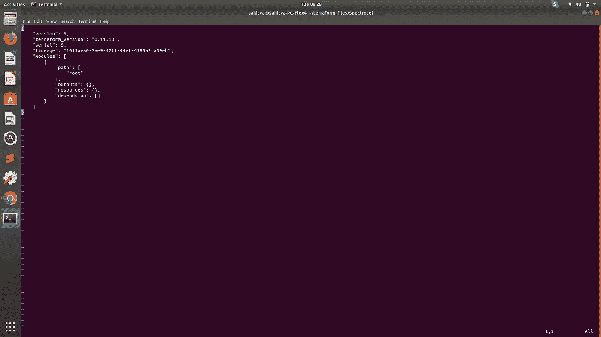

# 设置 Terraform 远程状态

> 原文：<https://medium.com/swlh/https-medium-com-sahityamaruvada-setting-up-terraform-remote-state-azure-aws-e936a48f672b>

basic state file with no resources created yet!

**简介:**

当作为一个团队使用 Terraform 时，设置一个远程状态总是最理想的，因为多人想要更新同一个状态文件，而使用不同状态文件的多个副本并不容易。设置远程状态的最佳特性之一，以及所有团队成员访问和使用单个状态文件的事实是，状态文件带有…