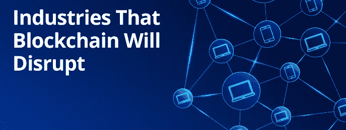

# 区块链发展可以彻底改变的行业

> 原文：<https://medium.com/swlh/https-medium-com-swlh-blockchain-development-disrupt-industries-b0b616cab05b>

区块链是最有前途的技术，它将为未来带来创新。但许多区块链世界的新来者有一种误解，认为区块链的潜力只在于金融和银行业。

支持加密货币的区块链技术不仅仅是一种交换和价值储存的媒介。从[区块链供应链](https://www.leewayhertz.com/blockchain-supply-chain/?utm_source=thestartup)到医疗保健、农业、制造业、时尚和出版业，区块链的发展为各个行业带来了机遇。

凭借其独特的特性，如透明性、可追溯性、可审计性和不变性，它可以为各种业务领域提供一定程度的清晰性。

让我们来看看区块链的发展会极大地扰乱哪些行业。

# **以下是近期区块链发展可以治理的突出行业:**

**1。金融服务** 了解区块链的人都知道，加密货币在全球经济中的应用是金融业。今天的银行和金融系统缺乏公平性和安全性。高交易和利率有利于银行/金融公司，因为客户从与银行的互动中只能获得一点点。

世界上数十亿人甚至根本无法获得银行服务。进行跨境交易也增加了系统的高成本。

区块链可以克服这些问题，因为它有廉洁的账本，没有集中的权力，让每个人都更容易交易、创业和接受支付。区块链开发提供了没有中间人费用和高利率的解决方案。

**2。供应链管理** 供应链行业目前面临的问题包括高昂的运输费用、因缺乏透明度而导致的生产过剩、低效的召回以及日益增多的盗窃/假冒案件。

区块链和智能合约为这些挑战提供了理想的解决方案。如果汽车工业使用一种只有在收到特定请求时才生产汽车的系统会怎样？

智能合同可以锁定合同中的资金，允许制造商在收到特定数量的请求时开始生产。通过将制造商与消费者直接联系起来，基于区块链的供应链解决方案将消除中间商的参与。

此外，消费者可以追溯到分类账，以检查交易历史，以确定产品从其起源到分销。

**3。医疗保健** 医疗保健是任何国家经济的基础。在美国，[医疗保健占全国](https://en.wikipedia.org/wiki/Health_care_in_the_United_States)的五分之一，粗略估计为 38 亿美元。但该行业还没有能力进行更大规模的数字化，缺乏透明度、互操作性和更新的基础设施。

区块链可以通过提供一个廉洁的账本来存储和管理系统内所有利益相关者都可以访问的数据，从而为医疗保健行业带来变革。

*如果您所在的行业需要处理数据或任何金融交易，那么您可以利用区块链技术改善业务运营。您需要做的就是* [*找到合适的区块链开发*](https://www.leewayhertz.com/hire-blockchain-developer/?utm_source=thestartup) *合作伙伴，他们可以帮助您从咨询到开发和推出成功的区块链产品。*

## 这篇文章发表在 [The Startup](https://medium.com/swlh) 上，这是 Medium 最大的创业刊物，拥有+439，678 名读者。

## 在这里订阅接收[我们的头条新闻](https://growthsupply.com/the-startup-newsletter/)。

