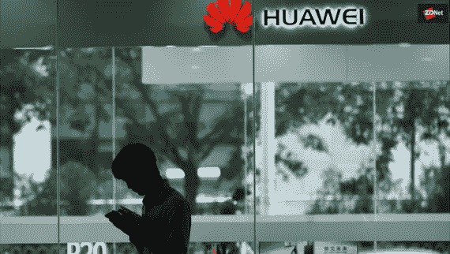

# 监察机构警告称，华为在塞尔维亚的监控系统威胁公民权利

> 原文：<https://medium.com/swlh/huaweis-surveillance-system-in-serbia-threatens-citizens-rights-watchdog-warns-8ba924af5040>

塞尔维亚希望利用技术来改善首都贝尔格莱德的公共安全。为此，它决定实施华为的安全城市解决方案——一个包括安装数千个安全摄像头的监控系统。

但是现在一个国际人权监察机构警告塞尔维亚人的潜在危险…