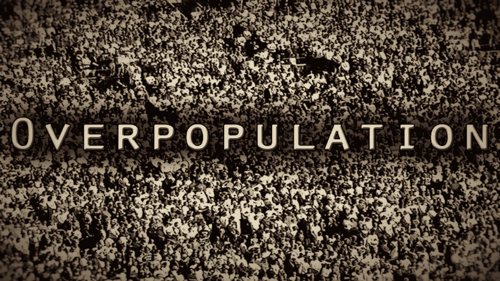

# 人类人口过剩是个问题吗？

> 原文：<https://medium.com/swlh/human-overpopulation-isnt-a-problem-sort-of-341c5367bdf5>

## (有点)

人口过剩不是迫在眉睫的问题，因为人口转变有四个阶段

*   第一阶段:**过渡前** *(高出生率和高死亡率。)*
*   第二阶段:**早期过渡** *(死亡率开始下降，因为出生率仍然很高。)*