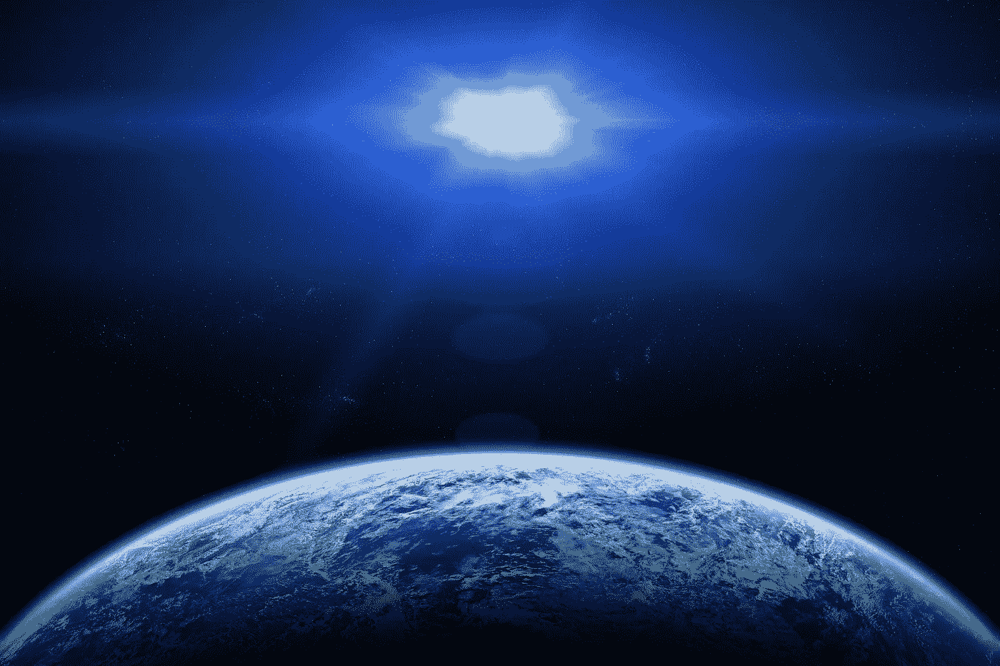

# 人类的独生子女综合症

> 原文：<https://medium.com/swlh/humanitys-only-child-syndrome-894bd77f5f2>

## 对宇宙的智力追求

## 我们并不孤单

# 自我中心模式

地球的天然卫星被简单地称为*月亮*，当有 *181* 其他*月亮*独自在我们太阳系的其他行星周围漂浮的时候……离地球最近的恒星被称为*“太阳”*，尽管在地球上有大约 3000 亿个其他*太阳*…