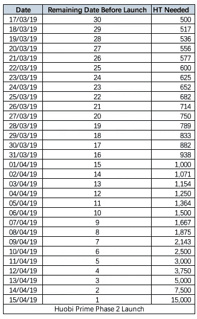

# 黄金时间的火币 Prime！

> 原文：<https://medium.com/swlh/huobi-prime-in-the-primetime-c52eb160a429>

## 如何参与的一步一步的指南和第三轮的新变化！下面的文章将解释用户现在如何获得新的代币——也就是牛顿代币！


[Source](https://unsplash.com?utm_source=medium&utm_medium=referral)

火币一直准备创新和改进其平台，并准备发布火币 Prime。Huobi 一直处于数字资产市场空间创新的前沿，发布的功能有助于巩固其作为全球最佳数字市场交易所之一的地位。然而，技术以极快的速度变化，这要求玩家也要适应和进化。对于火币来说，这些需求使得他们迫切需要不断创新，在这个过程中留住他们的用户和客户。

Huobi Prime 是一个关于获得区块链领域最有前途的数字硬币的游戏。火币评估硬币的潜力，它是否能成为前沿创新或改变行业的资产。一旦建立了真正的潜力，火币网就会通过他们的数字交换平台为他们的客户创建一个硬币链接。

Huobi Prime 不仅面向财大气粗的个人，也面向那些能够设法攒够钱以便尽早获得这些有前途的硬币的爱好者。

# 计划参与

对 Huobi 用户的要求是在一个经过验证的 Huobi 全球账户中平均每月持有 500HT 或以上。500HT 标志被认为介于包容性和合法参与之间。火币网希望确保每个人都可以使用它的服务，同时保证参与者积极参与火币网内的交易活动

参与者需要有一个注册并验证过的[火币](https://www.hbg.com/en-us/)账号才能进入。

Huobi Prime 只会列出尚未在任何数字货币交易所上市的优质项目。为了达到并保持他们的高标准，Huobi 将在最终选择硬币之前采用严格的筛选和审查程序。通过这些方法，Huobi Prime 用户将获得高质量的产品。[参与需要的步骤有:](https://huobiglobal.zendesk.com/hc/en-us/articles/360000225182) *(顶网参与结束，但步骤适用于火币 Prime 上所有上市的项目！)*

*   ***第一步:*** *确认您参与 Prime 交易的资格****-重要*** *(参与 Prime 的门槛设置为:Prime 交易前 30 日内日均持有 500 HT。根据 HT 价格变动，HT 持有要求可能会有微小变化，并将随项目公告一起披露)。*
*   ***第二步:*** *打开 HT 行情页面(Prime 倒计时会显示出来)等待 Prime 交易开始；*

****

**Participants will be required to send snapshots of their HT held | [Source](https://blog.hbg.com/how-to-use-huobi-prime-the-complete-guide-2nd-launch-edition-2/)**

## ****一些需要知道的小技巧:****

1.  ***Prime 交易分为三轮，每轮都会发布大量的卖出指令，请在 Prime 开始时尽快下达市场买入指令。***
2.  ***由于网络问题，幻灯片认证系统可能会出现延迟，请耐心等待。***
3.  ***在 Prime 交易阶段，用户可以发出市场卖出指令，但是如果指令成功执行，个人上限将不会恢复。***
4.  ***用户在 Prime 交易结束后，token 在火币正式上市时，可以不受限制的自由交易。***
5.  ***如果市价单未成功执行，则市价单可能不存在，请等待下一轮或代币正式上市。***

**以下是在 Huobi Prime 上上市的硬币的一些最低要求:**

*   **一个令人印象深刻的项目团队正在领导这个项目。**
*   **他们的用户群和更广泛的社区的支持。**
*   **前瞻性的商业策略。**
*   **整个项目不得有任何丑闻。**
*   **火币 Prime 的项目上市一定是该项目在数字货币交易平台上获得的第一个上市。**
*   **在区块链业界享有盛誉。**

**这些都是火币团队用来筛选可能收到的众多申请的重要因素。这些要求对于保护其用户可能参与的潜在投资至关重要。**

**牛顿已经通过了 Huobi 的审核，并作为第一个在 Huobi Prime 上市的硬币获得了绿灯。牛顿确实是一个很有前途的创业公司。它通过不同的设备提供低成本的通信和数据共享服务。它由一个对公司有清醒认识的能干的团队领导。**

# **为什么要参加火币 Prime？**

## **完整的用户体验**

**为多样化的用户群提供服务一直是 Huobi 的灵感来源。他们希望他们的客户和用户能够充分利用他们的平台。Huobi Prime 的创新是为了给 Huobi 用户创造一个更好的平台。**

## **是什么让火币质数与众不同？**

**以下是 Huobi Prime 将拥有的一些关键优势:**

*   **提前进入意味着提前进入火币 Prime，无需等待预售或任何其他程序。一旦 Huobi Prime 列出了硬币，用户就可以购买硬币，这些硬币会立即存入他们的帐户，并准备兑换。这些硬币将通过 Huobi 全球平台与 Huobi 的本地令牌(HT)进行交易。**
*   **与早期获取相关的是这些硬币的有利可图的价格。Huobi Prime 将以折扣价上市这些硬币，折扣价很可能大大低于市场价。**
*   **如前所述，火币 Prime 将是一个面向各行各业的平台。在通常情况下，这种服务是为类似平台的财大气粗的家伙保留的。然而，霍比相信包容的力量。Huobi Prime 可以轻松满足行业内大小玩家的需求。专业人士，投资者，贵宾或定期交易者会发现这个平台令人满意。**
*   **在设立 Huobi Prime 时考虑了市场现实。市场波动会影响任何硬币；因此，为了应对波动市场可能带来的影响，火币 Prime 将对硬币进行不同层次的定价。这项措施将防止投资者在市场动荡时遭受任何过度损失。**

**这些特点将使火币保持领先地位。用户可能会欣赏火币网采取的预防措施以及火币网在火币网 Prime 中采用的客户或用户至上的方法。**

**火币 Prime 定于 2019 年 4 月 16 日**与牛顿计划一起发射。****

**更多关于牛顿出售的信息可以通过[这个链接找到。](https://huobiglobal.zendesk.com/hc/en-us/articles/360000229161-Huobi-Prime-Second-Project-Newton-Project-Introduction)**

*****#火币#环球#火币# HT #火币*****

```
***Disclaimer:*** *Please only take this information as my* ***OWN*** *opinion and should not be regarded as financial advice in any situation. Please remember to* ***DYOR*** *before making any decisions.*
```

**♂️你好，我叫萨尔。*如果你觉得这篇文章有用，并想查看我的其他作品，请务必鼓掌并关注我的* [*中型*](/@salmanmiah) *和* [*LinkedIn！*](https://linkedin.com/in/salman-miah-57aa90a0/) *😎***

**[](https://medium.com/swlh)**

## **这篇文章发表在 [The Startup](https://medium.com/swlh) 上，这是 Medium 最大的创业刊物，拥有+443，678 读者。**

## **订阅接收[我们的头条新闻](https://growthsupply.com/the-startup-newsletter/)。**

**[](https://medium.com/swlh)**