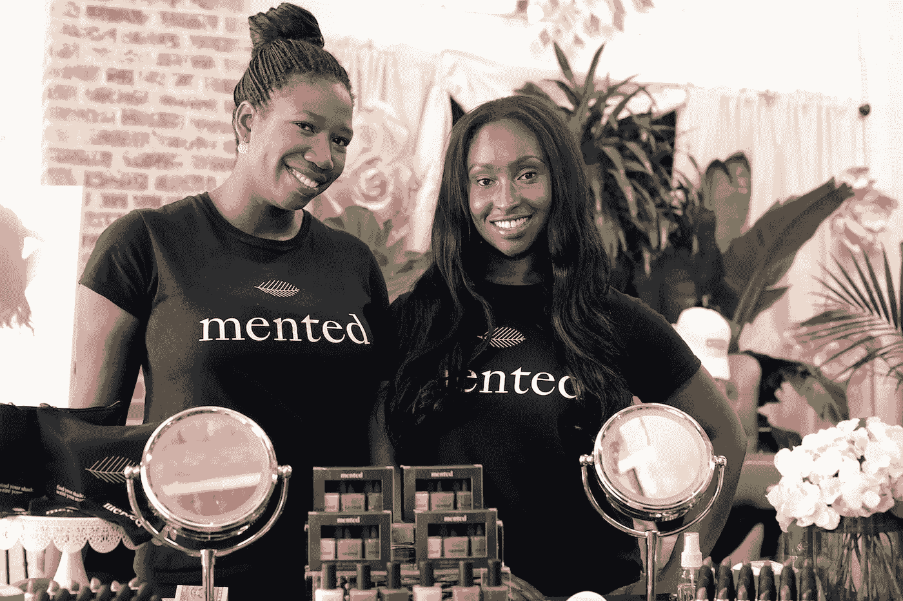

# 喧嚣与魅力:Mented 的联合创始人如何为他们的包容性美容系列筹集了 400 万美元的种子资金

> 原文：<https://medium.com/swlh/hustle-and-glam-how-menteds-co-founders-raised-4m-in-seed-funding-for-their-inclusive-beauty-9790402f9c29>

Mented founders K.J. Miller and Amanda E. Johnson

“现在美女真的很火辣。这是唯一一个持续增长的消费品类别，而且在网上的增长速度令人难以置信，”针对有色人种女性的高档美容品牌 [Mented Cosmetics](https://www.mentedcosmetics.com/) 的 K.J. Miller 说。

她和她的联合创始人阿曼达·约翰逊在哈佛商学院相遇，并很快成为朋友。他们对 Mented 的想法来自于他们对完美裸色唇膏的共同探索。他们说，对于较深的肤色来说，这是一件棘手的事情。

“我们的理念是，每个女性都应该能够在美丽的世界中找到自我。阿曼达解释道:“在购买美容产品时，我们常常感到被忽视了。"我们感觉像是事后想起的。"

“人们想让我们穿上鲜艳的紫色、红色和橙色。但事实是，大多数女性不会涂紫色口红去上班。他们每天都涂唇彩，我们不能让这种事发生在我们身上。所以我们说，如果我们找不到它，我们就建造它。”

他们在 2017 年推出了 Mented(色素的简称)，推出了一系列百搭的裸色唇色。不久，他们根据大众需求添加了中性指甲油、眼影、荧光笔和一系列红色唇膏。

那么，他们是如何为他们的利基美容产品公司筹集到 400 万美元的呢？以下是我在[播客](https://soundcloud.com/user-2586856/how-i-raised-it-with-amanda-johnson-and-kj-miller-of-mented-on-6112018)中与他们交流时，他们分享的一些筹款经验。

**种子期前的一轮:在(HBS)电视网的一点帮助下“磨磨蹭蹭”**

K.J .说，当他们开始筹集他们的种子资金时，他们的筹款之旅“真的是又累又忙”

起初，这些女性关注的是天使投资人、朋友和家人。“把东西往墙上扔，看看能粘上什么，”K.J .回忆道。她一度将目光投向了自己在哈佛商学院的人脉。

“我联系了我们商学院每一位自称天使投资人的女性，给她们每一个人发了电子邮件，不管她过去资助过什么。我说，‘你是个女人。你可能化过妆，你可能会明白。"

在八个月的时间里，阿曼达和 K.J .估计在找到他们的对手之前，他们已经投了 100 多个投资者。主要投资医疗保健的 iSeed Ventures 领投了他们 100 万美元的种子轮。Amanda 说:“他们公司有%的资金用于其他投资，我们的第一位天使投资人把我们和他们联系了起来。”。

那碰巧是 K.J .的一个冷漠的哈佛校友关系。“她参加了会议，我们做了宣传，她很喜欢。她说，‘嘿，让我给你介绍一下这些人，他们从来没有在美容上投资过，但是我想他们可能会感兴趣。’"

这种联系是巨大的，因为投资者肯定不会争夺这家羽翼未丰的公司。“在那个早期阶段，我们还没有任何销售额，所以没有风投来敲我们的门，”K.J .说。“iSeed 愿意在我们身上冒险，这太棒了。但真正让我们找到他们的是骗局。”

哈佛协会也不吃亏。K.J .说，成为 HBS 校友“当然有所帮助，但我要说，很多很多 HBS 的学生都投给了风投，但从未筹集过资金”。“所以它可能会让你进门，我对此表示感谢，但它不会得到检查。”

**种子期:6 周至 300 万美元**

Mented 在筹集到 100 万美元资金后仅几个月就成功完成了另一轮种子融资。这一次他们获得了 300 万美元的资助。“我们喜欢在筹资问题上保持相当超前的思维，”K.J .说，“当我们完成第一笔 100 万美元时，我们知道我们会在春天回来。”

几个月过去了，他们的业务超过了预期的基准。这时候，联合创始人知道是时候再次筹集资金了。

K.J .表示，他们在这一轮中采用了“更加正式的流程”。首先，他们“分而治之”，K.J .在路上会见投资者，阿曼达经营业务。然后，他们对加薪进行“时间限制”。“我在二月初出去说，我想在三月底之前完成投球。我也是。大概花了六个星期。现在*关闭*花费的时间比那更长，”她说。又花了大约一个月的时间敲定这笔交易，这是 K.J .感到压力最大的部分。

“我喜欢推销——这就像一场对话，”她说。但是，一旦所有感兴趣的投资者都围坐在桌前，“那就是每个人都开始提出要求的时候，那就是你感觉像*哦，不*的时候，这可能会落空。”

但对 K.J .和阿曼达来说很管用。他们成功地与旧金山的风险基金 CircleUp 结成了对子。“她们实际上是我们这一轮投资的首批投资者之一，”K.J .说，“她们非常了解消费产品，非常熟悉投资女性创始人。”

他们预计未来的筹资目标是 500 万至 1000 万美元。这两位联合创始人说，他们已经进行了两轮投资，他们也知道哪些指标将为投资者描绘出一幅令人信服的画面。

“我们不是一个小型生活方式品牌。我们试图建立一个十亿美元的全球企业。这就是他们想听到的故事，”阿曼达说。

“我们今天拥有的指标非常重要，投资者真正想知道的是:愿景是什么，为什么你们两个会实现这个愿景？”

*内森·贝克德是 Foundersuite.com***的首席执行官，这是一个软件平台，自 2016 年以来已经帮助用户筹集了超过 10 亿美元的种子和风险投资。本文基于 Foundersuite 的* [*我如何筹集资金播客*](https://soundcloud.com/user-2586856/how-i-raised-it-with-amanda-johnson-and-kj-miller-of-mented-on-6112018) *的一集，来看看创业公司创始人如何筹集资金的幕后故事。**

**

## *这篇文章发表在 [The Startup](https://medium.com/swlh) 上，这是 Medium 最大的创业刊物，拥有+430，678 名读者。*

## *在这里订阅接收[我们的头条新闻](https://growthsupply.com/the-startup-newsletter/)。*

**