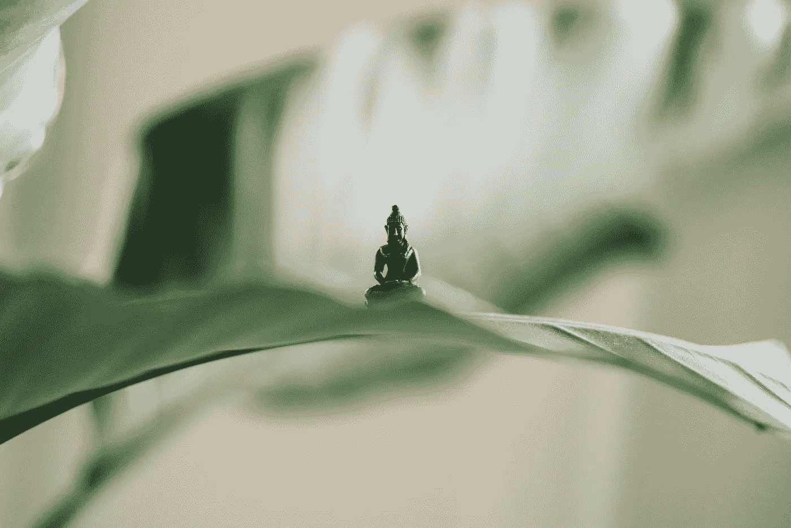

# 我有能力，我自信，我冷静

> 原文：<https://medium.com/swlh/i-am-capable-i-am-confident-i-am-calm-df4293eedd40>

## 使用积极的咒语来减少焦虑

Photo by [Samuel Austin](https://unsplash.com/@samaustin?utm_source=unsplash&utm_medium=referral&utm_content=creditCopyText) on [Unsplash](https://unsplash.com/search/photos/meditation?utm_source=unsplash&utm_medium=referral&utm_content=creditCopyText)

焦虑似乎在我们的社会中变得越来越普遍。这并不奇怪，现代生活节奏繁忙，充满活力；其他人的生活展示在我们面前，让我们不断地比较。