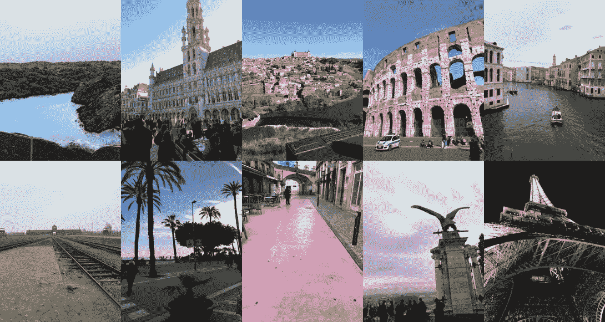

# 我独自一人徒步穿越欧洲 3 个月——以下是我学到的东西

> 原文：<https://medium.com/swlh/i-backpacked-solo-across-europe-for-3-months-heres-what-i-learned-a97c1482f98f>

## 对你下次旅行的建议、见解和忠告

Left to right then top to bottom: Grindavík, Brussels, Toledo, Rome, Venice, Auschwitz, Stiges, Lisbon, Budapest, Paris

时间肯定是会飞的。我现在正带着我的笔记本电脑坐在都柏林的机场，等待我的飞机到达。大约 8 个小时后，我将抵达纽约定居，并开始在[广场](https://www.squarespace.com/)的新工作。它…