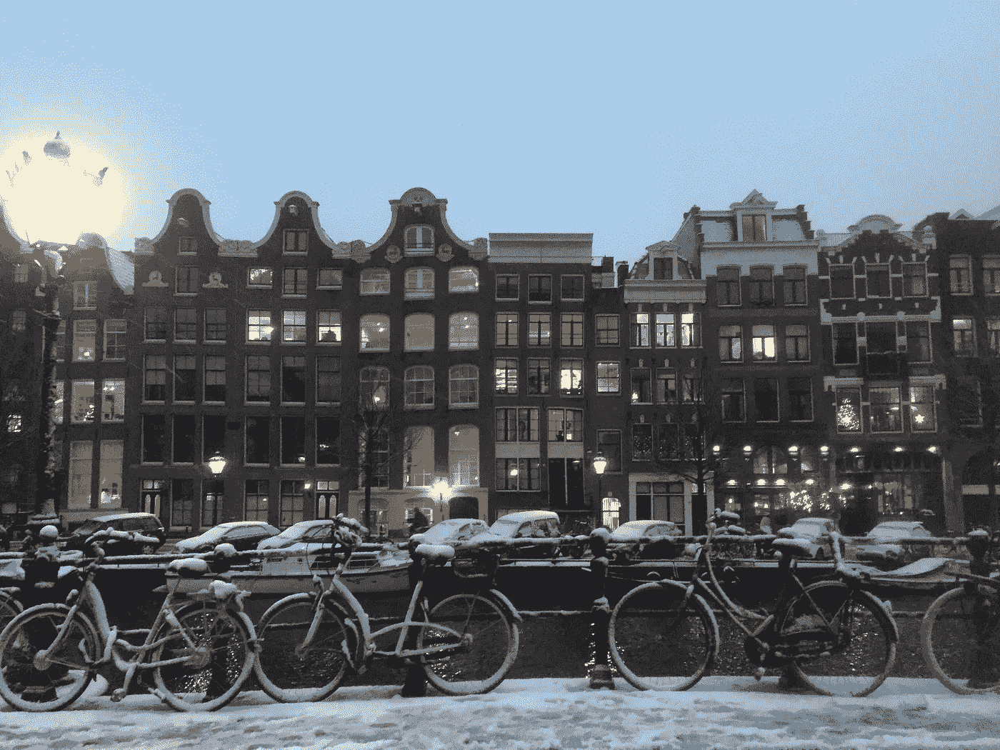
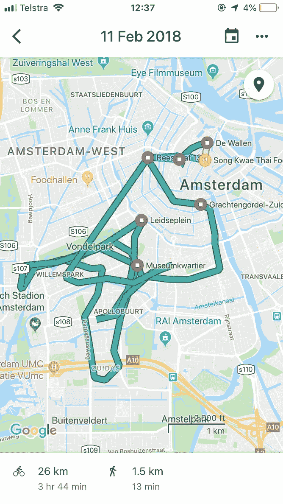
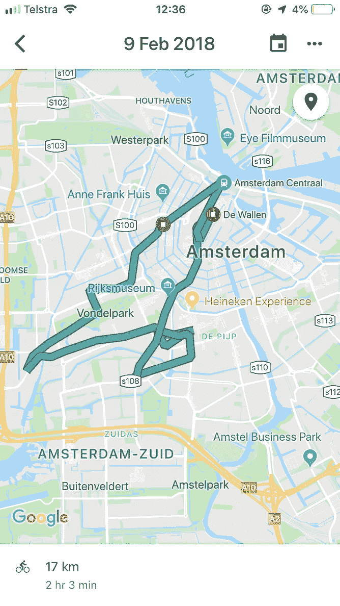
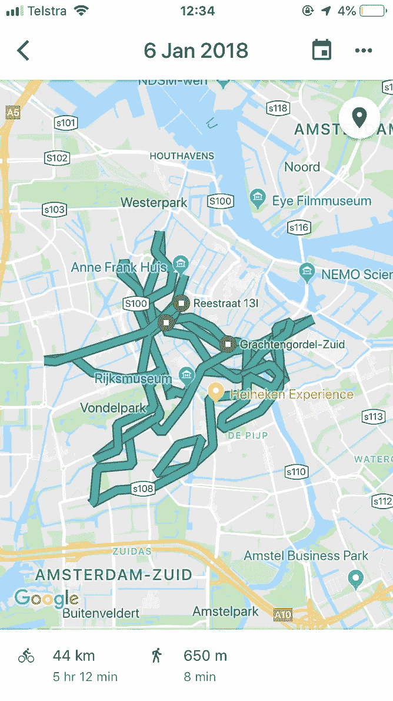
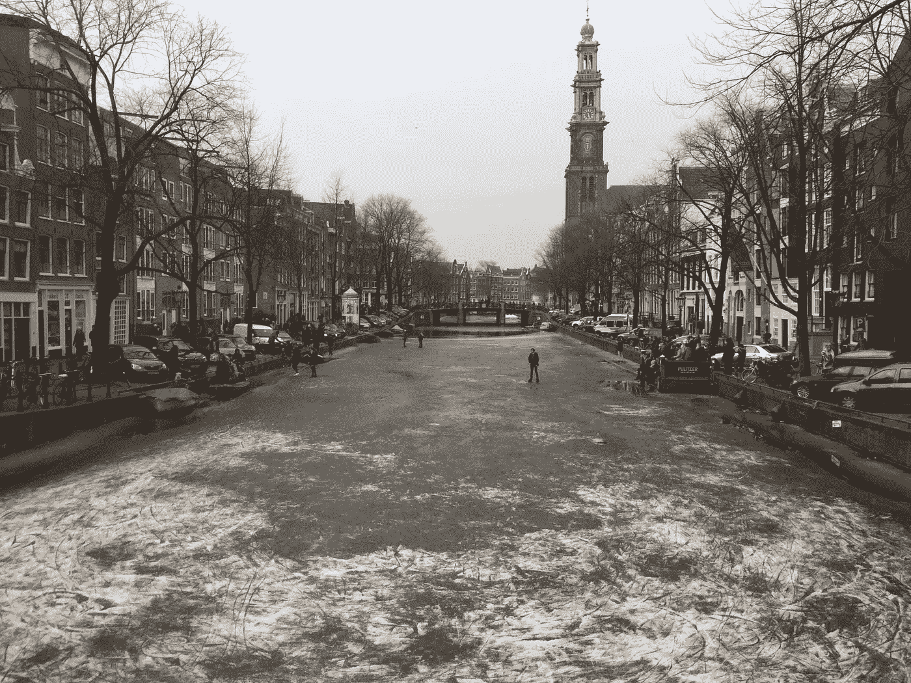
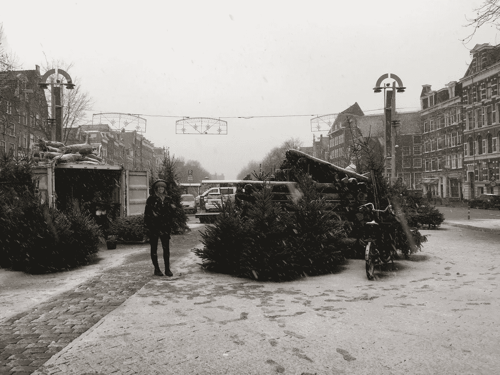
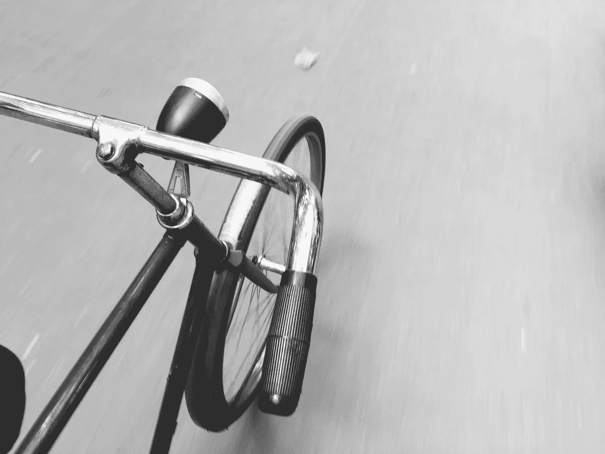

# 我在阿姆斯特丹骑自行车去交货

> 原文：<https://medium.com/swlh/i-cycled-for-deliveroo-in-amsterdam-efd6bc045a98>

## 这是我的工资和我骑行的距离。

从 2017 年 9 月到 2018 年 7 月，我在阿姆斯特丹骑行了 4090 多公里。

## 我实际上骑了多少自行车？

My timeline data plotted showing my cycle path for 3 different shifts.

从第一天开始，我完成了 1405 次送货。我一班最多干了 14 个。

我使用谷歌时间表来跟踪工作时骑行的距离。

从开始到现在，我骑了 4090 公里——平均每班 22 公里，每次送货 3 公里。

我一个班次最多骑了 44.6 公里，最短骑了 7.7 公里

## 天气怎么样？

The Prinzengracht frozen over (2017)

184 班中有 72 班下雨了。这大约是 40%的时间。

我的大部分轮班也是在下午 5 点到 10 点之间的高峰时间，这意味着我通常在一天中最冷的时候。以下是我工作时的天气统计:

*   下雨天数:72 天
*   下雪天数:8 天
*   最热的一天:14 摄氏度
*   最冷的一天:-9C
*   零下 21 天

雨雪其实是塞翁失马，焉知非福。这意味着路上挡你路的人少了。

My wife and I exploring snow-covered Amsterdam.

令人惊讶的是，温度在获得小费方面没有起到任何作用——我在零下 6 摄氏度的晚上工作了 4 个小时(没有下雨)，整晚都没有收到小费。然而，在一个相对温暖的下雨的夜晚，我收到了很多提示！人们同情下雨，但他们习惯了寒冷。

## 我拿了多少钱？

自由职业者的基本工资是每次分娩 5€。

我发现平均每小时我可以完成 3 次送货。

除此之外，还有一些激励措施——例如，在冬天，€每次送货都会额外给我 1 英镑，此外还有完成一定数量订单的奖金，即*在这个支付周期(2 周)内完成 75 个订单，我会额外得到一辆€70* 。

因此，使€达到每小时 15 英里是可能的。实际上，我在€每小时 12.06 英镑和€每小时 15.20 英镑之间

**小费呢？**

我只追踪了通过应用程序给出的小费——我得到的还是差不多的现金。该应用程序的小费会在每个支付周期结束时随你的薪资包一起支付。每两周一次。

从开始我得到了€551 小费。大约相当于€平均每班 3 英镑。包括现金小费可能是两倍。

我从一次轮班中得到的最多的小费是€13(外加现金)。我从 1 个客户那里收到最多的是€7。

## 总体思路和经验

我和妻子只有 12 个月的时间去探索和了解阿姆斯特丹。在地下厨房工作了几个星期后，我意识到我想把时间花在户外，探索和接触人们。我想真正看看阿姆斯特丹。我还希望能够放下一切，一接到通知就去旅行，因为整个欧洲终于在我们的家门口了——这是澳大利亚的一个可喜变化。

所以我加入了 Deliveroo，事实证明这是一个惊人的决定。我探索并记住了这个城市的所有角落。每天我都参观各种各样的工作场所。我参观了不同的郊区，观察人们的生活安排和生活方式。

我现在知道阿姆斯特丹了。我看过旅游中心和它的外围。我热爱在那里的每一分钟，我很感激我能够在探险的同时工作并获得报酬。

