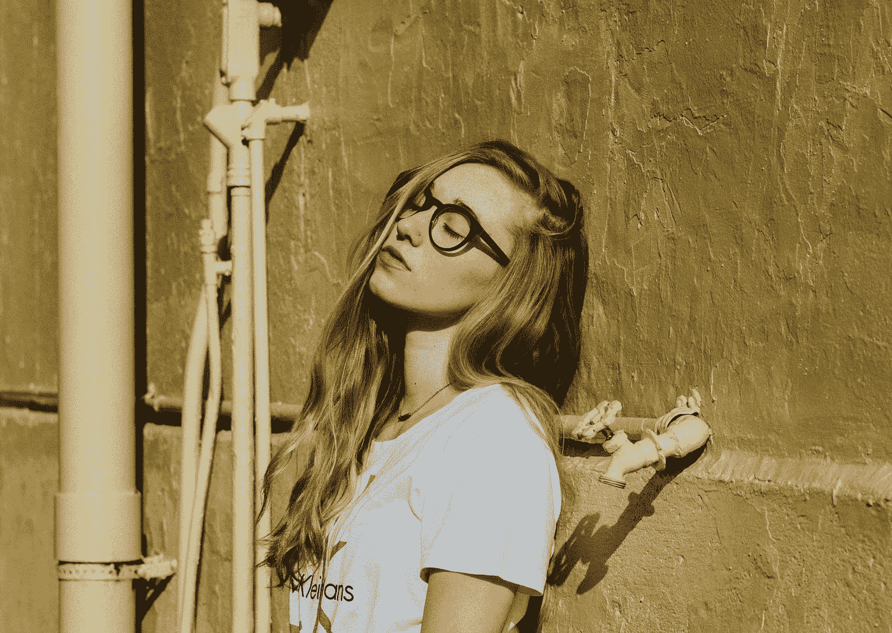

# 我不必把你所说的当作我的真理

> 原文：<https://medium.com/swlh/i-dont-have-to-take-in-what-you-say-as-my-truth-b497378dc7f5>

## 从治疗中学到的一课。

Photo by [Joanna Nix](https://unsplash.com/@joanna_nix?utm_source=medium&utm_medium=referral) on [Unsplash](https://unsplash.com?utm_source=medium&utm_medium=referral)

## 多么沉重的负担

上小学的时候，我会去保姆家，直到晚饭前我爸来接我。

只是他不肯来。

大多数时候，我会和保姆的女儿一起玩，她在学校和我同班…