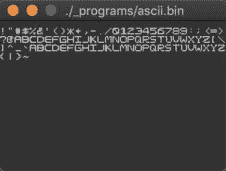
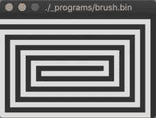

# 我不知道 CPU 是如何工作的，所以我用代码模拟了一个

> 原文：<https://medium.com/swlh/i-dont-know-how-cpus-work-so-i-simulated-one-in-code-bd85f216b49>


几个月前，我意识到我并不真正理解计算机是如何工作的。我仍然不明白现代计算机是如何工作的。

然而，在打通[之后，*却是怎么知道的呢？J. Clark Scott 的《T4》一书描述了一个简单的 8 位计算机的位，从与非门到寄存器、RAM、CPU 位、ALU 和 I/O，我渴望用代码实现它。*](http://buthowdoitknow.com/)

虽然我对电路的物理学并不感兴趣，但这本书只是略述了这些领域的表面，并且在没有必要的电气工程知识的情况下，给出了布线和比特如何在系统中移动的简洁概述。对我来说，虽然我不能适应书本上的描述，但我必须看到实际发生的事情，并从我不可避免的错误中吸取教训，这使我在用代码编写电路的汹涌大海中开辟了一条道路，并对此感到有点伤感。

我这次航行的成果可以在[简单电脑](https://github.com/djhworld/simple-computer)中看到；一台简单的计算机，它很简单，可以计算东西。



这是一个非常巧妙的小东西，CPU 代码被实现为[打开和关闭](https://github.com/djhworld/simple-computer/blob/master/cpu/cpu.go#L763)的一个可怕的挥霍，但是它工作了，我已经[单元测试了它](https://github.com/djhworld/simple-computer/blob/master/cpu/cpu_test.go)，我们都知道单元测试无可辩驳地证明了某些东西工作了。

它处理[键盘输入](https://github.com/djhworld/simple-computer/blob/master/io/keyboard.go#L20)，并使用我命名为“Daniel Code Pro”的专业字体的一组精心制作的字形将文本[呈现给显示器](https://github.com/djhworld/simple-computer/blob/master/io/display.go#L13)。唯一的欺骗之处是让键盘输入和显示输出工作起来，我必须连接 go 频道，通过 [GLFW](https://github.com/djhworld/simple-computer/blob/master/cmd/simulator/glfw_io.go) 与外界通话，但其余的都是模拟电路。

我甚至写了一个[粗汇编器](https://github.com/djhworld/simple-computer/blob/master/asm/assembler.go)，至少可以说是令人大开眼界的。它并不完美。实际上这有点废话，但它向我强调了很多很多年前其他人已经解决的问题，我认为我是一个更好的人。或者更糟，取决于你问谁。

## 但是你为什么这么做？

> “我在《我的世界》见过 13 岁的孩子这样做，等你用电报继电器造出真正的 CPU 后再来找我”

我的计算心理模型停留在初级计算机科学教科书中，我在 2013 年写的游戏模拟器的 CPU 与今天运行的 CPU 完全不同。尽管如此，仿真器只是一个状态机，它并不描述逻辑门级别的东西。您可以只使用一个`switch`语句并存储寄存器的状态来实现它的大部分。

所以我试图更好地理解这种东西，因为我不知道 L1/L2 缓存是什么，我不知道流水线是什么意思，我不完全确定我理解 Meltdown 和 Spectre 漏洞论文。有人告诉我，他们正在优化他们的代码，以利用 CPU 缓存，我不知道如何证实这一点，除了相信他们的话。我不太清楚所有 x86 指令的含义。我不明白人们是如何将工作卸载到 GPU 或 TPU 的。我不知道什么是 TPU。我不知道如何使用 SIMD 指令。

但所有这些都是建立在你需要获得军衔的知识基础上的，所以我不先看地图是到不了那里的。这意味着回到基础，用简单的东西弄脏我的手。书中描述的“斯科特计算机”很简单。就是这个原因。

## 天哪！它还活着！

斯科特计算机是一个附在 256 字节 RAM 上的 8 位处理器，所有这些都通过 8 位系统总线连接。它有 4 个通用寄存器，可以执行 [17 条机器指令](https://github.com/djhworld/simple-computer#instructions)。有人在这里为网络建立了一个视觉模拟器，这真的很酷，我不敢想象跟踪所有的连接状态要花多长时间！


这本书将带你开始一段旅程，从不起眼的与非门，到一点内存，到一个寄存器，然后继续在组件上分层，直到你最终得到类似上面的东西。我真的推荐阅读它，即使你已经熟悉这些概念，因为它是一个很好的概述。不过我不推荐 Kindle 版本，因为图表有时很难在屏幕上放大和解读。以我的经验来看，这是 Kindle 的一个老问题。

我的电脑唯一不同的地方是我将它升级到了 16 位，以便有更多的内存可供使用，因为即使只存储 [ASCII 表](https://github.com/djhworld/simple-computer/blob/master/_programs/ascii.asm#L27)的字形也会让书中描述的大多数 8 位机器相形见绌，没有多少空间留给有用的代码。

## 我的发展历程

在开发过程中，实际上只是阅读文本，浏览图表，然后尝试使用通用编程语言代码进行翻译，当然*不是*使用为集成电路开发设计的东西。我之所以用围棋来写，是因为我懂一点围棋。反对者可能会插话说，你这个喋喋不休的白痴！我不敢相信你没有把所有的时间都花在学习 [VHDL](https://en.wikipedia.org/wiki/VHDL) 或 [Verilog](https://en.wikipedia.org/wiki/Verilog) 或 [LogSim](http://www.cburch.com/logisim/) 或其他什么东西上，但是我已经写了我的比特和字节，那时我已经陷得太深了。也许我下一步会学它们，为我浪费的时间哭泣，但那是我要承受的苦难。

总的来说，计算机的大部分工作只是传递一堆布尔，所以任何布尔友好语言都可以完成这项工作。

将一个模式应用到这些布尔值上有助于你(程序员)理解它的含义，任何人都需要做出的最大决定是决定你的系统将使用什么样的字节顺序，并确保所有组件以正确的顺序在总线上来回传输。

这绝对是一个难以实现的过程。从偏移量开始，我选择了小尾序，但在测试 ALU 时，我的头发受到了打击，试图找出为什么数字出来是错误的。许多，许多打印语句都发生在这个上面。

开发确实花了一段时间，在我的空闲时间里可能需要一两个月，但是一旦 CPU 完成并成功执行 2 + 2 = 5，我就很高兴了。

嗯，直到这本书讨论了 I/O 功能，设计了一个简单的键盘和显示界面，这样你就可以把东西放进和拿出机器。*我已经走了这么远*，没有必要让它处于半成品状态。我给自己设定了一个目标，那就是能够在键盘上打字，并在显示器上显示字母。

## 外围设备

外围设备使用[适配器模式](https://en.wikipedia.org/wiki/Adapter_pattern)作为 CPU 和外界之间的硬件接口。猜测这是软件设计模式的灵感来源可能不是一个巨大的飞跃。


有了这种关注点的分离，将键盘的另一端挂起来并显示到由 GLFW 管理的窗口实际上是非常简单的。事实上，我只是从我的[模拟器](https://github.com/djhworld/gomeboycolor-glfw)中取出了大部分代码，并对其进行了一点改造，使用 go 通道作为进出机器的信号。

## 赋予它生命


这可能是最棘手的部分，或者至少是最麻烦的部分。用这么有限的指令集写汇编太烂了。用我写的粗糙的汇编器写汇编更糟糕，因为除了你自己，你不能对别人挥舞拳头。

最大的问题是处理 4 个寄存器并保持对它们的跟踪，将数据放入内存作为临时存储。在这样做的时候，我记得 Gameboy 的 CPU 有一个堆栈指针寄存器，这样你就可以推入和弹出状态。不幸的是，这台电脑没有这样的奢侈品，所以我主要是在定制的基础上把东西移入和移出内存。

我花时间实现的唯一伪指令是`CALL`来帮助调用函数，这允许你运行一个函数，然后返回到函数被调用后的点。如果没有堆栈，你只能调用一层。

另外，由于机器不支持中断，你必须为获取键盘状态等功能实现糟糕的轮询代码。这本书确实讨论了实现中断所需的步骤，但它会涉及更多的布线。

但是不管怎样，抱怨已经够多了，我最终写了四个程序，其中大部分使用了一些共享代码来绘制字体，获取键盘输入等等。不完全是操作系统的材料，但它确实让我欣赏一些简单的操作系统可能提供的服务。

然而这并不容易，文本编写程序最棘手的部分是计算出何时换行，或者当你按下回车键时会发生什么。

```
**main-getInput:**
	CALL ROUTINE-io-pollKeyboard
	CALL ROUTINE-io-drawFontCharacter
	JMP main-getInput
```

*(文本编写程序的主循环)*

我也没有实现退格键，或者任何修饰键。让我意识到制作文本编辑器需要做多少工作，以及这可能有多乏味。

## 对..进行反思

对我来说，这是一个有趣且非常有益的项目。在用汇编语言编程的过程中，我很大程度上忘记了 NAND、AND 和 OR 门在下面工作。我已经上升到上面的抽象层。

虽然中的 CPU 非常简单，距离我的笔记本电脑还有很长的路要走，但我认为这个项目教会了我很多，即:

*   位如何使用总线在所有组件之间移动
*   简单的算术逻辑单元是如何工作的
*   一个简单的*获取-解码-执行循环看起来像什么*
*   没有堆栈指针寄存器+堆栈概念的机器很糟糕
*   一台没有中断的机器很糟糕
*   汇编程序是什么和做什么
*   外设如何与简单的 CPU 通信
*   简单的 T5 字体是如何工作的，以及在显示器上显示它们的方法
*   一个简单的操作系统看起来会是什么样子

那么下一步是什么？这本书上说，自 1952 年以来，没有人制造过这样的计算机，这意味着我有 67 年的时间来温习资料，所以这应该会让我忙上一阵子。我看到 [x86 手册有 4800 页长](https://software.intel.com/sites/default/files/managed/39/c5/325462-sdm-vol-1-2abcd-3abcd.pdf)，足够一些乐趣，睡前轻松阅读。

也许我会短暂地玩玩操作系统，玩玩 C 语言，度过一个令人遗憾的夜晚，尝试[焊接一个 PiDP-11 工具包](https://obsolescence.wixsite.com/obsolescence/pidp-11)，然后可能会放弃。我不知道，我们走着瞧。

严肃地说，虽然我认为我接下来将开始研究基于 RISC 的东西，也许是 RISC-V，但可能会从早期的 RISC 处理器开始，以了解其谱系。现代的 CPU 有更多的特性，比如缓存之类的，所以我也想了解它们。有很多东西要学。

我在日常工作中需要知道这些东西吗？可能有帮助，但不是真的，但我很喜欢它，所以无论如何，感谢阅读 xxxx

*原载于 2019 年 5 月 21 日*[*https://djh world . github . io*](https://djhworld.github.io/post/2019/05/21/i-dont-know-how-cpus-work-so-i-simulated-one-in-code/)*。*