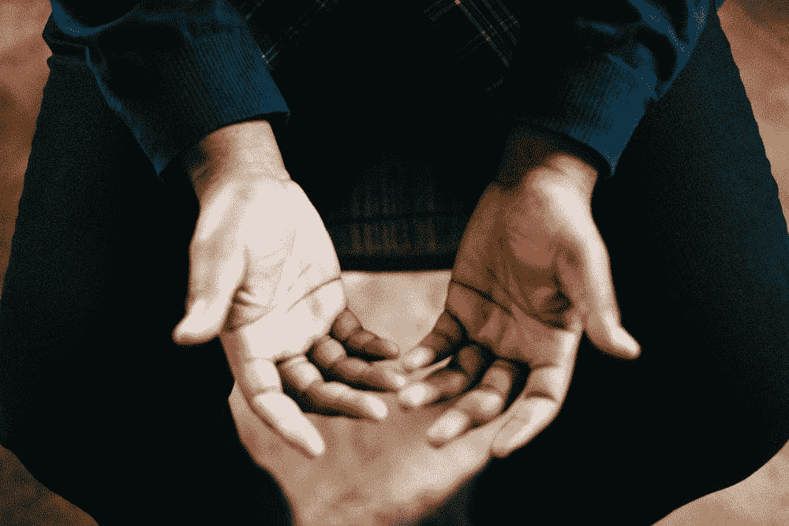

# 我不知道我的手该怎么办

> 原文：<https://medium.com/swlh/i-dont-know-what-to-do-with-my-hands-3f7fab48f74c>

## 如何充分利用你最好的视觉教具

Photo by [Jeremy Yap](https://unsplash.com/photos/eCEj-BR91xQ?utm_source=unsplash&utm_medium=referral&utm_content=creditCopyText) on [Unsplash](https://unsplash.com/search/photos/hands?utm_source=unsplash&utm_medium=referral&utm_content=creditCopyText)

## 你最好的视觉教具

忘记幻灯片或道具，你的手是你拥有的最好的视觉辅助工具！当有效使用时，它们可以帮助强调和增加你的信息的一致性。用好的手势来强化你的想法会让你的演讲更吸引人…