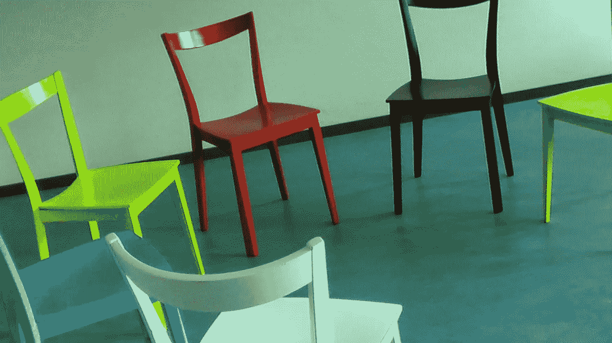

# 我在 20 个人面前放平了一把椅子

> 原文：<https://medium.com/swlh/i-flattened-a-chair-in-front-of-20-people-8657062d116c>

## 一次潜在的羞辱经历教会了我什么是自我接纳

Image by [wollyvonwolleroy](https://pixabay.com/users/wollyvonwolleroy-8285/?utm_source=link-attribution&utm_medium=referral&utm_campaign=image&utm_content=58475) from [Pixabay](https://pixabay.com/?utm_source=link-attribution&utm_medium=referral&utm_campaign=image&utm_content=58475)

昨晚，我经历了一场被许多人称为噩梦的经历。我当时正在主持一个当地的一夫多妻制讨论组，我一直坐在一把灰色软垫椅子上领导这场对话。我之所以选择它，是因为它似乎比 30 英寸的硬木床更舒适…