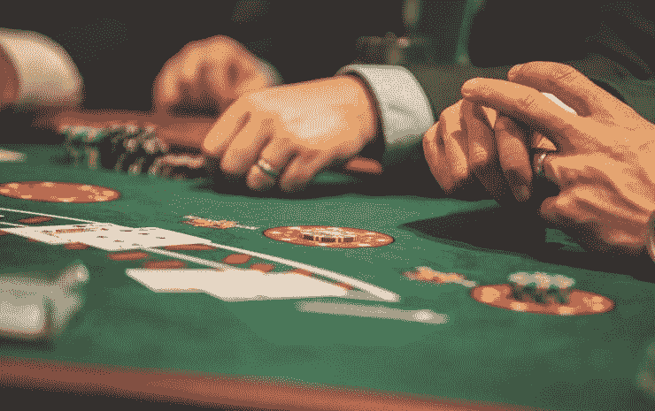

# 我嫁给了一个赌徒

> 原文：<https://medium.com/swlh/i-married-a-gambler-258dba542754>

Photo by [Drew Rae](https://www.pexels.com/@drewrae?utm_content=attributionCopyText&utm_medium=referral&utm_source=pexels) from [Pexels](https://www.pexels.com/photo/person-playing-poker-1871508/?utm_content=attributionCopyText&utm_medium=referral&utm_source=pexels)

我母亲总是对赌博保持警惕。据我所知，我父亲从不赌博。他喜欢 21 点，但他总是可以带着一定数量的钱进入赌场，让自己输掉，并在超出上限之前退出。他脑海中的数字从未超过 200 美元，他也不经常赌博。此外，我的母亲讨厌他赌博，这让她想起了她的童年和她游手好闲的父亲赌博…