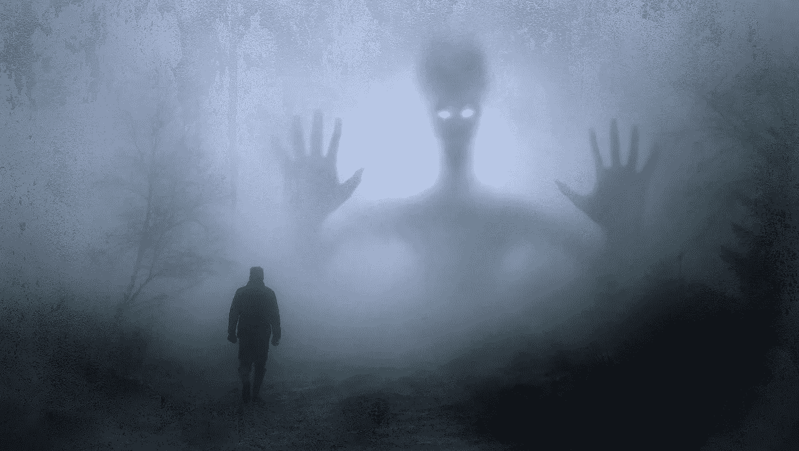

# 我从不相信灵魂，直到我不得不和一个灵魂生活在一起…

> 原文：<https://medium.com/swlh/i-never-believed-in-spirits-until-i-had-to-live-with-one-6b68a281315a>

从小到大，我一直认为灵魂或鬼魂，无论你选择叫它们什么，都是你从来没有谈论过的东西，是你在电视上看到的假东西。一想到他们，我就害怕得要命。我记得年轻的时候甚至看《颤栗》，看着那些僵尸在迈克尔·杰克逊杀了我一晚上后出现。

但是当我不得不和一个人一起生活时，一切都变了。

那是 2017 年初，我刚从佐治亚州肯尼索的哥哥和家人那里回来。我很早就到家了，但旅途还是很累，所以我决定在上班前小睡一会儿。

我仰面躺着，突然感到有什么东西从我身下把我推下床。我身体的上部被抬起，然后又躺了下来。有趣的是，我并不害怕。我睁开眼睛，环顾四周，好像在想“那到底是什么？”我起身查看床下，以确保我的女儿没有呆在家里和我开玩笑。当我意识到房子里除了我自己没有别人时，我失控了。

我坐了起来，全身发冷，我完全惊呆了。我打电话给我的一个朋友，他说听起来好像我有灵魂出窍的经历。我不喜欢这种声音，决定穿好衣服，尽快离开那栋房子。

在上班的路上，我和另一个朋友聊了聊，告诉了她发生的事情。我从来不知道这一点，但她是一个媒介，并开始问我关于我的房子的问题。“你的房子里有一个幽灵，它想让你消失”是她脱口而出的话。

> 说什么，说哈？

她接着说，一位年长的白人女士和她的丈夫曾经住在我的房子所在的地产上，她不太高兴我在那里——在她的房子里。她形容这位女士看起来像电影《为戴西小姐开车》中的白人老太太。

你只能想象我的感受和我脑子里的想法。我无法理解她所说的一切，我觉得她只是在瞎编。这一切怎么可能是真的？一个鬼魂在我的房子里制造麻烦好让我出去？

"我怎么能再住在那栋房子里"？但是，租约还剩 5 个多月，我不得不留下来想办法让她离开。

我继续听着，然后问她她建议我做什么。她告诉我，当我回家的时候，我应该和灵魂进行一次对话，而且应该在我的卧室里进行，因为那里是最折磨人的地方。“做完这些后，你应该彻底打扫房子，”她说。

> 说什么，说哈？

“所以你想让我和这个虚构的人谈谈？”她告诉我，灵魂从未超度，她和我在一起已经有一段时间了。我要向她解释这是我的房子，她必须离开。坐在那里，我仍然感到失落和困惑，我不知道我该如何鼓起勇气，不仅进入我的房子，而且与一个灵魂交谈。

那天晚上我回到家，我的女儿和狗在沙发上睡着了。我打电话给我妈妈，问她是否可以在我做这件事的时候和我保持通话，因为我害怕得无法形容。当我走上楼梯时，我能感觉到手臂上的汗毛都竖起来了。每走一步，我都感到一滴眼泪从我的脸上滚落下来，我的呼吸变得如此沉重，以至于我以为我要昏过去了。我注意到当我走进我的卧室时，空气很浓，我能感觉到周围有一股强大的力量。

我坐在床上，开始大声说话。“这对我来说真的很难，因为这些对我来说都没有意义。但是，我对你所经历的感到抱歉，我知道你觉得这是你的房子，但是我需要你离开。我努力工作来养活我和我的女儿，这是我们的房子”。

之后，我跑下楼，坐在我的沙发上，仍在哭泣。突然，我听到楼梯附近有砰砰的声音。我歇斯底里地给朋友打电话，告诉她这是怎么回事。她指示我冷静下来，并记住我也有权力。她说“奥米卡，呼吸，呼唤你的灵魂向导。你不是无能为力。不要让她在你自己的家里吓到你”。

我仍然被吓得魂不附体，我必须找到足够的力量熬过那晚，并在那栋房子里再住 5 个月。我从来没有告诉我的女儿我遇到了什么，因为我只知道她会吓坏了，想离开。

> 从那天起的每一天，我都害怕呆在那个房子里，很少闭上眼睛睡觉。我不做饭，甚至害怕洗澡。我在自己的家里成了一个陌生人。

我决定接受朋友的建议，保护我的家。我从未听说过使用 Sage 或所谓的[涂抹](https://www.mindbodygreen.com/0-17875/a-sage-smudging-ritual-to-cleanse-your-aura-clear-your-space.html)。然而，我愿意抽一磅狗屎，如果这意味着能睡个好觉，不用害怕住在自己家里。在我弄脏房子后，我没有立即感觉到不同，但是几天后能量开始转移。

**“你是如何最终接受这个事实并学会在你的家里生活的？”** —我敢肯定你在想。

我生气了！我厌倦了让恐惧控制我，我说，“该死，无论发生什么，都会发生”！我又开始生活了。我打开我的音乐，我开始做饭，我跳舞，我甚至开始和灵魂说话…是的，我知道疯狂。

为了看到光明，我必须面对黑暗。

我不会撒谎说我并没有一直挣扎，但是我变得更坚强了，看待事物也不一样了。我决心不让它剥夺我在自己的空间里生活的权利。她给我上了非常宝贵的一课。不管你从其他人那里寻求什么帮助，当它来临时，只有你自己能够去寻找力量和勇气来度过黑暗时代。

后来我搬出了那栋房子，买了自己的房子。我被带到了我的新家，我非常喜欢它。我有没有想过那里也可能有灵魂，绝对有！我感觉到了能量。我被感动了。我会和他们说话，让他们知道我不喜欢被触碰，但是我承认他们的存在。我知道大多数人没有恶意，有些人只是想引起我的注意来传递信息。

为了在这一切中保持我的理智，我创造了根植和净化仪式，因为当我感觉失落或我的家感觉有点沉重时。我圣人，冥想和传播积极的爱和光。这听起来可能很奇怪，但那次经历是我经历过的最好的事情。它将我弹射进我的精神旅程，并推动我找到自我和我内在的力量。

我坚定地站在这个事实的基础上——*“我不是我的恐惧，我可以克服任何挡在我面前的东西，即使它看不见！”*

非常感谢您的阅读！

爱与光