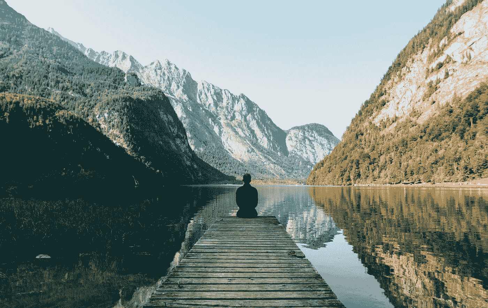

# 我放弃了一切去环游世界…以下是我很高兴错过的东西

> 原文：<https://medium.com/swlh/i-quit-everything-to-travel-the-world-heres-what-i-m-glad-i-missed-out-on-28d3d08a53c3>

Photo by [Simon Migaj](https://unsplash.com/@simonmigaj?utm_source=unsplash&utm_medium=referral&utm_content=creditCopyText) on [Unsplash](https://unsplash.com/search/photos/travel?utm_source=unsplash&utm_medium=referral&utm_content=creditCopyText)

你经常听说有人决定去环游世界。我能理解这种渴望。对许多人来说，这是终极梦想。可悲的是，我发现很多人只有在年老退休后才能做到这一点。即便如此，这也是一场斗争。在人生的那个阶段，这是一个永久的决定。