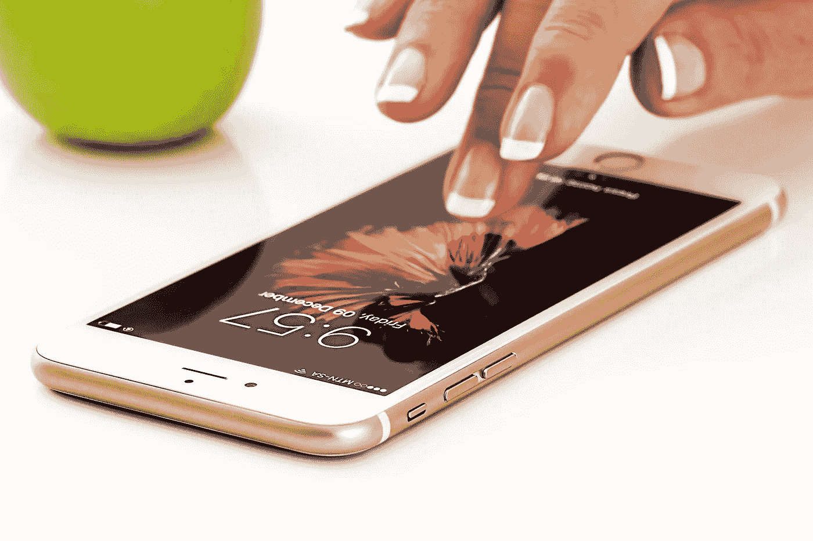

# 我退出社交媒体两周了

> 原文：<https://medium.com/swlh/i-quit-social-media-for-two-weeks-8fa2f02d7724>

## 我的生活是如何改变的

Source: Pixabay, stevepb

社交媒体是 21 世纪的惊人发明。现在我们可以足不出户地学习和分享新的经验。毫无疑问，互联网让我们的生活变得更加容易。另一方面，越来越多的社交媒体平台追求的目标是吸引更多读者的注意力。每年我们都会花更多的时间在脸书的小组讨论上，查看我们的 Instagram 赞和…