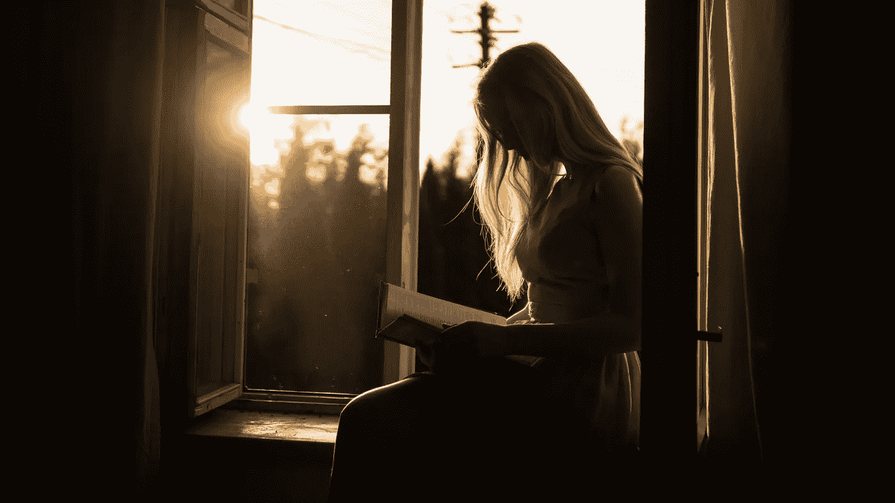

# 两年来，我每周读一本小说…这是我学到的

> 原文：<https://medium.com/swlh/i-read-one-novel-a-week-for-two-years-this-is-what-ive-learnt-bb9f0b6a27e9>

## 压力小，睡眠好，思想开放。

Photo by [Yuri Efremov](https://unsplash.com/@24frames_majestic?utm_source=unsplash&utm_medium=referral&utm_content=creditCopyText) on [Unsplash](https://unsplash.com/?utm_source=unsplash&utm_medium=referral&utm_content=creditCopyText)

我一直是个狂热的读者。一直都是。我最快乐的童年记忆来自于冬天坐在取暖器旁，在妈妈身边沉迷于最新的读物，或者躺在码头上看小说，而爸爸和哥哥在我身边钓鱼。