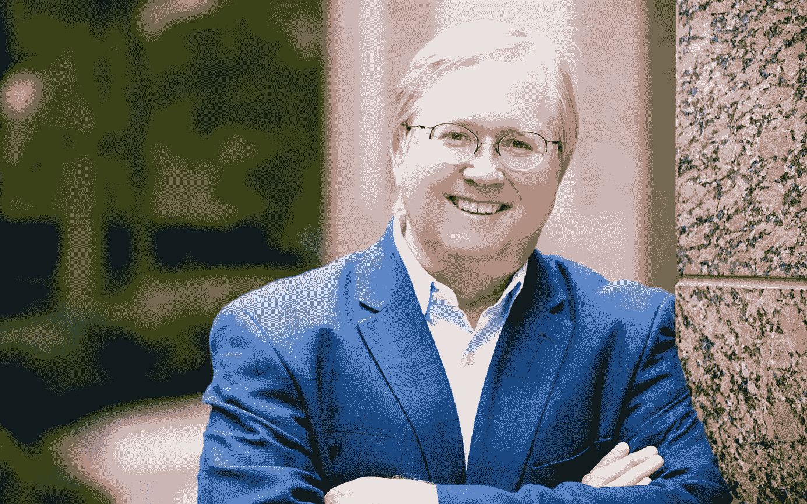

# 我昨天和一个亿万富翁呆了 60 分钟，这是我学到的

> 原文：<https://medium.com/swlh/i-spent-60-minutes-with-a-billionaire-yesterday-heres-what-i-learned-56f1802105e3>

[Weston](https://www.texasmonthly.com/articles/power-issue-graham-weston-reinventing-downtown-san-antonio/)

昨天，我与 Rackspace 的联合创始人格雷厄姆·韦斯顿坐在一起，这家公司最近于 2008 年上市，并于 2016 年被阿波罗全球管理有限责任公司收购并私有化。我是由超级接头人乔·波兰语介绍给韦斯顿的，他是天才网络的创始人。

出售 Rackspace 让韦斯顿成为了 [*亿万富翁*](https://www.mysanantonio.com/news/local_news/article/Rackspace-s-Weston-now-on-billionaire-list-3419021.php) 。

自从几年前离开 Rackspace 后，Weston 将他的精力和注意力集中在他居住的城市圣安东尼奥。

他创建了一个名为[极客天地](https://geekdom.com/)的创业孵化器，人们每月支付 50 美元，就可以进入合作空间和社区。韦斯顿个人向圣安东尼奥投资了数亿美元，以重振这座城市，使其成为一个创新和技术驱动的城市。

圣安东尼奥现在是韦斯顿的初创公司。

当其他人试图创办一家公司时，韦斯顿正试图扩展整个圣安东尼奥市。

这是不同层面的思考。

那么他是怎么做到的呢？

# 附属品

首先，他明白人类有一种与生俱来的归属感。马斯洛在他的需求层次理论中将归属视为基本要素。

但是人们不仅仅想属于任何地方。

是的，他们需要归属感。他们需要感受到被需要和被重视。

但最终，人们希望属于一个“胜利”的团队。如果你觉得你所在的“团队”没有前进，那么这将对你的整个身份和观点产生负面影响。

从韦斯顿的角度来看，工作的目的和激励一群人的最佳方式是:

*   帮助他们感觉自己是一个有价值的成员
*   获胜队伍的标志
*   执行一项鼓舞人心的任务

毫无疑问，韦斯顿是个资本家。但他的动机不是钱。他是有目的的。因此，“鼓舞人心的使命。”

韦斯顿说:“当人们感到自己是重要的、鼓舞人心的事情的一部分时，他们就会非常兴奋地工作。”

# 2 的力量

韦斯顿喜欢一本特别的书——《两个的幂》。这本书是关于两个人一起工作的创新组合。想想约翰·列侬和保罗·麦卡特尼，或者玛丽和皮埃尔·居里，或者史蒂夫·乔布斯和史蒂夫·沃兹尼亚克。

两个人一起工作比单独工作更有力量——不管你有多“内向”或“有创造力”。

最好的创造性工作是协作性的。即使你认为是单干的人也有很多顾问和帮助他们完成工作的人。

韦斯顿将这一原则应用于他生活的各个领域。他做任何事都有“顾问”或合作者。

亿万富翁考虑的是世卫组织，而不是如何。

亿万富翁不是试图自己做每件事，而是找到擅长自己工作的专家和专业人士，并立即获得帮助。

这是一种与我们在公立学校和整个社会中所学的截然不同的心态。人们通常被教导要“解决问题”，而不是合作和创新。

# 升级的心态

人类的大脑适应性很强，总是在变化。当你改变了你的行为，你就改变了你的个性。随着时间的推移，你的大脑发展出新的神经连接和网络，你就有了一个新的大脑。你也对过去有新的记忆，因为你的过去总是基于你现在的环境、大脑和视角被重建。

当你开始与亿万富翁和比普通人想得更多的人在一起时，你开始像剥洋葱一样剥掉你对生活和可能性的许多核心假设。

你的潜意识并不真正知道如何处理它正在处理的事情，因为你正在学习的东西正迫使你不去学习你已经习惯于思考和做的一切。

在成功中成长的人通常会成为高度熟练的思想家和战略家，以及能够启发和激励他人建设的远见卓识者和领导者。这并不意味着他们没有出色的技术能力。

事实上，他们很可能比他们的同行，也就是他们开始雇佣和合作的专家和专业人员，拥有更高程度的技术能力。

然而，他们实际上有一个新的不同的大脑——在这个大脑中，他们很难陷入技术创造的杂草中。他们的想法大相径庭，范围很广，规模也很大。

他们有眼光和能力去做技术工作，这使他们能够确定正在做的工作是否好。

但是他们自己不再做了。

如果他们不再做技术工作，他们的时间价值 100 或 1000 倍。结果，他们建立了几个伙伴关系——在他们生活的几个不同领域中的两个人左右的小团队。

这使得他们能够将自己的聪明才智——他们的想法和思维——融入到协作增效中，并由他们的合作伙伴来创造。随着时间的推移，他们善于与真正的专家建立正确的伙伴关系，这些专家在他们的领域是世界上最好的。通过一次又一次的合作，他们可以产生更大的影响，做更多的事情。

# 恐惧

问题是——大多数人没有这种技能，也没有这种信心。

*你有什么资格让别人为你工作？*

不一定要这样。

同样，人们希望成为在鼓舞人心的任务中获胜团队的重要成员。你不应该假设人们和你持有相同的价值观。只要人们在自由、自主、高度负责的情况下从事他们个人热爱的工作，他们就会热爱他们所做的事情。

事实上，他们会为成为项目的一部分而感到兴奋和荣幸。

我们生活在“零工”经济中。工作不应该被视为工作，而是项目。即使是花费数亿美元和数十年时间重建和改造圣安东尼奥市的韦斯顿，也将其视为一个项目，而不是一份工作。项目中有几个不同的项目。

有很多不同的项目。

你在建立伙伴关系方面做得怎么样？

你是在最大限度地发挥你的优势和超能力，还是竭尽全力去做每一件事？

# 结论

毫无疑问，亿万富翁的想法与大众不同。韦斯顿和其他人确实在努力改善城市。

他们从伙伴关系的角度考虑问题。

他们明白是什么让人们滴答作响——显然不是胡萝卜和大棒。这是在一个鼓舞人心的任务中成为一个胜利团队的重要成员。

这是“变革型领导”的精髓——激励个人去相信一个强大的未来，感受到被重视和支持，并为参与其中而兴奋。

# 你准备好升级了吗？

点击此处下载我的免费晨间清单，让自己每天都处于最佳状态。

## 这篇文章发表在[《创业](https://medium.com/swlh)》上，这是 Medium 最大的创业刊物，有+424，678 人关注。

## 订阅接收[我们的头条新闻](https://growthsupply.com/the-startup-newsletter/)。

