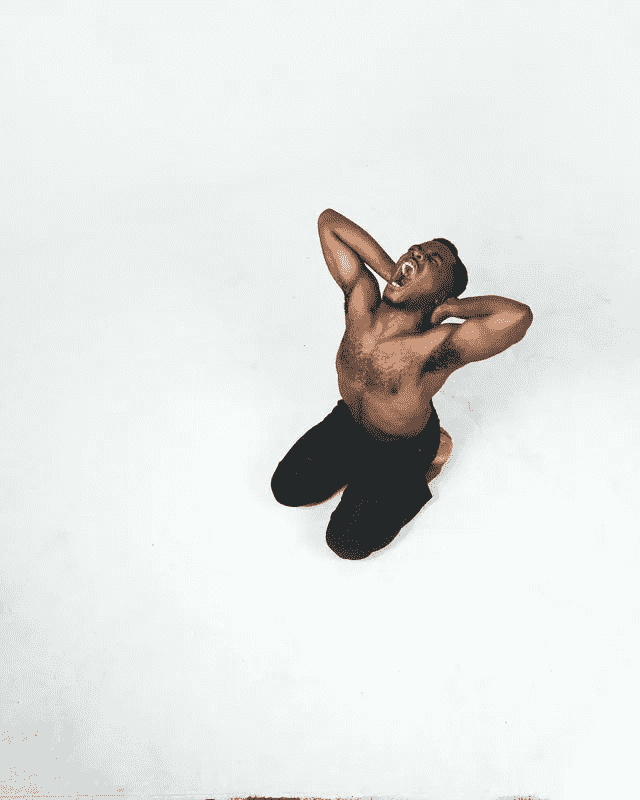
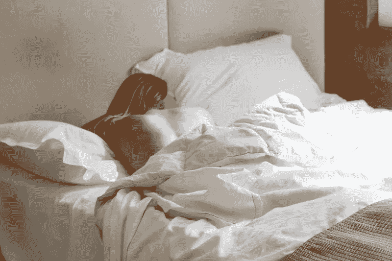

# 十年后我停止喝咖啡，以下是我的感受

> 原文：<https://medium.com/swlh/i-stopped-drinking-coffee-after-a-decade-and-heres-how-i-feel-2156cf3c267e>

我相信咖啡的好处并没有超过喝咖啡的成本。

如今，越来越多的研究揭示了咖啡对健康的诸多益处。从癌症到脂肪燃烧，咖啡被认为是一种健康的食物。

然而，正如传奇的斯坦福经济学教授托马斯·索威尔博士经常说的那样，在考虑添加有预期益处的东西时(在这种情况下，咖啡的健康益处和你的感觉)，你必须问:

“代价是什么？”

很多时候，东西的预期收益并没有超过与它们的使用相关的成本——我认为咖啡属于这一阵营。

无论是旨在创造效率的软件，还是因其用户体验和/或实施而导致效率低下的软件(这两者都很难做到正确)，还是以造成糟糕的睡眠和其他生活方式副作用为代价的具有抗癌功效的咖啡，都是导致你体内癌症环境的首要原因。

以这项研究为例，这项由《国家睡眠医学杂志》发表的研究(以及许多其他类似的研究)表明，咖啡对快速眼动睡眠有显著影响。

这项研究的结论是:

***“总睡眠时间减少的幅度表明，睡前 6 小时摄入咖啡因对睡眠有重要的破坏性影响，并为睡眠卫生建议提供了经验支持，以避免在睡前至少 6 小时大量使用咖啡因。”***

很明显，睡眠是健康最重要的组成部分之一，睡眠不足会导致糖尿病、免疫功能低下等等。

当然，一个人应该自己思考，并根据他们的经验和感受做出决定，这让我想到了我最近在健康和健身方面的策略——专注于去除东西(经常禁食，每天一餐),减少添加东西(服用补充剂，艰苦的锻炼)。

我现在尽可能多地切咖啡。如果不是必须喝，而且对身体不好，为什么还要喝呢？

**但首先:我为什么要写这篇文章**

我喝咖啡已经有很长一段时间了——直到大约一个月前我决定停止。我喜欢咖啡。

为什么不呢？这是一种冥想，因为我会喝一杯热咖啡放松一下。无论我是从突发的工作中恢复过来，为下一个工作做准备，还是以阅读和写作开始我的一天(啊，天哪！).有什么不喜欢的呢？所以要知道，这不是对咖啡行业或任何类型的政治议程的讨伐。

这只是一个悲伤的前咖啡饮用者，他把健康和表现看得比他对咖啡的爱更重要一点——自从戒烟后，他在睡眠和总体精力方面有了突破。

由[姆旺吉·加塞卡](https://el2.convertkit-mail2.com/c/preview/zvtghnh9/aHR0cHM6Ly91bnNwbGFzaC5jb20vcGhvdG9zL0FEcHRrMzhLMTRnP3V0bV9zb3VyY2U9dW5zcGxhc2gmdXRtX21lZGl1bT1yZWZlcnJhbCZ1dG1fY29udGVudD1jcmVkaXRDb3B5VGV4dA==)在 [Unsplash](https://el2.convertkit-mail2.com/c/preview/pnceh9hk/aHR0cHM6Ly91bnNwbGFzaC5jb20vc2VhcmNoL3Bob3Rvcy9hbmdyeS1tYW4_dXRtX3NvdXJjZT11bnNwbGFzaCZ1dG1fbWVkaXVtPXJlZmVycmFsJnV0bV9jb250ZW50PWNyZWRpdENvcHlUZXh0) 上拍摄的照片

事实是，如果你每天都喝咖啡，哪怕是一两次，咖啡因都会留在你的体内，这个习惯会让你无法获得最佳睡眠。最佳的睡眠对于最佳的健康和康复是绝对重要的。

当我意识到这一切，再加上许多其他事情，我决定停止喝咖啡。

事情是这样的。

我的睡眠变得好多了

**照片由** [Maddi Bazzocco](https://el2.convertkit-mail2.com/c/preview/xksph6h8/aHR0cHM6Ly91bnNwbGFzaC5jb20vcGhvdG9zLzUxOXo2eHVpTXhjP3V0bV9zb3VyY2U9dW5zcGxhc2gmdXRtX21lZGl1bT1yZWZlcnJhbCZ1dG1fY29udGVudD1jcmVkaXRDb3B5VGV4dA==) **拍摄于** [Unsplash](https://el2.convertkit-mail2.com/c/preview/60aeh8hv/aHR0cHM6Ly91bnNwbGFzaC5jb20vc2VhcmNoL3Bob3Rvcy9jb2ZmZWU_dXRtX3NvdXJjZT11bnNwbGFzaCZ1dG1fbWVkaXVtPXJlZmVycmFsJnV0bV9jb250ZW50PWNyZWRpdENvcHlUZXh0)

自从我停止喝咖啡以来，我一直睡得像个婴儿。入睡变得更容易了。最重要的是，高能量更自然的醒来已经成为常态。

我喜欢在工作日的早上 5 点醒来，这意味着按时睡觉以获得足够的休息是至关重要的。当你 8:30 躺在床上试图在晚上 9 点入睡时，这并不容易。我经常躺在床上试图入睡，但却睡不着，尽管我的大脑和身体都被训练成这样。

当我回顾那些难以入睡的夜晚时，有一种微妙的身体负担感(可能来自肾上腺素，因为[咖啡会耗尽你的肾上腺素，从而影响荷尔蒙](https://el2.convertkit-mail2.com/c/preview/kmbmh6hg/aHR0cHM6Ly93d3cuZGVjYWRlbnRkZWNhZi5jb20vYmxvZ3MvZGVjYWRlbnQtZGVjYWYtY29mZmVlLWNvL2NhZmZlaW5lLWFuZC1hZHJlbmFsLWZhdGlndWU=))，这激起了一种微妙的压力，使大脑更加活跃。

这种事再也不会发生了。

现在在床上感觉更自然，更容易入睡。我早上醒来时也更精神——通常是在闹钟响之前。

**我的下一个理由:发现肠道健康的重要性**

肠道现在被认为是我们的“第二大脑”。正如[在《科学美国人](https://el2.convertkit-mail2.com/c/preview/52hvh7hp/aHR0cHM6Ly93d3cuc2NpZW50aWZpY2FtZXJpY2FuLmNvbS9hcnRpY2xlL2d1dC1mZWVsaW5ncy10aGUtc2Vjb25kLWJyYWluLWluLW91ci1nYXN0cm9pbnRlc3RpbmFsLXN5c3RlbXMtZXhjZXJwdC8=)上的这篇文章所说:

*“肠道神经系统(gut)通常被称为我们身体的第二大脑。有数亿个神经元将大脑与肠道神经系统相连，肠道神经系统是神经系统的一部分，负责控制胃肠系统。”*

除了对你的肾上腺征税之外，每次喝酒时分泌压力荷尔蒙皮质醇的腺体(值得重复一下，当你醒来时，皮质醇已经很高了)，它还会破坏你的胃壁，并可能导致(或最终导致)溃疡和胃炎。

the[buswl 做了一篇很棒的文章](https://el2.convertkit-mail2.com/c/preview/2ou2hohr/aHR0cHM6Ly93d3cuYnVzdGxlLmNvbS9wL2RvZXMtZHJpbmtpbmctY29mZmVlLWFmZmVjdC15b3VyLWd1dC1oZWFsdGgtaGVyZXMtd2hhdC10aGUtcmVzZWFyY2gtc2hvd3MtMTU5MzUzMDE=)并引用了 Shawn Khodadadian 博士的观点，他说:

*“由于咖啡的酸性，它会对你的胃和肠道产生不利影响。如果你长期大量饮用咖啡，将会恶化你现有的任何状况。”*

他继续分享他对病人的建议:

*“如果你患有克罗恩病、肠易激综合征或溃疡性结肠炎等胃肠道疾病，就不应该喝咖啡。会加剧你的症状。”*

*这个建议可能不是针对每天喝 1-3 杯酒的人，但我确实认为每天喝超过一杯的酒是在浪费我们的钱，而不是帮助我们。*

*就我个人而言，我没有任何溃疡或严重胃病的问题，但是我要说的是，自从我停止喝咖啡以来，我的身体似乎更加凉爽和平静，不是由咖啡引起的排便似乎比喝我的晨间咖啡更自然。*

然而，同样值得注意的是,“规律”等同于健康，这似乎是直觉，但最重要的是我们吸收实际摄入的东西有多好。因为我们摄入的大部分食物，最终都会留给我们不健康的东西。因此，尽管看起来很直观，但理想情况下，我们会保留更多，减少浪费。

*这实际上是为什么很多人被认为是“瘦”的，尽管他们“想吃什么就吃什么”——他们经常喝咖啡，胃不好，不能吸收他们摄入的大量食物。*

**结论**

每天我都看到新的研究说某样东西是好的，而另一项研究说同样的东西是不好的。**因此，从这次经历中如果有什么主要收获的话，那就是多听听自己的声音。**

激发我写这篇文章的是我停止喝咖啡后的感受。对我来说，结果是显著的。然而，我们都是不同的，生活方式也不同。

当然有

不同的饮食结构和营养方案可以让咖啡以健康的方式被消费。我从不羞于承认我做的每件事都很极端。

例如，防弹咖啡的创始人戴夫·阿斯普雷经常说要做防弹咖啡，不吃早餐和午餐，这导致你一天中的一餐是间歇性禁食。举例来说，这是一种喝咖啡的健康方式，而我们大多数人却把它当作拐杖(我知道我是这样做的)。

我跟踪的另一位[首席教练](https://el2.convertkit-mail2.com/c/preview/q3i8h7hg/aHR0cHM6Ly93d3cuaW5zdGFncmFtLmNvbS8xMDAweWVhcnlvdW5nLz9obD1lbg==)也是这么做的，而且非常健康。

但问题是，你是这样消费的吗？每天一次，大量的运动？

自从我戒了咖啡(两周)，我的睡眠变好了。精力充沛多了，我现在随身携带的习惯也少了一个。**也许最重要的是，这也促使我去晨练“醒来”,这太棒了。在某种意义上，我已经用那个代替了它。**

不要总是去咖啡店也可以节省时间和金钱。

我当然不会说我再也不喝咖啡了，因为我太喜欢它了。然而，六年前我又喝了同样的酒，再也没有回去过。

出于某种原因，我觉得咖啡会掉到营地里。

> [*点击接收我个人用来赢得一天的晨间例行电子表格和愿景板。多年来我一直在改进它，它改变了我的生活。每周日早上你还会收到我的最佳每周文章。*](https://betreatedhowyouwanttobetreated.com/optin-main)

## 这篇文章发表在 [The Startup](https://medium.com/swlh) 上，这是 Medium 最大的创业刊物，拥有+446，678 名读者。

## 订阅接收[我们的头条](https://growthsupply.com/the-startup-newsletter/)。

