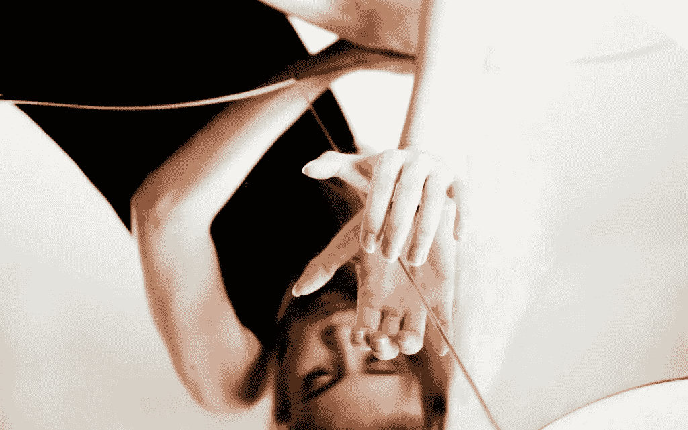

# 我戒酒了，然后意识到我的一生都是谎言

> 原文：<https://medium.com/swlh/i-stopped-drinking-then-realized-my-whole-life-was-a-lie-680b642ca93b>

假装有你的屎在一起很像你自己烤生日蛋糕，然后一个人吃。很多努力最终会让你感觉比开始时更糟糕。

当我的生活一团糟时，我所有的精力都花在了外表上。嗯，所有的精力不是花在购买毒品和喝醉上。我的…