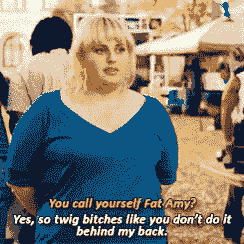
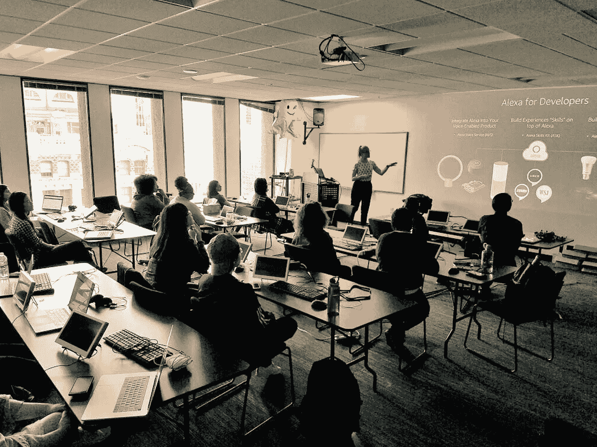
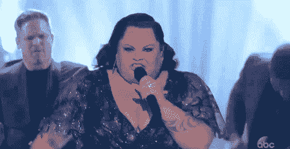

# 我发誓这将是我最后一次谈论自己

> 原文：<https://medium.com/swlh/i-swear-this-will-be-the-last-time-i-talk-sh-t-about-myself-9e7f53cdea20>

# 声明，我最初是在 2018 年 5 月写的。

*我即将从* [*Ada 开发者学院*](http://adadevelopersacademy.org) *毕业，需要将紧张的情绪从脑海中释放出来，写在纸上。但我没有发表。我无法让自己真的按下* `*publish*` *键。承认我 f̶e̶l̶t̶在科技行业的不安全感让我感到羞愧。*

然而，现在，差不多一年过去了，随着我有了更多的经验，有了新的公司，有了新的角色，我开始意识到我从来不是唯一有这种感觉的人。**我们当中有太多的人面临着自我怀疑、不安全感和冒名顶替综合症。许多人也通过非常规的途径(如训练营或自学)进入这个行业，而不是在大学里学习计算机科学。很多人同样质疑这个行业是否有像我们这样的人存在的空间。**

*虽然写这篇文章的时候感觉很好，也很宣泄，但对我自己来说，现在分享是很重要的。也许它会引起你的共鸣，谁知道呢🤷🏼‍♀️:可能不会，但我不想让它再占用我草稿文件夹的空间了。*

> *2018 年 5 月:*

*事情是这样的。我很清楚，当我谈论自己的时候，没有人会赢。然而我似乎无法停止。也许这是一个骗子综合症的糟糕案例，或者是我们的男权社会教给我的一种根深蒂固的行为，但不管出于什么原因，我用自我贬低引领了太多的职业互动。*

*在我的这个新领域很容易做到。*或者更确切地说，我已经想出了很多理由来解释我为什么要这么做:你知道，我是一名程序员，但我来自一条非传统的道路。在过去的 7 年里，我一直是英语老师，之后我参加了一个编码训练营。这意味着我不像开发团队中的其他人那样拥有计算机科学学位。虽然我的同行已经在这个行业工作了至少五年，但我只做了大约一年的编码工作！**

*所以我经常面临没有归属感和不安全感的感觉。为了应对，我降低自己的能力，或者拿自己的无能开玩笑，并藏在讽刺和幽默的背后。我笑着做这件事，一笑置之——邀请其他人一起欢笑，这是我的不足。*

*但让我们现实一点，这不好笑，也不真实，完全是一种防御机制。我这样做是因为害怕有人会认为我真的不属于这里。出于害怕他们最终会揭露我隐藏的真相，看穿我的外表，并意识到我天生不知道如何穿越二叉查找树！他们会发现我不属于这里。因此，我发现自己试图在别人拒绝我之前，通过自我破坏来击败他们。*

**

*事情是这样的，自嘲式的幽默可能是一种好的品质。它可以证明某人有自知之明，谦逊，有同理心，没有自我。*

*但更多的时候，对我来说，这变成了一个自我实现的预言。因为，令人震惊的是，如果你说的次数足够多，你最终会相信的！*

*最近，我在 Ada 教授了一个技术物联网研讨会，内容是如何构建一个支持 Alexa 的原型。我为此做了紧张的准备，花了大量的时间来练习我的幻灯片，并修改我的例子以使它变得完美。我做好了充分的准备，并积累了我所交付的技术内容的专业知识。但是你知道什么？在我的演讲中，充满了自嘲式的俏皮话，说我对硬件的内部工作方式知之甚少！*

*最糟糕的部分？我甚至没有意识到我在开这些玩笑。😳后来我的导师不得不向我指出这一点！这就是这种行为的根深蒂固。有时我完全不知道我正在做这件事！*

**

*Me teaching a technical workshop & demo-ing my expert ability to self-deprecate at the very same time!*

*太可笑了。我知道我必须摆脱这种不安全感。尤其是当我开始面试新的科技公司时——这种在第一印象时为自己道歉的习惯会严重影响我获得工作的机会。此外，我的一个严肃目标是继续举办研讨会，并更多地参与公共演讲。我已经向几个地方会议提交了一些建议。*但是让我们现实一点，如果连我都不相信我有资格去那里，为什么会有人想听我演讲呢？**

*我写下这些，深知这让我有多脆弱。对我来说，暴露如此深刻的不安全感可能相当冒险:**我不属于这个行业的感觉。或许，我终究没有成为一名成功的程序员的潜质。***

*但让它见鬼去吧。因为我拒绝相信我是第一个有这种感觉的人！也许我们谈论得越多，将来别人就越不可能成为这些自我怀疑的困扰的受害者。*

*所以我在这里，站在我的真相中，准备好最终停止为我是谁而道歉。是的，你们已经在这里听过了，伙计们，今天真的是我真正停止(或者至少*真的真的*尝试)的一天——记住伙计们，根深蒂固的行为很难戒掉！).毕竟，谁会从这些不安全感和这种自嘲的行为中获益呢？**只有那些首先创造了这个男性主导的行业的人，才是真正的男人！***

**

*my favorite line from my favorite movie, The Greatest Showman*

*重要的是要注意，绝不是我充满了自我憎恨。那是*绝对*不是这样的。这么多年后，我为自己改变职业道路、追求梦想的选择感到无比自豪。我喜欢做开发人员。我很擅长这个！*

> *事实上，我写这篇文章是为了提醒自己，我最不安全的东西实际上可能是我无论去哪里都随身携带的资产。也许我在当老师、系主任、排球和越野教练以及这些年的导师时学到的技能可能会让我未来的技术团队受益。*
> 
> *也许我的观点会与那些来自相同教育道路的人不同。也许我真的**属于这个行业，感谢 Ada 开发者学院，我正在进入的领域每天都在变得更好。***

*因此，我保证不会让那些自我怀疑的时刻得逞。他们再也不能打败我了。我真的相信自信来自内心，我的使命是改变我看待自己的方式。我会一天天地接受它，但希望那些关于我智力的笑话已经成为过去。我想是 TBD 吧——我会随时通知你的。😉*

# *我 2019 年的一些更新:*

> *M arch 2019:*

*   *我很自豪地说，我不仅继续在西雅图的当地会议上展示和演讲，而且去年我还在两个国家科技会议上发言！我已经为 2019 年准备了一些💣*
*   *我不能自信地说，我实现了对自己的承诺，并让 2018 年 5 月的那一天成为我开自己玩笑的最后一天。但我可以高兴地报告，我不再相信我在这个行业不受欢迎。我为自己开拓了空间。我现在为自己与众不同而感到自豪，事实上，我喜欢分享我以前当老师的经验和故事。*
*   *我已经学会了如何识别盟友和导师，如何在雇主面试中提出正确的问题，以识别重视多元化的团队，现在我能够识别那些将我以前的生活经历和非常规的技术道路视为益处而不是贬损者的经理。*
*   *更重要的是，我自己不再把我的科技之路视为障碍。我接受了我作为一名教育工作者所学到的技能，并找到了在我作为技术产品经理的新角色中利用这些技能的方法。我不再为我的旅程感到尴尬。*
*   *我承认，虽然我有时仍然对自己不知道的东西感到不安全，但我已经学会了重新组织这些想法，并在我还不知道的东西中发现兴奋。那些未知都只是学习更多的机会！这个行业最大的好处是，我们永远都是学习者，总能找到挑战自我和学习新事物的方法。*
*   *因此，在过去的一年里，我学会了拥抱我的失败以及许多我不知道的事情，并把它们理解为成长的机会。*

> **{这么久自嘲&你好成长心态！}**

*我希望通过分享这篇文章，这些不安全感，以及我去年写给自己的不再用自我怀疑的感觉来定义自己的承诺，能引起某人的共鸣。*

*我希望，如果你感到孤独、无能、愚蠢、没有安全感，或者在这个行业不受欢迎，这可能会有所帮助。我不再不好意思承认我有时也有这种感觉。让我们开始拥抱未知。让我们庆祝我们进入这个行业的独特道路，并帮助创造空间，让更多的人加入我们的行列，继续使技术多样化！💪🏽*

*跟随我的旅程— @LoLoCoding👩🏼‍💻 [Instagram](https://www.instagram.com/lolocoding/) & [推特](https://twitter.com/LoLoCoding)*

****

## *这篇文章发表在 [The Startup](https://medium.com/swlh) 上，这是 Medium 最大的创业刊物，拥有+434，678 名读者。*

## *在这里订阅接收[我们的头条新闻](https://growthsupply.com/the-startup-newsletter/)。*

**