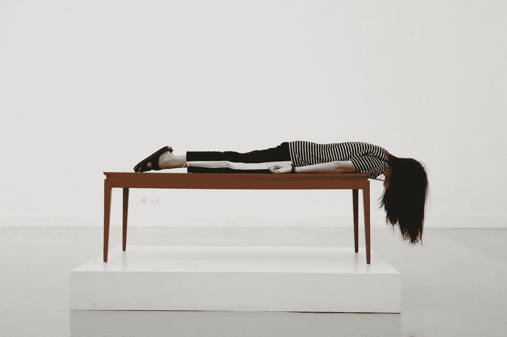

# 我想我睡得太多了

> 原文：<https://medium.com/swlh/i-think-i-had-too-much-sleep-cebe30567460>

Photo by [Pim Chu](https://unsplash.com/@pimchu?utm_source=medium&utm_medium=referral) on [Unsplash](https://unsplash.com?utm_source=medium&utm_medium=referral)

## 这影响了我的工作效率

众所周知，随着年龄的增长，我们需要更少的睡眠来保持最佳状态。成年人每天应该睡 7-9 个小时，但是经常睡不到建议的时间。