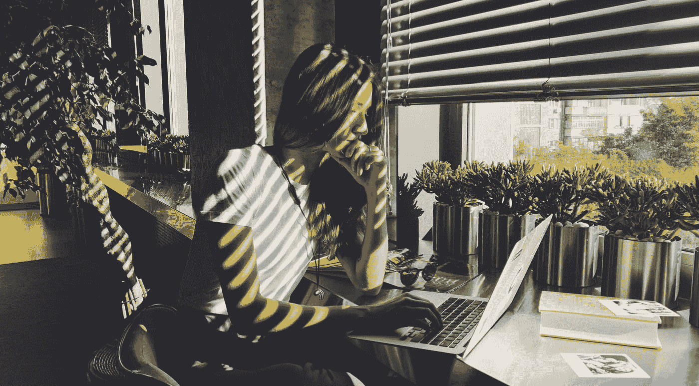

# 我以为我想成为一名自由职业者

> 原文：<https://medium.com/swlh/i-thought-i-wanted-to-be-a-freelancer-80596fc27872>

## 但事实证明我错了。

Photo by [Jane Palash](https://unsplash.com/@jane_palash?utm_source=medium&utm_medium=referral) on [Unsplash](https://unsplash.com?utm_source=medium&utm_medium=referral)

两年多前，我辞去了上一份全职工作，成为一名自由网页设计师和顾问。

一开始，一切都很顺利。

我沉迷于这种忙碌，并且能够找到一些报酬丰厚的好工作，而且不像我以前的“真正的”工作那样令人窒息。