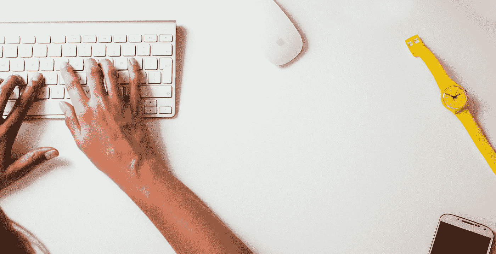

# 我放下写作休假了

> 原文：<https://medium.com/swlh/i-took-a-vacation-from-writing-d54d7ebf347a>

## 我学到了关于我写作生涯的宝贵一课。

Photo by [Life Of Pix](https://www.pexels.com/@life-of-pix?utm_content=attributionCopyText&utm_medium=referral&utm_source=pexels) from [Pexels](https://www.pexels.com/photo/keyboard-desk-wristwatch-watch-8264/?utm_content=attributionCopyText&utm_medium=referral&utm_source=pexels)

我不打算完全停止写作；我想我可以在假期里挤出一些工作时间。好家伙，是我弄错了！连花在自己身上的时间都没有，更别说工作了。当我终于坐下来的时候，我已经筋疲力尽，不想写作了。