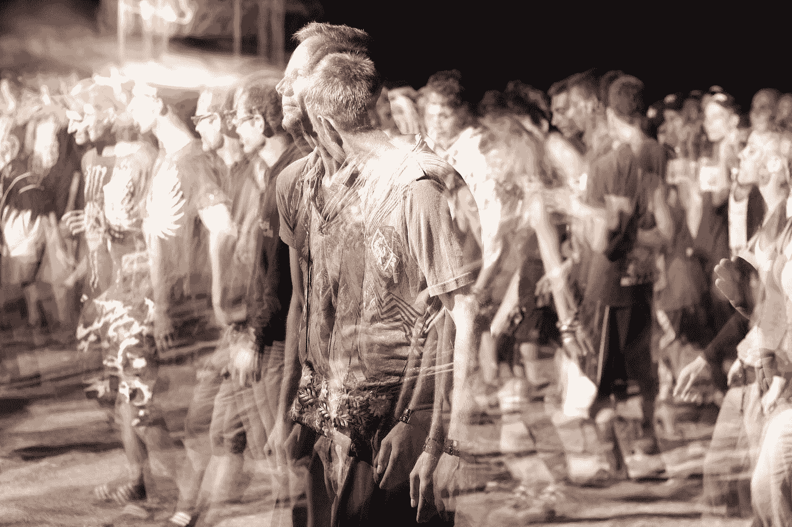

# 十七岁时，我超越了自我

> 原文：<https://medium.com/swlh/i-transcended-my-ego-when-i-was-seventeen-85c15287b26e>

## 不幸的是，它回来了，比以前更大，更强，更烦人。

Photo by [GoaShape](https://unsplash.com/@goashape?utm_source=medium&utm_medium=referral) on [Unsplash](https://unsplash.com?utm_source=medium&utm_medium=referral)

在我长大的曼哈顿海滩的街对面，有一个叫布莱恩的家伙每天都推着这辆奇怪的气球轮胎自行车到处跑。他会把它一路推到商店，在那里他会像时钟一样买三个银河。他会吃一个…