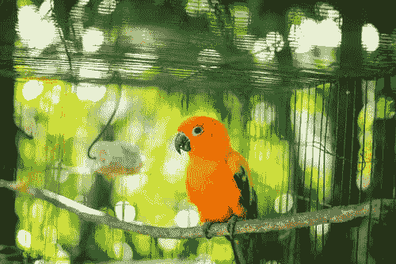

# 我曾经是一个隐私鹰派；我曾经知道笼中鸟为何歌唱

> 原文：<https://medium.com/swlh/i-used-to-be-a-privacy-hawk-i-used-to-know-why-the-caged-bird-sings-e773683aed1d>

Public Domain Photo by Huỳnh Đạt from Pexels

在我十八九岁的时候，我为国家安全局的空军部门工作，我认为自己相当老练，认为没有必要因为是一个从飞越乡村辍学的美国印第安人而声称自己有残疾。我读过 1984 年的《T1》。我读过《T2》《美丽新世界》。