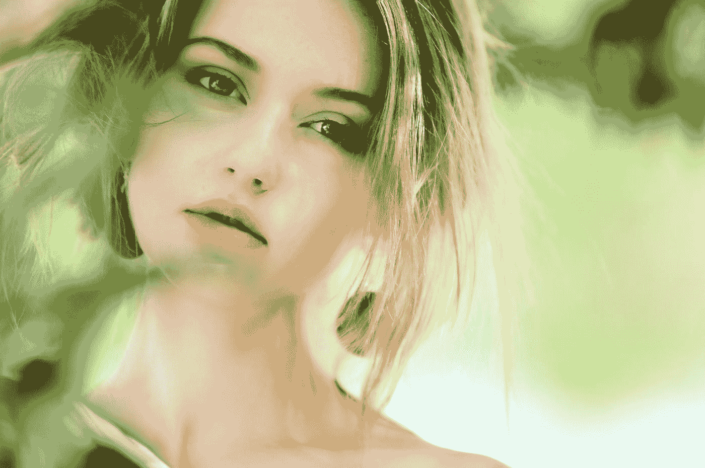

# 我想变漂亮:对不起不是对不起

> 原文：<https://medium.com/swlh/i-want-to-be-beautiful-sorry-not-sorry-fa184dfe5b68>

Photo by [Melan Cholia](https://unsplash.com/@melan_cholia_photography?utm_source=medium&utm_medium=referral) on [Unsplash](https://unsplash.com?utm_source=medium&utm_medium=referral)

## 如果你也想，我会告诉你怎么做

好吧。我想变漂亮。好了，我说了。由于某种原因，这个短语在我们的社会中变得带有贬义。我们被鼓励重视我们的智慧、同情心和勇气。对此，我说，当然可以！但是…我还是想变漂亮。