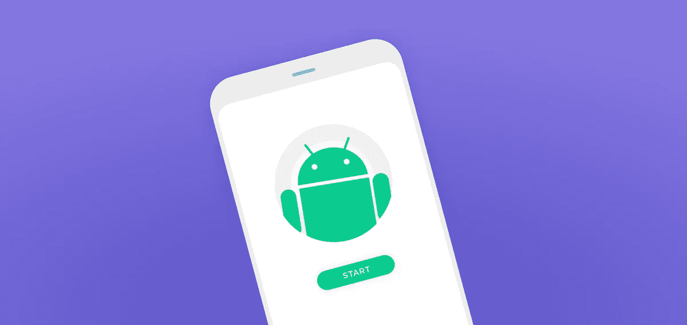
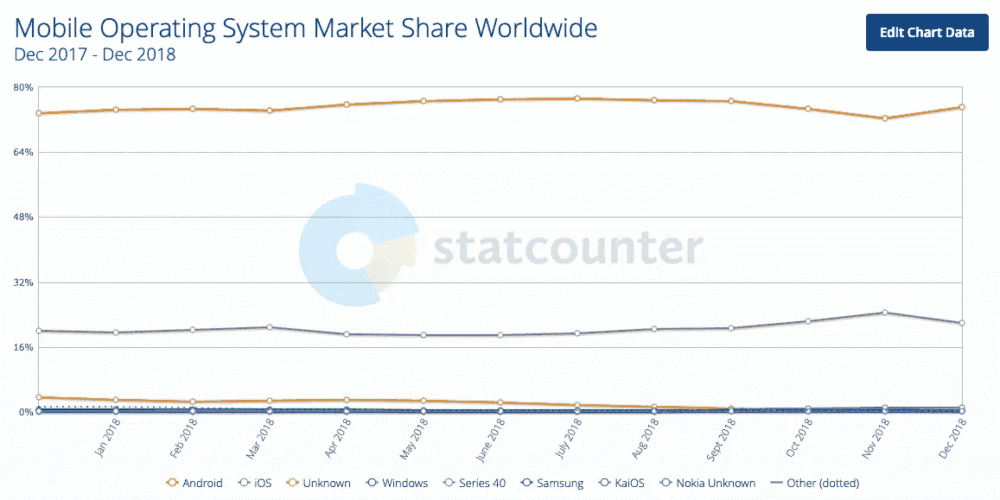
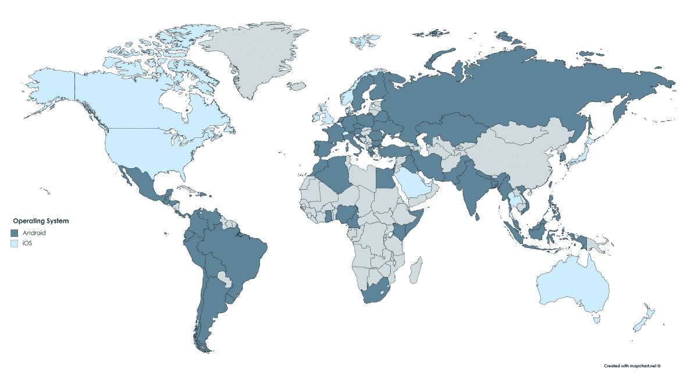
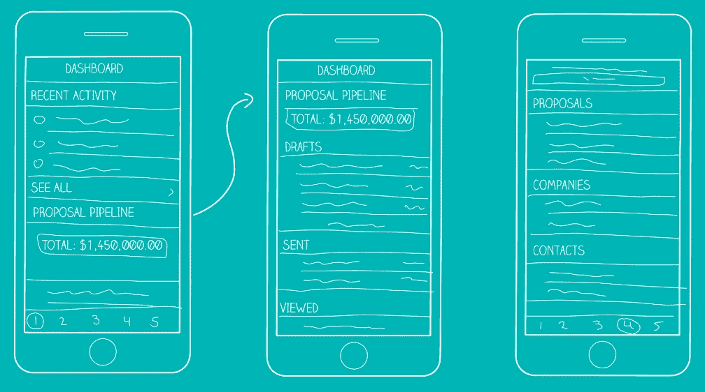

# 我想建立一个 Android 应用程序。我应该从哪里开始？

> 原文：<https://medium.com/swlh/i-want-to-build-an-android-app-where-should-i-start-8230ea94dec0>

所以你想开发一个安卓应用🤖

你已经想出了一个惊人的移动应用程序的主意——你甚至可能知道它需要什么样的功能或者你想要什么样的用户界面。

现在怎么办？

现在是时候卷起你的袖子，让一些移动魔术发生了！但首先，你需要一个计划。

请记住，没有计划的目标只是一个愿望——在 MindSea，我们将帮助您将愿望转化为目标，并将目标转化为现实。因此，让我们弄清楚实现最终产品的具体步骤。

以下是如何做到这一点:

# 做你的研究

首先确定为什么 Android 是你选择的操作系统。

你确定你的受众是安卓用户，还是仅仅是你自己的偏好？

当构建你的应用时，根据直觉和直觉做决定是个坏主意。你希望你的目标受众参与进来，你希望你的应用程序在未来几年里蓬勃发展。这意味着你的观众的喜好比你自己的更重要。

在全球范围内，Android 的优势在于:

*图片来源:*[*【http://gs.statcounter.com/os-market-share/mobile/worldwide】*](http://gs.statcounter.com/os-market-share/mobile/worldwide)

如果新兴市场是你的目标，安卓仍然是更强的选择:

*图片来源:*[*https://deviceatlas.com/blog/android-v-ios-market-share*](https://deviceatlas.com/blog/android-v-ios-market-share)

另一方面，iOS 在北美和澳大利亚更受欢迎，在青少年中更受欢迎。

在开始构建之前，您需要知道哪个平台适合您公司的愿景和您的受众群体。

# 保护你的团队

你具备开发安卓应用的资源吗？

因为 Android 是一个开源操作系统，让你的应用程序跨设备兼容并不那么简单。技术熟练程度，以及开发所需的时间和金钱，通常对你是内部开发还是外包给代理公司有最大的影响。

考虑一下你现有的团队是否具备这三样东西:

1.  能力——如果你是一家小型创业公司，为了追求这个项目，你的任何(或所有)团队成员将他们的注意力从业务的其他方面转移是否有意义？请记住，一个应用程序可能需要四个多月的时间来构建。这是否会导致您业务其他领域的延迟？
2.  能力——你的团队成员可能有他们的专业领域，并且处理得很好，但是他们如何适应新的职责，比如项目管理、应用程序设计和应用程序开发？你的团队越小，每个人需要戴的帽子就越多。
3.  资金——时间就是金钱，因此将团队的关注点从日常运营转移到应用构建可能会影响其他创收活动。虽然雇佣外部团队的成本可能很高，但你必须权衡失去业务的成本或雇佣新的内部角色的成本。

根据你的资源，有形的和无形的，雇佣外部代理可能是你最好的选择。如果你也是这种情况，[今天就联系我们的产品专家](http://content.mindsea.com/schedule-your-free-meeting-with-our-product-strategist)，看看我们能帮上什么忙！

# 发展你的战略

制定一个计划。

了解你的时间表。

清楚地了解你的应用是为谁设计的，它解决的是什么问题。确保你的计划包括重要的检查点，如用户研究、用户测试、原型制作、投资者推介等。

在 [MindSea](https://mindsea.com/) ，当我们接手任何新的客户端构建时，我们从我们称之为[的移动应用蓝图](https://content.mindsea.com/blueprint)开始。这份文件通过制定项目的时间表、预计成本、设计和开发策略等，让我们的团队保持正轨。

在这一步，你还应该明确你的目标受众和你的应用程序的基本要求。与您的团队*和*您的客户召开一次战略会议，根据市场需求、市场需求和竞争对手提供的产品，集思广益，确定功能和功能的优先顺序。

# 多做研究

你已经完成了最初的头脑风暴；现在你需要用数据来支持你的想法。

在深入设计和开发计划之前，您需要有清晰的、有数据支持的证据来支持您的每个决策。你需要能够清楚地表达你的应用程序是为谁和做什么的，为什么它应该有某些功能，以及为什么它应该按照它的方式构建。

不确定如何进行用户研究？查看[如何开展推动 UX 成功的用户研究](https://mindsea.com/ux-user-research/)开始行动。

# 创建您的草图

根据你的应用程序的大小和复杂程度，你可能会使用像 [OmniGraffle](https://www.omnigroup.com/omnigraffle) 或 [LucidCharts](https://www.lucidchart.com/) 这样的工具来创建你的草图——或者只是一支铅笔和一张纸，或者一支记号笔和一块白板。

不管你的方法是什么，规划出你的应用程序的用户流是很重要的。如果你能在导航工作之前描绘出一幅清晰的画面，某些屏幕将把用户带到下一步——本质上是任何应用程序内操作的结果——你就能在开始构建之前发现设计缺陷和可用性问题。

# 构建你的线框

草图之后是你的线框。这些是你的产品的低保真度、简化的轮廓，由方框、文字、线条和有时的描述组成——基本上是更详细的草图。他们的目的是为你的应用奠定框架，而不是产生最终的外观和感觉。

# 开始原型制作

如果你想为你的应用筹集资金，你需要向潜在投资者展示一些东西。这意味着[建立一个原型](https://mindsea.com/how-to-prototype-a-mobile-app/)。

原型是一些具体的、有形的东西，你可以在用户测试、最终设计规划和投资者推介中使用，以展示你的应用程序的功能。

# 开始建设！

完成设计，创建动画，构建您的代码…

这是一切汇集的地方！我们推荐使用 Android 的官方集成开发环境 [Android Studio](https://developer.android.com/studio/) ，并将其与 [Material Design](https://material.io/design/) 和 [Java](https://go.java/index.html?intcmp=gojava-banner-java-com) 等工具配对。

# 包装它

与任何大型项目一样，当你将一个应用分解成可操作的步骤时，整个过程似乎就没那么可怕了。同样，规划出构建的每一步也揭示了需要投入多少！

学习编码和开发你自己的移动应用肯定是可行的——你可以在像 [Coursera](https://www.coursera.org/) 和 [Lynda](https://www.lynda.com/) 这样的网站上查找课程，或者在你所在的地区找到一些当地聚会或培训项目。

另一方面，如果过程看起来漫长而复杂，[给我们打电话](http://content.mindsea.com/schedule-your-free-meeting-with-our-product-strategist)！这就是我们从事这项业务的原因——帮助像贵公司这样的初创公司和企业更快地将其移动应用推向市场。

在 MindSea，我们的团队致力于为 Android 设备创造出色的移动应用体验。我们不断测试和采用谷歌的最新技术，以确保我们的应用符合谷歌标准，并超越我们客户的期望。

想看看我们如何帮助你的下一个版本吗？[今天就联系我们](http://content.mindsea.com/schedule-your-free-meeting-with-our-product-strategist)。

*原载于 2019 年 2 月 13 日*[*【mindsea.com*](https://mindsea.com/build-android-app/)*。*

## 这篇文章发表在 [The Startup](https://medium.com/swlh) 上，这是 Medium 最大的创业刊物，拥有+429，678 名读者。

## 在此订阅接收[我们的头条新闻](https://growthsupply.com/the-startup-newsletter/)。

