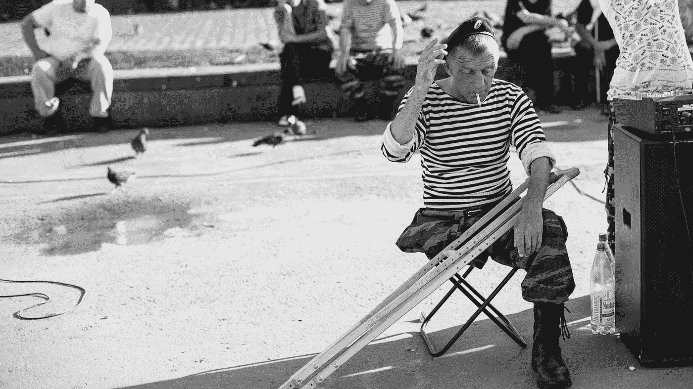

# 我想成为一名作家，但我却成了一名矫形师。

> 原文：<https://medium.com/swlh/i-wanted-to-be-a-writer-i-became-an-orthotist-instead-6b0982b869e4>

## 作为作家应该有 B 计划吗？

Photo by [Alev Takil](https://unsplash.com/@alevtakil?utm_source=medium&utm_medium=referral) on [Unsplash](https://unsplash.com?utm_source=medium&utm_medium=referral)

当我在 2008 年获得矫正和修复学硕士学位时，还没有一个叫 Medium 的地方可以让你通过博客立即赚钱。如果有的话，我想我永远也完成不了我的学位。