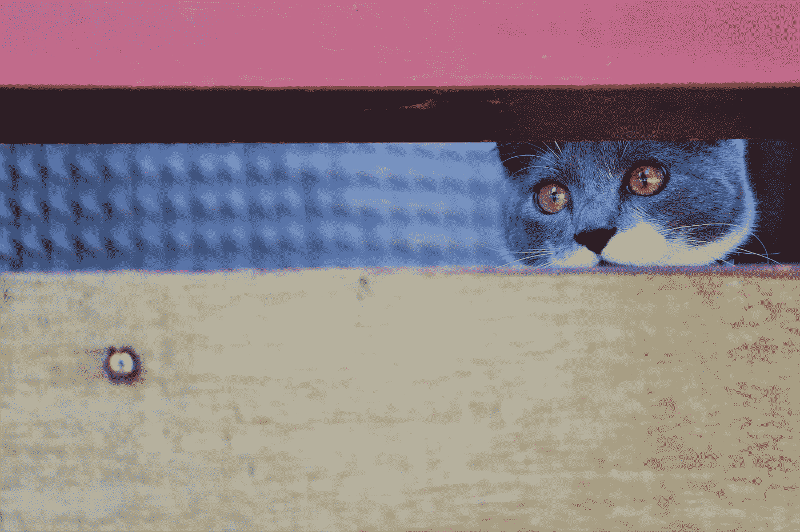

# 我会…但是我是一个内向的人

> 原文：<https://medium.com/swlh/i-would-but-im-an-introvert-1cabcc90a39>

现代文化中似乎有一条潜规则:如果你被邀请参加某件事，你就应该去。

当然，有一些警告。如果一级亲属只有三天可活，你会勉强原谅。或者你已经怀孕 8 个月零 29 天，身体不适，无法开车。Ubers 正以 4 倍的速度增长。

否则，很可能你会尽一切努力去那里。带着铃铛。许多铃铛。

问题当然是有些人就是不爱社交。

当然，一个人可能不会“忙于其他事情”或在预定的场合的晚上猛烈地呕吐。但是当他们天生离群索居，床头柜上有一本吸引他们的书时，一个远方熟人的 28 岁生日派对可能会成为他们愉快夜晚计划的一个令人沮丧的障碍。

在适当的情况下，即使看似吸引人的事件也会变得令人倒胃口。与好朋友共进晚餐听起来像是庆祝，但当你感到有点疲惫时，感觉更像是一种义务。

事实上，我认识的许多内向的人在一次活动结束时已经筋疲力尽，他们不得不把自己锁在一个安静的房间里三天，以恢复精神。见鬼，作为一个骑墙派的半外向半内向的人，甚至**我**偶尔也会在派对中途去趟洗手间，纯粹是为了暂时逃离喧嚣。

因此，尽管社交活动被宣传为令人向往的休闲活动，但让我们面对现实吧。如果你不是一个名副其实的外向者——有时即使你是——社交可能是一项艰苦的工作。

但是我们都讨厌冒犯。我们当然不希望因为不够“善于交际”而被批评。

所以当我们收到邀请时，我们做出乐观的承诺。锁定计划。说我们会去的…然后抱歉地以突发疾病为借口在最后一分钟取消。* **

这很可悲。

作为被邀请者，我们感到需要用虚假的封面故事来掩盖我们内向的特质，这很可悲。作为邀请方，令人难过的是，当我们举办活动时，我们为最初答应的 30 个人买了足够的食物和饮料，但最终只为最后一刻没有取消的 15 个人提供了食物。

有些东西必须放弃。

所以，听听这个行动的号召吧。如果我邀请你参加一个活动，而你不想来，**告诉我你不会来。你可能对我很重要…但我保证我会好好的，即使你不在我身边。**

如果我告诉你我不会去参加你的活动…不要觉得有必要去挖掘找出原因。请不要生气。

因为那真的不是你。

是我。

*我发现这个策略非常简单。毕竟，没人希望你在派对上把你那带着胃腥味的口水喷到餐桌上。

* *亲爱的朋友们；请不要假设。有时候我真的不舒服！