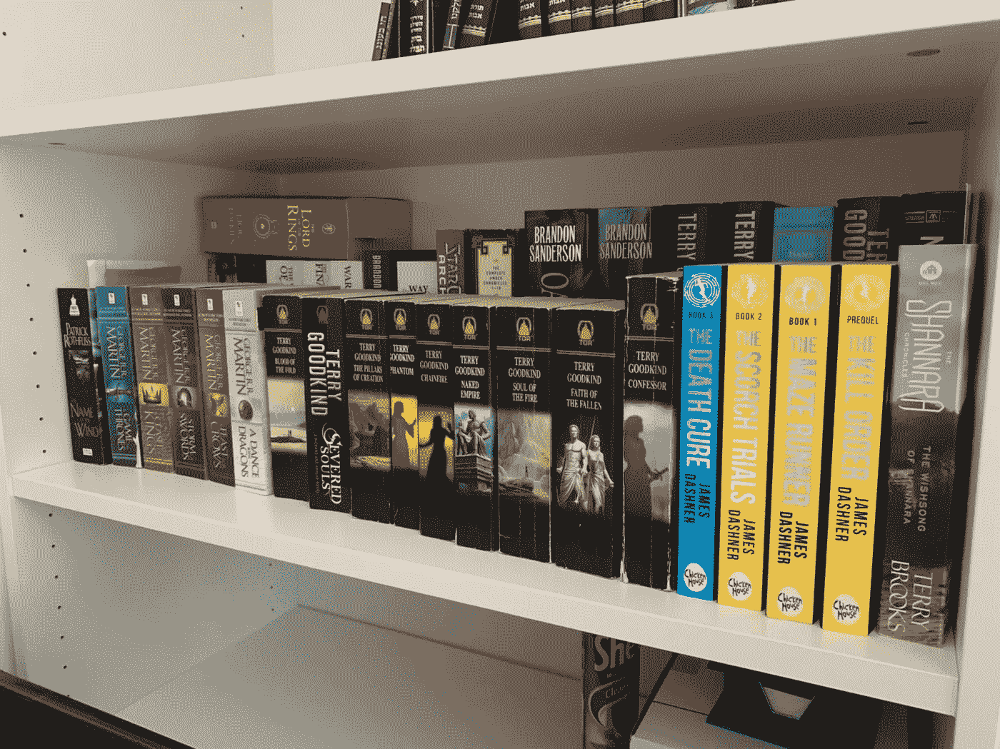

# 我写在我喜欢读的书旁边

> 原文：<https://medium.com/swlh/i-write-near-the-books-i-love-to-read-4791171bee82>

My Bookshelf. Do you recognize the books you’ve read?

## 不断提醒我想成为的作家。

有一样东西绝对摧毁每个作家的创造力:期待。现在，我不是在谈论其他人对作家的期望。我说的是我们对自己的期望。这本杂志会接受我的短篇小说吗？这个出版物会买我的书吗？威尔策展人…