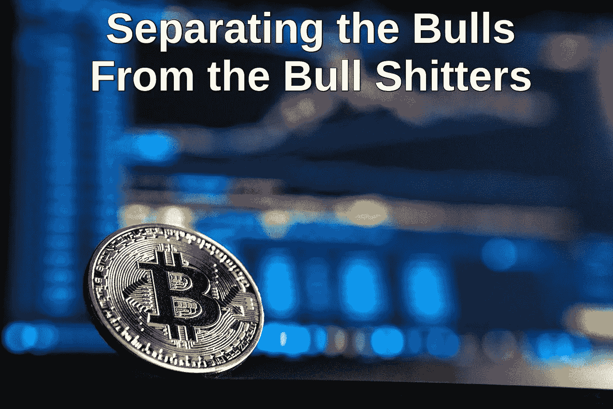

# ICOs——区分公牛和公牛屎

> 原文：<https://medium.com/swlh/icos-separating-the-bulls-from-the-bull-shitters-7363f8e4d108>

Do not get scammed by a sketchy ICO

令我烦恼的是，在如此多的社交和专业圈子里，来自这个生态系统的某些词汇会产生负面的回应。作为一家即将推出代币生成活动(TGE)的新科技初创公司的一部分，得知区块链、加密货币、Crypto、ICO、比特币、以太坊、采矿、代币、硬币等与这个生态系统相关的词汇(和首字母缩写词)就是这样做的，令人极其沮丧。当我对 ICO 进行研究时，有各种各样的文章指出，50%到 80%[1]发起 ICO 的组织最终都是骗局或失败。

在我作为联合创始人的项目中，我们真正将自己视为一个基于技术的组织，拥有一个全新的分布式平台，当谈到与人讨论项目时，提到“区块链”这个词会激起这些人的负面想法和/或情绪——尽管他们不是来自这个生态系统。

我不知道是否会有一天，这个生态系统中不诚实的个人会获得一些道德上的支持，并通过不启动无价值的项目来停止折磨人们，但我知道，普通大众可以选择支持或不支持这种行为。有许多人会参与 ICO 或 TGE，因为他们可能会成为赢家，但他们往往不会考虑进行适当的尽职调查或不在乎，因为他们只想成为赢家。因此，参与这些活动的社区必须承担部分责任，开始关心并投入时间来真正了解一个寻求您参与他们活动的项目。这意味着阅读每一篇文档，每一篇新闻稿，在 LinkedIn 上查找每一个人的个人资料，并在网上搜索。如果你对一个行业、一项技术或一个价值主张不确定，要么请你认为可能是该领域专家的人来帮助你，要么遵循我所说的“沃伦巴菲特投资方法”——将你的希望投资于你了解的产品或服务，和/或无论经济如何，人们通常仍会购买该产品或服务的地方。

你应该知道的另一个非常重要的知识是审查或评级服务网站，这些网站声称做了所有必要的尽职调查，以筛选出诈骗项目。自 2017 年以来，ICO 骗局的浪潮迅速而沉重，表现不佳的企业和粗略的 ICO 营销实践很少考虑商业道德、法律和人类尊严。可悲的是，自称 ICO 评级服务公司就属于这一类。你怎么可能会问？根据瑞士初创公司 Alethena 的一份报告，一种方法是在一个流行的 ICO 评级网站上购买一个好的评级(你可以点击报告超链接阅读详细信息)。此外，一些评级网站确实与某些项目有关联，这意味着 ICO 评级有可能不像他们声称的那样独立。那么，你应该认真对待这些评级吗？你能相信一个 ICO 评级吗？也许吧。大多数评级平台都充当着营销和公关工具的角色，它们向出价最高的投标人出售可见性，但看起来却是合法、公正的专家评级机构。有人告诉我，有一些真正的评级网站可能会雇佣有经验的分析师来评估创业项目。但归根结底，请记住，大多数评级机构的商业模式都是基于“发行人付费”模式的。综上所述，老密码投资缩写 DYOR(做你自己的研究)应该永远是第一位的。

这里有一些关于如何识别可能是“狗屎”骗局项目(ICO 或 TGE)的提示。请使用您自己的判断，因为这不是一门科学，也请理解该列表并不适用于每个项目——它们只是需要注意的警告标志。该列表并不意味着某个项目、公司或项目中的个人或与项目相关的个人是在进行诈骗。我想说的是要注意细节，从“为什么我不应该参与这个项目”和“为什么你应该参与”的角度来看待项目。这里有一些“危险信号”。

答:据说有些项目使用雇佣(女性)模特的照片来吸引潜在的投稿人。你可能还会在他们的 LinkedIn 个人资料中发现假的模特照片。LinkedIn 的个人资料可能很粗略，包含的信息很少，被奇怪地放在一起，通常缺乏导致他们在项目中的位置的职业轨迹的实质内容，包含很少或没有推荐，很少或没有联系人，使用不专业的照片，等等。请记住，有很多联系人的人并不一定意味着他们是合法的联系人，因为他们可以很容易地通过一个人将人随机添加到他们的联系人列表中以及使用技术营销代理来获得。

如果你看一下顾问名单，10 个以上的顾问会被认为是过多的，因此是可疑的。倾向于顾问的项目可能表明该项目几乎没有可信度和/或成功执行的可能性，因此它将使用顾问作为提升其品牌形象的工具。让名人在项目早期担任代言人的项目也可能被视为危险信号，因为他们可能试图利用所述个人的良好声誉，因此试图通过情感可信度而非技术可信度来影响公众。

在任何项目中，团队都是极其重要的组成部分。团队不仅是可能成功的度量，也是项目可信度的度量。在阅读了数百份白皮书和宣传资料后，很明显，许多项目的团队成员在商业、创业、技术以及行业或市场方面经验不足。

d-沟通中的完整性通常适用于团队成员关心他们向公众展示的输出质量的真实项目。他们会仔细检查他们项目的文档，寻找流程、语法、冗余、无关信息和错误。这并不是说它们是完美的，你可能会发现一些低级错误，但没什么大不了的。通过仔细阅读所有内容来寻找质量。

e-另一个有趣的争论焦点适用于所有印刷材料，包括但不限于宣传资料、执行摘要、网站和白皮书。我要说的是，当你看到直接的抄袭或者大量的措辞和概念形式的“借用”语言时。在我们的案例中，我们至少阅读了数百份 ICO 白皮书和数百个项目的数百份其他支持文档——在阅读了大约十份之后，您实际上能够看到这么多白皮书几乎相同的模式，这是一个真正的危险信号。

白皮书是一个巨大的争议焦点。technopedia.com 对白皮书的定义:“*白皮书是解释特定技术、产品或政策的好处的权威指南或报告。研究人员、组织供应商和顾问将白皮书发布在网上和打印出来。白皮书通常用于描述计算机方法论新技术背后的理论"*。

关于这个生态系统的许多有趣的事情之一是，绝大多数白皮书都没有抓住要点，而是倾向于将松散的语言、图像和图形的过度使用与关于区块链历史及其如何工作的页面交织在一起。然而，如果你要看这个生态系统中最短、最简洁的白皮书，看起来就像一份白皮书——请参考 9 页的比特币白皮书。这是简洁，中肯，没有任何绒毛和填料。

这也有例外，比如我参与创办的这个项目。在我的项目中，有如此多的全新技术和功能，以至于我们不得不创建一个项目概述白皮书，作为关于该技术的多个关键组件的多个白皮书的前奏——否则，实际的白皮书将长达数百页。

g- A **项目的网站**也可以是其真实意图的明显标志，但这些标志实际上可能与自己的逻辑“相悖”。一个很好的例子是，一个看起来非常专业的网站意味着这个项目是合法的——这是错误的！一个项目背后的人并不愚蠢，他们明白大多数人通过封面来判断一本书，所以他们会在读者会接触到的所有东西上投入大量资金，如文档、讲解视频、网站设计和内容，以使其“*出现*”合法。有一整个行业致力于 ICO 的推出和营销，通常收取高得离谱的巨额费用(以及比特币)。许多粗略的项目网站会列出启动日期和倒计时，直到 ICO 结束。在某些情况下，一些 ICO 项目实际上删除了他们的整个网站，或者就这样离开了他们的网站，然后离开了项目——没有任何人知道，直到为时已晚。很难解释什么是真的什么是假的，所以你需要尽可能多地观察接触点，以得出一些似是而非的结论——除了询问外部个人的想法。

检查项目的**时间表、里程碑和承诺**。通常，像一些政治家一样，他们会公开陈述自己的愿景和宏伟的承诺。这不仅体现在承诺的可交付成果上，也体现在吹捧的财务回报上，前提是你要参与他们的项目。

i-当一个 ICO 项目推出其**众筹活动**并持续到所有公开发售的单位售出或活动到期或达到硬上限(公开声明的项目希望筹集的金额)时，这也可能是另一个潜在的指标，表明它可能是“抢了就走”。许多已经这样做的项目可能仍然存在，但是如果你要执行一些尽职调查，你可能会惊讶于项目进展得有多好——特别是如果你要比较已经过去了多少时间和筹集了多少资金。

j- **空投**——这样的**一个牛屎概念**！为什么任何好的产品或项目都需要从事这种违反直觉的活动？如果一个项目或技术是高质量的，有需求，并提供解决方案，就没有理由空投——除非你试图让尽可能多的人尽快购买该项目——否则你为什么需要提供空投？空投已经成为一种常见而愚蠢的做法，似乎适用于创始人可能对他们的项目和/或技术缺乏信心的项目，或者可能觉得有必要通过宣传活动尽快筹集资金来推动他们的项目——也就是“*抓住机会*”。

对自己的技术或产品有信心的管理 k-项目不需要求助于参与**过度的社交媒体炒作**——特别是通过电报组，尽管这似乎是社区发展和管理的一部分的常见做法。一些公司可能会更进一步，决定在其网站上创建一个社交论坛和聊天小组，从而实现对数据的更多控制和所有权。所以在这里，它可能是也可能不是一个好的指标。

l-一些个人认为，拥有早期追随者和支持团队方向的大型**社区**的项目是一个很好的指标，表明项目将是成功的，也是合法的。这个指标的问题是，有些项目选择不希望出现在雷达上——这在进入市场时提供了一个优势。秘密营销可能是一个非常好的策略，可能与项目的成功或合法没有任何关系。

相反，电报数量非常高的项目也可以作为一种欺骗性的策略，为一个即将实施骗局的项目带来可信度——请记住，如果有人真的想产生这种印象，机器人和其他技术黑客可以用来伪造参与。

m-**MVP 及其代码**通常被视为可信度的基准，因此个人可以在 GitHub 上评估代码，GitHub 最近被微软收购，并于 2018 年 6 月以 75 亿美元的价格在新闻稿中发布。这意味着微软基本上获得了一个大型(开源)代码库，总共超过 8500 万个库，有超过 2800 万名贡献开发者。你还必须记住，这个社区还记得微软在 2001 年被指控用专利战秘密攻击 Linux，还把 Linux 贴上“癌症”的标签——这可能是许多 GitHub 用户转向竞争对手 GitLab 的部分原因。

随着 GitHub 和 LinkedIn 的加入，微软现在将对这个竞争激烈的就业市场中的技术行业和开发人员有相当多的洞察力。这是一个令人羡慕的位置，可能会让竞争对手以及一般的开源社区感到不安。我甚至认为可以把这个例子延伸到“看守鸡舍的狐狸”。因此，这可能是一些项目没有在 Github 上发布的另一个原因——因此，GitHub 本身可能不是一个粗略项目的明确指标。

n- **不设上限的筹款**目标也是一个危险信号，也可能意味着这是一场“抢劫”。应该有某种形式的框架来确定至少提供多少个单元，这意味着，一个项目可以在给定的事件中释放其总可用单元的 x%。应该有始有终。此外，应该有一些明确定义的声明，列出使用该活动的资金将实现的里程碑。

*[1]4 月，总部位于纽约的 ICO 咨询公司 Satis Group 估计，2017 年多达 80%的 ICO 是骗局，4%失败，3%死亡，只有 15%的 ICO 在交易所进行交易。*

## 这篇文章发表在 [The Startup](https://medium.com/swlh) 上，这是 Medium 最大的创业刊物，拥有+427，678 名读者。

## 订阅接收[我们的头条新闻](https://growthsupply.com/the-startup-newsletter/)。

