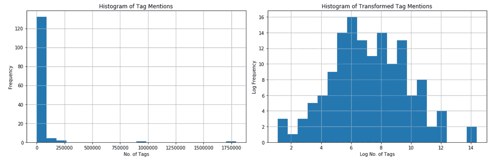
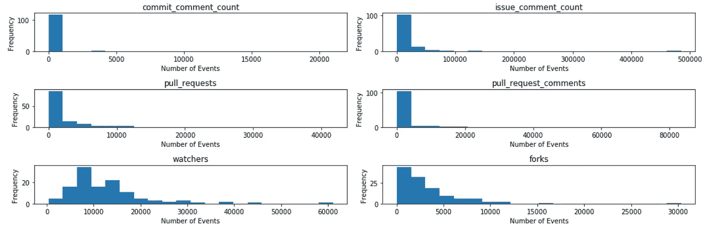
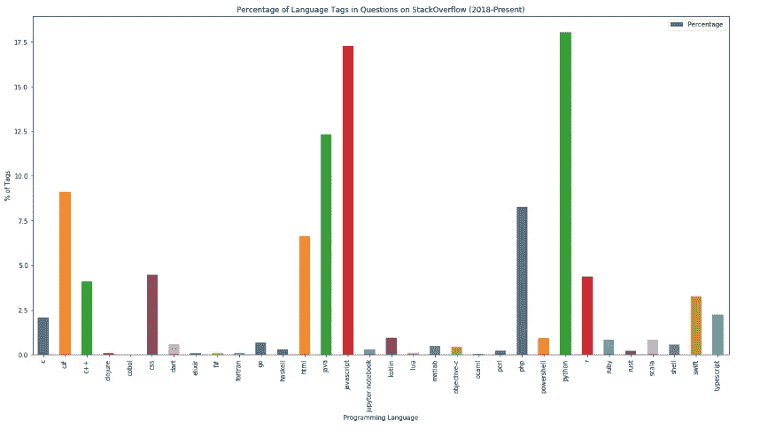
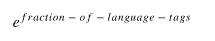
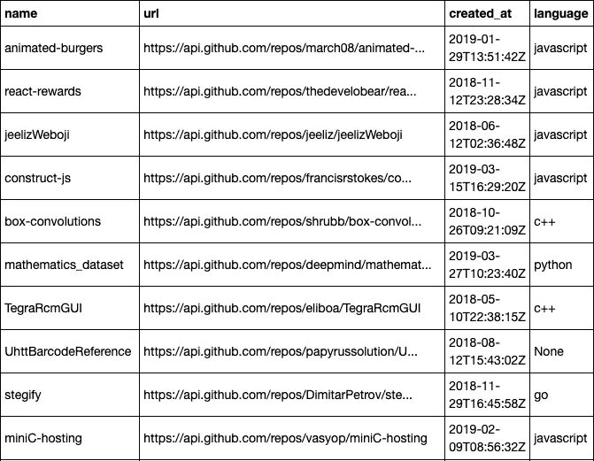

# 确定 Github 上 100 个最有潜力的欧洲开源项目

> 原文：<https://medium.com/swlh/identifying-the-100-highest-potential-european-open-source-projects-on-github-33d4e8624290>

一个蓬勃发展的风险投资给了我一个有趣的挑战，寻找欧盟最有潜力的开源项目。为什么这与他们和许多其他风投相关？它是开放式的和主观的，但它抓住了风投们每天都要努力解决的问题；他们如何在竞争对手之前以有效的方式找到相关的创业公司。没有灵丹妙药，但肯定有更聪明的方法。这是一个尝试用“聪明”的方式在 Github 中寻找金蛋的总结。

# 顶级存储库的特征

一个直观的起点是查看已经非常成功的开源项目。使用 Github API，我检索了大约 300 个拥有 20，000 颗*星*或更多星的存储库。

> 星级数表明了给定存储库的受欢迎程度以及跟踪该存储库的用户数量。

我们的目标是确定知识库流行度的预测特征。因此，我们的首要工作是定义一个流行度的度量标准。考虑到我们在寻找高潜力库时会将 stars 作为一个相关特性，我使用了 Github 外部的一个因变量；一个作为存储库成功的代理。我对流行度的定义如下:

> 在过去两年里，在 StackOverflow 上发布的问题中发现的给定存储库的标签数量

将来自 Github 的~ **300** 仓库映射到 StackOverflow 上带有标签的仓库，我们剩下了 **140** 仓库。查看我们的存储库中标签的分布，我们看到一个严重的正偏差。

Figue 1

使用标签数量的对数作为我们的因变量，我们能识别可能提供一些预测能力的特征吗？为了尝试这样做，我们需要这些流行存储库的历史数据。Github API 不太适合这样的尝试，因此，我们使用了 [GH 存档](https://www.gharchive.org/)。我们提取以下特征:

*   提交注释事件
*   问题评论事件
*   拉请求事件
*   拉式请求审核注释事件
*   观看活动
*   分叉事件
*   拥有 Wiki

理想情况下，我们希望从存储库的开始到 1 年后的总计数，以捕获它们的新生阶段；然而，早期一些仓库的数据并不可靠。我决定在“2015 年 4 月 27 日”到“2017 年 4 月 27 日”期间获取我们 140 个存储库的数据。我们的因变量——给定存储库的 StackOverflow 上的标签数——是在以下时间段内计算的:' > 2017–04–27 '。

让我们来看看我们的功能:

Figure 2

我们将 log(x+0.001)变换应用于我们的特征，以说明正偏度，然后根据我们的变换特征回归每个存储库的 StackOverflow 标签计数。

如果我们假设显著性水平为 5%,那么我们发现以下变量在预测 StackOverflow 标签时具有统计显著性:

*   提交注释的数量
*   叉子的数量

鉴于这项工作的性质，统计意义不是我们可以完全依赖的东西；然而，我们将这样使用这些发现:

*   对两个具有统计显著性的变量赋予较高的权重
*   包括除以下功能之外的所有其他功能:has_wiki 和 issue_comment_count_log

# 确定最有潜力的欧洲开源项目

根据我们的观察，我们将 high-potential 定义为一个可能在 StackOverflow 上受到很多关注的存储库，因此，使用上面探索的度量。这些是:

*   提交注释的数量
*   拉取请求的数量
*   拉取请求注释的数量
*   观察者人数
*   叉子的数量
*   语言流行度

为了找到非常有前途的开源项目，我们将把搜索范围缩小到去年创建的存储库，以避开已经流行的存储库。在这种情况下，我检索了 **52，000 个**存储库。

为了识别欧洲高潜力项目，最好在进一步筛选之前识别相关区域的储存库；然而，在使用 AsyncIO 进行尝试之后，Github API 速率限制意味着这需要进一步考虑将 AsyncIO 与速率限制功能相结合。目前，我们只是使用以下指标来优化我们的存储库，以关注更受欢迎的存储库:

*   叉的数量> 10
*   观星者数量> 400

请注意，我们在这里使用 forks，因为它很容易获得，并且之前在预测 StackOverflow 受欢迎程度时显示了统计上的显著结果。我们将这与 stars 结合起来，进一步细化我们对 **2228** 库的结果。我们现在过滤这些来识别欧洲的储存库。这里我们做一个假设，如果所有者是在欧盟，那么该项目将被视为欧盟的开源项目。这给了我们 **136 个**仓库。

## **排名项目**

我们遵循同样的方法，对数据进行对数转换，然后遵循 z 计分法。在这种情况下，我们没有因变量，即 StackOverflow 标签提及；然而，我们知道两个变量在预测我们对受欢迎程度的定义时具有统计学意义，它们是:

*   提交注释的数量
*   叉子的数量

在创建总 z 分数时，我们将赋予这些排名更高的权重，但仍将纳入其他提到的指标:

*   拉取请求的数量
*   拉取请求注释的数量
*   观察者人数
*   语言流行度

虽然数据是正偏的，但这并不阻止我们计算 z 分数，这将允许我们创建一个总排名。

总分数被认为比单纯依赖数值要好。如果我们简单地添加原始值，我们可能无法捕获在所有三个度量上显示出比平均承诺更好的存储库。z 评分允许我们克服这一点，并提供了一种将功能添加到一起的方法。

一旦我们结合了我们的特征，我认为加入语言流行度是明智的。如果一个项目利用了一种非常流行的编程语言，我们预计，给定一个开发人员的随机样本，开发人员将更有可能利用这个库。

为了捕捉编程语言的流行程度，我使用了 StackOverflow。我分析了一种给定编程语言在一年前到现在的问题上的标签数量。

好在 StackOverflow 提供了一个查询引擎，请看[这里](https://data.stackexchange.com/stackoverflow/query/new)。使用这个引擎，我得到了以下结果:

Figure 3

为此，我们将总排名乘以:

这是为了奖励使用流行语言的存储库，但是对于使用当前不流行语言的存储库来说，不要太苛刻。

瞧，我们有排名了！当然，您希望定期运行这个工具来记录任何变化，但是，现在我将展示这个方法揭示的(当时)前 10 个存储库:

Figure 4

感谢阅读！欢迎所有的想法和反馈。