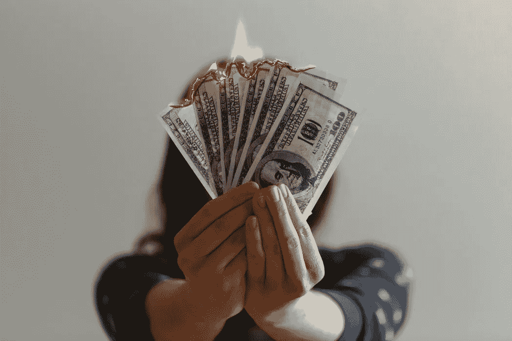

# 如果钱不是问题，我该怎么生活？

> 原文：<https://medium.com/swlh/if-money-werent-an-issue-how-would-i-live-b17dc097a4d7>

Photo by [Jp Valery](https://unsplash.com/@jpvalery?utm_source=unsplash&utm_medium=referral&utm_content=creditCopyText) on [Unsplash](https://unsplash.com/search/photos/money?utm_source=unsplash&utm_medium=referral&utm_content=creditCopyText)

> 我没有钱，但我成了百万富翁

“我们欠了一个放高利贷的一千美元，我们必须马上偿还，否则我们会欠更多，”我丈夫说。

*高利贷？一千美元？他到底在说什么？*