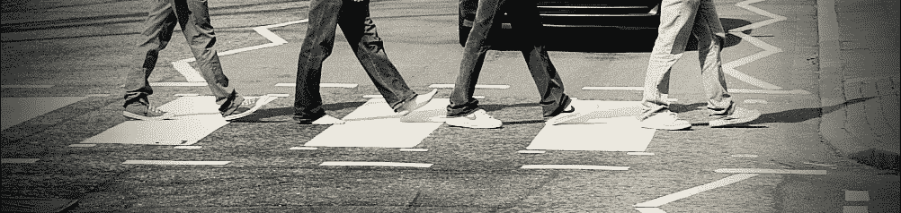

# 如果我的 MS 有地址的话，应该是艾比路

> 原文：<https://medium.com/swlh/if-my-ms-had-an-address-it-would-be-abbey-road-66f38424331c>

Photo: loop_oh [doing the beatles](http://www.flickr.com/photos/80384851@N00/4541651284) via [photopin](http://photopin.com/) [(CC)](https://creativecommons.org/licenses/by-nc-sa/2.0/)

## 听甲壳虫乐队的音乐改变我生活的那一天

> 似乎已经过了很多年，太阳出来了，甲壳虫乐队来了(艾比路)

有些疾病会猛烈地袭来，就像用拳头猛击你的前门。其他像我一样的人从浴室的窗户进来*，那里没人看见。*

几年来，我一直带着病呆在“浴室”里。这是一个秘密，只是因为我和妻子不知道什么时候才能得到确认。

我们开始生活在我手臂麻木、视力衰退、平衡能力下降、胸部疼痛加剧的情况下。多发性硬化症就像是一种未来的形式，最终会有人发现并揭露出来。

诊断是在 2016 年 4 月通过更衣室首次进行的，更衣室是放射诊所的一个半私人小隔间，在那里他们给你一件衣服穿上。我花了大约 10 分钟小心翼翼地脱下衣服，把我所有的弹片——两部手机、钱包、两个玻璃杯、硬币、衣服——都装了进去。但我又花了五分钟来挑选浅蓝色的一次性礼服。

我发誓我是从后面看到的，后面有一个不合适的缺口，显然连基本的医学检查都不熟悉。

这位放射科医生是一位年轻的女性，比我的身高要矮得多，她起初是临床和专业人员。站在这里。坐在那里。躺下。你会没事的。如果你需要我，就按这个按钮。

她真正想说的是*‘当我把你的头滑进一个非常吵的隧道时，请不要对我大惊小怪，但是如果你一定要的话，请在中间的某个地方按下按钮。’*

她说核磁共振会很吵是对的。不过，谢天谢地，对我来说，听《艾比路》专辑的一半声音还不算太大，那是我从外面隔间里的一个塑料文件夹里挑选的。

> 我感觉冰正在慢慢融化小乖乖’太阳来了，披头士(艾比路)

第一次扫描是无痛的，但是是对抗的。凯伦仍然是一个不为世人所知的秘密，她在咖啡馆换班后来到了等候室，衬衫上散发着新鲜的咖啡味道。

在隧道里，除了机器模糊的白色隧道壁，我什么也看不见。

放射科医生是对的。比我想象的要响。

可悲的是，考虑到音乐扬声器的糟糕质量，甲壳虫乐队并没有发挥出他们的最佳水平。这就像是 1974 年的磁带播放机在播放《修道院路》,每一首歌都在不断地咀嚼磁带。不知何故，听到伴随我长大的音乐，听到我十年前为兰登书屋写书时放入播放列表的音乐，我感到很欣慰。

虽然与核磁共振成像竞争，但太阳来了让我更多地呆在隧道外而不是隧道内。

“你做得真的很好，”放射科医师在完成扫描后说，尽管当她完成扫描并开始从我乘坐的雪橇上解开我时，没有以前那么欢快了。

她脸上有一种不寻常的表情。我称之为担忧或悲伤，尽管我的思绪可能和她的扫描结果一样混乱。

你和你的家庭医生约好了吗？我慢慢起身时，她问道。

“是的，我为本周晚些时候做了一个，但不知道你需要多长时间才能出结果，”我回答道，捕捉到了她眼中的担忧。

“很好，”她说，低头看着雪橇上的什么东西。很快就能见到他。

> 男孩，你将承受那份重量，
> 长期承受那份重量’
> 承受那份重量，甲壳虫乐队(艾比路)

*“很快就能见到他。”我知道那意味着什么。这就像她试图给我一个没有诊断的线索，就像她绕过一些“放射学法则”，禁止她告诉我她刚刚发现的真相。*

实际上，*【很快】*第二天早上 GP 打来电话的形式先找到了我。

“我们已经有结果了，保罗，”他说，“我不会拐弯抹角的。你得了多发性硬化症，昨天的扫描很清楚。

我记得当我离开一个工作会议时，我的心跳加快了一点，为我接私人电话找借口。

“我并不真的感到惊讶，”我说，出于某种原因，我试图让他轻松一些。

是的，我很抱歉不得不说。

医生那天休假，但还是设法让我回来做了另一次强度更大的扫描。

正是如此。非常长。我知道它持续了一个半小时以上，因为我前一天选择的阿比路专辑在他们把我带出来之前至少重播了两次。

第二天在隧道里，我可以看到更多，这要感谢一位新的放射科医生在我眼睛上方放了一面小镜子。他比前一天的那个女人年长，也不太爱说话。

我看到的更多，像他自始至终专注地看着监视器。

…比如他向显示器示意，看上去像是前一天给我做测试的那个女人。

…喜欢他在显示器上给她看东西时她点头。

…好像他们没有任何怀疑。

我记得在等待的时候，我想知道我应该在隧道里做什么，试图转移自己的注意力，不去想眼泪或害怕抽搐或移动会破坏手术。

我记得我对妈妈说了些什么，我的妈妈五年前死于严重的多发性硬化症——在 5 岁时从小儿麻痹症开始的艰苦生活的姑息治疗结束时被发现。

“你知道这是什么样的，妈妈，”我说，相信她能从天堂听到我的声音。你以前来过这里。你已经穿过了这条隧道。你已经听到了它有多吵，经历这一切有多难。

“但是我要对这个妈妈做点什么，”我补充道。“他们会告诉我我得了多发性硬化症——这不是我要带进坟墓的东西，也不会带我进坟墓。”

> 太阳来了，做做做做
> 太阳来了，我说
> 没关系’
> 太阳来了，甲壳虫乐队(艾比路)

> 一篇改编自个人博客的文章，[没那么快](https://notsofastweb.wordpress.com/2016/10/08/if-my-ms-had-an-address-it-would-be-abbey-road/)，现在写的都在[PG](http://RatedPG.net/blog2)以下。