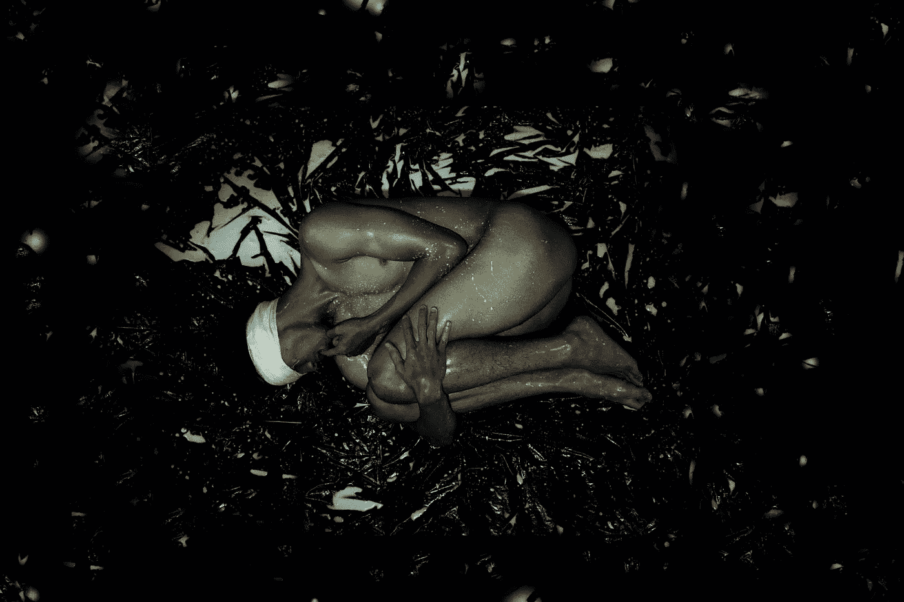

# 如果鬼魂能在我们的家里出没

> 原文：<https://medium.com/swlh/if-spirits-can-haunt-our-homes-318426410d15>

为什么我们的身体不能呢？

Photo by [Nate Nessman](https://unsplash.com/@nate_nessman?utm_source=unsplash&utm_medium=referral&utm_content=creditCopyText) on [Unsplash](https://unsplash.com/search/photos/bodies?utm_source=unsplash&utm_medium=referral&utm_content=creditCopyText)

美国对超自然现象的痴迷是真实的。A&E 重启了《捉鬼者》这部电视剧，并在今年增加了四个新的超自然主题。好莱坞有媒介，长岛也有。当我今天早上在跑步机上跑步时，我对自己说，*为什么很难接受灵魂也可以附着在人类的光环上？*